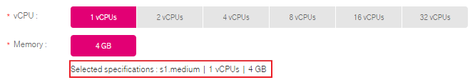
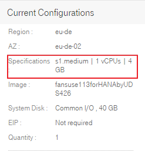

## ECS Types and Specifications

The public cloud provides various ECSs for different application scenarios.

-   General-purpose
-   Computing I
-   Computing II
-   Memory-optimized
-   Large-memory
-   GPU-optimized
-   Disk-intensive
-   High-performance
### ECS Flavor Naming Rules

ECS flavors are named using the format "AB.C.D".

The format is defined as follows:

<ul>
<li><b>A</b> specifies the ECS type. For example, <b>s</b> indicates a general-purpose
ECS, <b>c</b> a computing ECS, and <b>m</b> a memory-optimized ECS.</li>
<li><b>B</b> specifies the type ID. For example, the <b>1</b> in <b>c1</b> indicates a computing I ECS, and the <b>2</b> in <b>c2</b> indicates a computing II ECS.</li>
<li><b>C</b> can be any of the following options:
<ul><li>medium</li>
<li>large</li>
<li>xlarge</li></ul>
<li><b>D</b> specifies the ratio of memory to vCPUs expressed in a digit. For
example, value <b>4</b> indicates that the ratio of memory to vCPUs is 4.</li></ul>

### Obtaining Specifications When Creating an ECS

Specifications for the ECS being created are located under **Memory** in the
**Basic Information** area.

You can also find the ECS specifications under **Current Configurations** on the
right side of the page.

