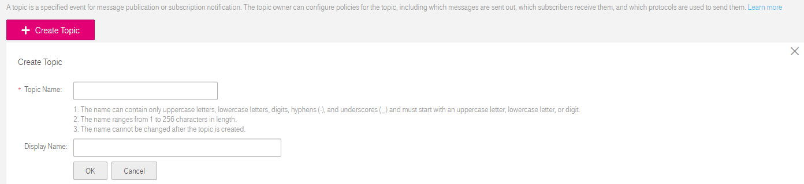

## Creating a Topic

### Scenarios

A topic is a specified event for message publishing or notification subscription. It serves as a message sending channel, where publishers and subscribers can interact with each other. Before you can send any messages using SMN, you must create a topic.

### Creating a Topic

<ol><li>Log in to the management console.</li>

<li>Click . Under <b>Application</b>, click <b>Simple Message Notification</b>.
<dd>The <b>Simple Message Notification</b> page is displayed.</dd></li>
<li>In the navigation tree on the left, choose <b>Topic</b>.
<dd>The <b>Topic</b> page is displayed.</dd></li>
<li>Click <b>Create Topic</b>.</li>
<dd>The <b>Create Topic</b> a1rea is displayed.</dd>
<dd><b>Figure 1</b> Create Topic</dd></li>
	 

<li>Enter a topic name and display name.</li>
	<dd><b>Table 1</b> Information required for creating a topic</dd>
  <table>
   <tr>
       <th>Parameter</th>
       <th>Description</th>
     </tr>
     <tr>
         <td>Topic Name</td>
         <td>Specifies the topic name, which:                                                                                                                                                                                              
               <ul>
<li>Contains only upper or lower case letters, digits, hyphens (-), and underscores (_) and must start with a letter or digit. </li>
                <li>Must be 1-256 characters long.</li>
<li>Must be unique and cannot be modified once the topic is created.</li>
			    </ul>
		  </td>
     </tr>
     <tr>
         <td>Display Name</td>
         <td>Describes the topic, which must be less than 192 bytes.                                                                                                                                                                                                
               <dd>NOTICE</dd>                                                                                                                                                                                                                              
               <dd>The topic display name is presented as the name of the email sender when you push an email message.</dd>
         </td>
     </tr>
   </table>
<li>Click <b>OK</b>.
<dd>The topic you created is displayed in the topic list. The system generates a topic URN, which is the unique resource identifier of the topic and cannot be changed.</dd></li></ol>
