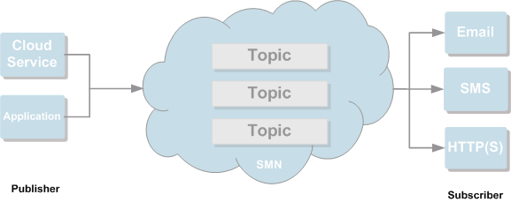

## Basic Concepts

### SMN

Simple Message Notification (SMN) is a reliable and flexible large-scale message notification service. It greatly reduces system coupling and pushes messages to specified messaging destinations. SMN involves two roles: publisher and subscriber. A publisher creates messages and publishes them to a topic. A topic is a collection of messages and a logical access point, through which the publisher and the subscriber can interact with each other. SMN then delivers these messages to subscribers of the topic. A subscriber can be an email address, phone number, or application. After subscribing to a topic, the subscriber can receive messages over the specified protocol.

Figure 1-1 shows the structure of SMN.

**Figure 1-1** SMN structure

 

### Topic

A topic is a specified event to publish messages and subscribe to notifications. It can be used to isolate messages. A topic serves as a message sending channel, where publishers and subscribers can interact with each other.

### Topic URN

After you create a topic, the system generates a uniform resource name (URN), which uniquely identifies the topic.

### Publisher

A publisher is a role who sends messages to a topic.
### Subscriber

A subscriber is a role who receives messages delivered from a topic.

When you add a subscription, you need to specify a destination to which messages are to be sent, that is, the subscription endpoint. For an email subscription, the endpoint is an email address. For an SMS subscription, the endpoint is a phone number. For an HTTP or HTTPS subscription, the endpoint is a URL.

### Message Template

A message template specifies the message format, which can be used for quick message sending. When you send a message using a template, SMN replaces the template tags with the message content you specified.

### Functions

SMN is designed to provide one-to-multiple message subscription and notification over a variety of protocols.

SMN allows you to create a topic and configure a topic policy to control who has permission to operate the topic. You can publish messages to a topic you created or a topic you have permission to publish messages. With SMN, you publish messages to a topic, instead of sending them to specific destination addresses. After you publish a message to the topic, SMN delivers it to all of those who have subscribed to that topic.

### Application Scenarios

SMN can be connected to cloud services or integrated with any application that uses or generates message notifications to push messages over multiple protocols. This section introduces the following typical scenarios:

- **Connecting to other cloud services**

	When connected to other cloud services, SMN can send alarms or notifications they generate to specified users through emails or SMS messages.

- **Integrating with a third-party application**

	When integrated with a third-party application, SMN enables the application to call SMN APIs to push emails or SMS messages to individuals or user groups.

### Related Services

SMN can be interconnected with other cloud services to provide them with messaging capabilities so that these services can send notifications to tenants or their message processing systems. For details about how to use SMN in other cloud services, see user guides of the related services.

- **Cloud Eye (CES)**

	After an alarm rule is configured, CES can use SMN to send alarm information to specified users.

- **Anti-DDoS**

	After the alarm notification function is enabled for Anti-DDoS, SMN notifies users by email or SMS message in the event that a DDoS attack occurs.

- **Cloud Trace Service (CTS)**

	SMN can use CTS to record operations performed on the cloud resources.

### Accessing and Using SMN

The cloud platform provides a web-based management console and HTTPS-based APIs through which you can access the SMN service.

- **Management console**

	The management console is a web interface for you to manage your computing, storage, and other cloud resources. You can access SMN using the management console. After you register an account on the management console, you can log in and select **Simple Message Notification** on the homepage to switch to the SMN console.

- **SMN APIs**

	If you want to integrate SMN into a third-party system for secondary development, you can access SMN using APIs. For details, see the ***Simple Message Notification API Reference***.
