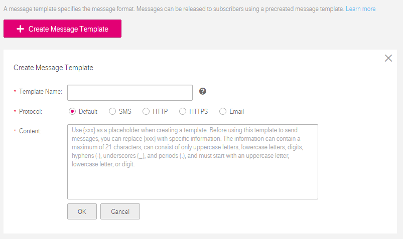

## Message Template Management

### Scenarios

A message template specifies the message format, which can be used for quick message sending. When you send a message using a template, SMN replaces the template tags with the message content you specified.

The message template is grouped by template name. You can create templates of different protocols using the same template name. Note that you must specify the default protocol in a template group. Otherwise, the system does not allow you to publish messages using the template. When sending messages using a template, SMN tries to match different types of subscribers with the template protocols. If the template of a specified protocol does not exist, SMN sends messages to subscribers of that protocol using the default template.

This section describes how you can publish messages using a template.

### Creating a Template

1.  Log in to the management console.

2.  Click . Under **Application**, click **Simple Message Notification**.

	The **Simple Message Notification** page is displayed.

1.  In the navigation tree on the left, choose **Message Template**.

2.  Click **Create Message Template**.

	The **Create Message Template** area is displayed.

	**Figure 1** Create Message Template

	

1.  Specify the template name, protocol, and content.

	**Table 1** Parameters required for creating a message template
	<table>
    <tr>
       <th>Parameter</th>
       <th>Description</th>
        
     </tr>
     <tr>
         <td>Template Name</td>
         <td>
Specifies the template name, which: 

				<ul>
                  <li>Contains letters, digits, underscores (_), and hyphens (-) and starts with a letter or digit.</li>                                                                                                                                                                                                                     
                  <li>Is a character string of 1 to 64 bytes. </li>                                                                                                                                                                                                                      
                  <li>Cannot be modified once the template is created.</li>  
                  </ul>
		</td>
     </tr>
     <tr>
         <td>Protocol</td>
         <td>Specifies the endpoint protocol of the template, which cannot be changed once the template is created.                                                                                                                                                                            	 <dd>The available options include <b>SMS</b>, <b>Email</b>, <b>HTTP</b>, and <b>HTTPS</b>.If you do not specify a protocol, the <b>Default</b> protocol is used. </dd> 
         </td>
     </tr>
     <tr>
         <td>Content</td>
         <td>Specifies the template content.
				<dd>You can use a tag as the placeholder. Before you send messages using the template, SMN replaces the tags with the specific message content you specified. A tag can be a string of up to 21 characters composed of letters (upper or lower case), digits, hyphens (-), underscores (_), and periods (.) and must start with a letter or digits.</dd> 
				<dd>The message template has the following requirements: 
                  <ul>
                  <li>The template supports plain text only.</li>                                                                                                                                                                                                                     
                  <li>The template content cannot be empty or larger than 256 KB.</li>                                                                                                                                                                                                                      
                  <li>A template can contain up to 90 non-repetitive tags or 256 tags with the repeated ones counted.</li> 
				<li>The message content you specified for each tag when sending messages using the template cannot exceed 1 KB.</li></ul></dd>                                                                                                                                                                                                                    
         </td>
     </tr>
     </table>               

	The following is an example for parameter configurations in the template creation:

	**Template Name**: **tem_001**

	**Protocol**: **Default**

	**Content**: **The Arts and Crafts Exposition will be held from {startdate} through {enddate}. We sincerely invite you to join us.**

1.  Click **OK**.

	The newly created template is displayed in the template list.

### Modifying a Template

1.  Select the template to be modified in the template list.

2.  Click **Modify** under **Operation** to change the template content.

### Deleting a Template

1.  Select the template to be deleted in the template list.

1. Click **Delete** under **Operation** to delete the message template.
