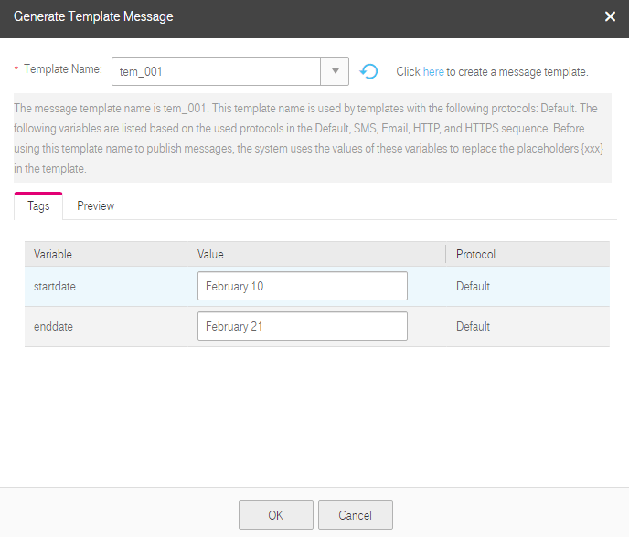
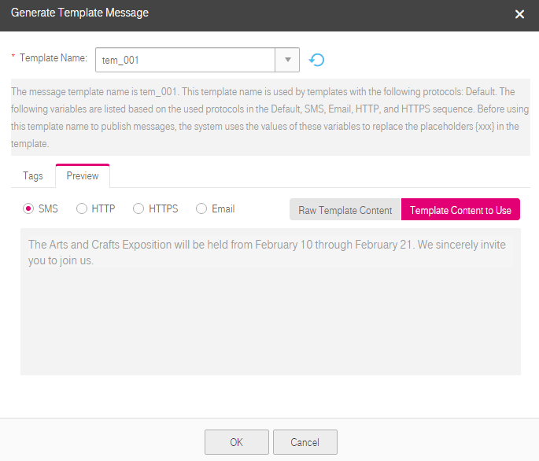
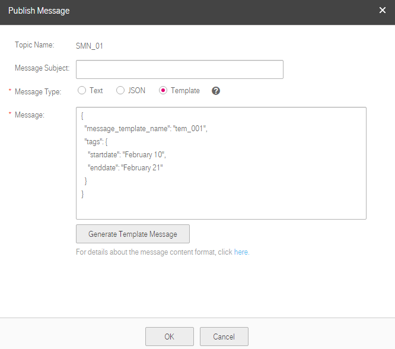

## Publishing Messages Using a Template

### Scenarios

A message template specifies the message format. If you need to send the same or similar messages for multiple times, you can create a message template for quick message sending.

You can create templates of different protocols using the same template name to match subscribers of different types. The template of each protocol uses tags as the placeholders to represent changeable content so that different types of subscribers can receive customized messages. Note that you must create a template of the default protocol. Otherwise, the system does not allow you to publish messages using the template.

When creating messages using a template, you need to select a specific template name. Then, the system lists all tags in the default, SMS, email, HTTP, and HTTPS sequence. Tags repeated in two protocols are listed only once, with the protocols they support following. In the message template, you need to specify the content for each tag, and SMN replaces the tags with the content you entered. If you do not enter specific content for a tag, the system does not replace the tag and treats the tag as empty when sending messages.

SMN tries to match different types of subscribers with the template protocols. If the template of a specified protocol does not exist, SMN sends messages to subscribers of that protocol using the default template.

This section describes how you can publish messages using a template. For details about the message template, see section <a href="Message Template Management">Message Template Management</a>.

### Prerequisites

Subscribers of the topic have confirmed the subscription, or they will not be able to receive any messages.

### Creating a Template

1.  Log in to the management console.

2.  Click . Under **Application**, click **Simple Message Notification**.

	The **Simple Message Notification** page is displayed.

1.  Create a message template. For details, see section <a href="Message Template Management">Message Template Management</a>.

	The following is an example for parameter configurations in the template creation:
	- **Template Name**: **tem_001**
	- **Protocol**: **Default**
	- **Content**: **The Arts and Crafts Exposition will be held from {startdate} through {enddate}. We sincerely invite you to join us.**
### Publishing Messages Using a Template

1.  Log in to the management console.

2.  Click . Under **Application**, click **Simple Message Notification**.

	The **Simple Message Notification** page is displayed.

1.  In the navigation tree on the left, choose **Topic**.

	The **Topic** page is displayed.

1.  Select the topic to which you want to publish a message and click **Publish Message** under **Operation**.

2.  Configure the required parameters according to "Table 1" in section <a href="Publishing a Text Message">Publishing a Text Message</a>. The topic name is provided by default and you cannot change it.

	Select **Template** for **Message Type** and manually type the template content in the **Message** box or click **Generate Message Template** to generate the template content. The template message content cannot exceed 256 KB.

	- If you choose to manually type the template message, see section A.3 Template Message Format for detailed requirements.

	- If you choose to automatically generate the template message, perform operations in steps [6](#jump03) to [9](#jump04).

1.  Click **Generate Template Message**.

2.  Select the **tem_001** template and specify content for the tags.

	The system replaces the tags with the message content you specified. The protocols configured in the template will be displayed after the tags. In this example, only the default protocol is specified in **tem_001**. Therefore, all confirmed subscribers in the topic receive the message content you entered for the default template.

	**Figure 1** Generate Template Message

	

1.  Switch to the **Preview** tab to check the raw template content. Click **Template Content to Use** to preview the template message.

	In this example, the message generated is "The Arts and Crafts Exposition will be held from February 10 through February 21. We sincerely invite you to join us."

	**Figure 2** Previewing the template message

	

1.  Click **OK**.

	The message that is generated contains the template name and tags.

	**Figure 3** Template message example

	

1.  Click **OK**.

	SMN pushes the message to the subscription endpoints.

	- The message received by an email or HTTP/HTTPS endpoint contains the message subject, message content, and unsubscription link.
	- The message received by an SMS endpoint contains only the message content.
