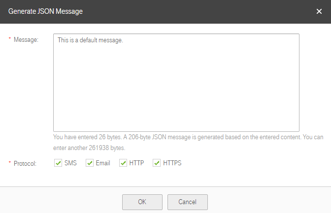
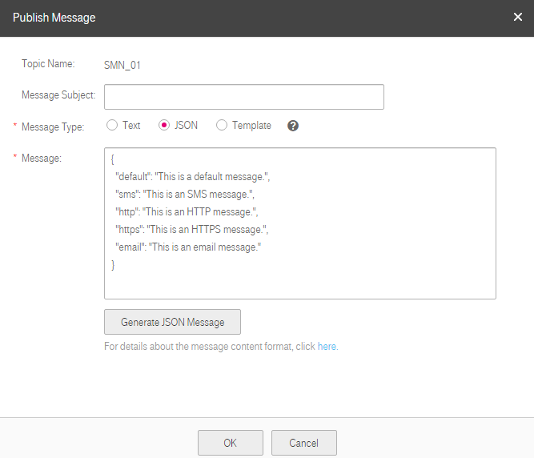

## Publishing a JSON Message

### Scenarios

In a JSON message, you can specify different message content for different protocols, including SMS, email, HTTP, and HTTPS. After you publish a JSON message to the topic, SMN will send the message to applicable subscription endpoints in the topic.

### Prerequisites

Subscribers of the topic have confirmed the subscription, or they will not be able to receive any messages.

### Publishing a JSON Message

1.  Log in to the management console.

2.  Click . Under **Application**, click **Simple Message Notification**.

	The **Simple Message Notification** page is displayed.

1.  In the navigation tree on the left, choose **Topic**.

	The **Topic** page is displayed.

1.  Select the topic to which you want to publish a message and click **Publish Message** under **Operation**.

2.  Configure the required parameters according to "Table 1" in section <a href="Publishing a Text Message.md">Publishing a Text Message</a>. The topic name is provided by default and you cannot change it.

	Select **JSON** for **Message Type** and manually type the JSON message in the **Message** box or click **Generate JSON Message** to generate the message. The total size of a JSON message cannot exceed 256 KB.

	- If you choose to manually type the JSON message, see section <a href="JSON Message Format.md">JSON Message Format</a> for detailed requirements.

	- If you choose to automatically generate the JSON message, perform operations in steps <a href="#6">6</a> to <a href="#9">9</a>.

1.  <a name="6">Click **Generate JSON Message**.</a>

2.  Enter the message content, for example, "This is a default message.", in the **Message** box and select all message protocols.

	The total size of a JSON message, including the braces, quotation marks, spaces, line breaks, and message content, cannot exceed 256 KB. The size of the JSON message generated for each protocol may vary. The system counts the number of bytes you have entered and prompts you how many remaining bytes you can enter. For details about how to calculate the JSON message size, see "Calculation on the JSON Message Size" in section <a href="JSON Message Format.md">JSON Message Format</a>.
	**Figure 1** Generate JSON Message

    

1.  Click **OK**. The system generates a JSON message.

	**Figure 2** JSON message

    

1.  <a name="9">Modify the message content for each protocol so that different messages are sent to endpoints of different protocols. The system generates the JSON-formatted content, including a default message and messages for different protocols. When SMN fails to match any specific message protocol, it sends the default message. For detailed JSON message format, see section <a href="JSON Message Format.md">JSON Message Format</a></a>.

	**Figure 3** JSON message example

	

1.  Click **OK**.

	SMN delivers the message to the applicable subscription endpoints.

	- The message received by an email or HTTP/HTTPS endpoint contains the message subject, message content, and unsubscription link.

	- The message received by an SMS endpoint contains only the message content.
