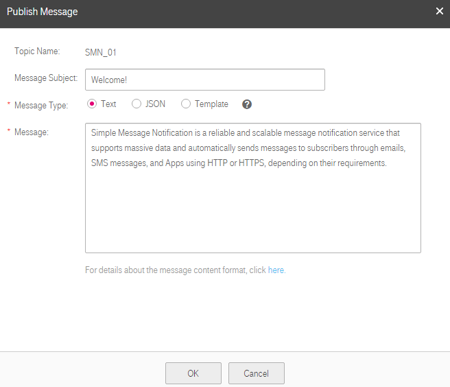

## Publishing a Text Message

###Scenarios

After you publish a text message to a topic, SMN will send the message to all confirmed subscription endpoints in the topic.

###Prerequisites

Subscribers of the topic have confirmed the subscription, or they will not be able to receive any messages.

###Publishing a Text Message

1.  Log in to the management console.

2.  Click . Under **Application**, click **Simple Message Notification**.

	The **Simple Message Notification** page is displayed.

1.  In the navigation tree on the left, choose **Topic**.

	The **Topic** page is displayed.

1.  Select the topic to which you want to publish a message and click **Publish Message** under **Operation**.

2.  Configure the required parameters according to Table 3-3. The topic name is provided by default and you cannot change it.

	**Table 3-3** Parameters required for publishing a message
	<table>
    <tr>
       <th>Parameter</th>
       <th>Description</th> 
     </tr>
     <tr>
         <td>Message Subject</td>
         <td>(Optional) The message subject is a string of less than 512 bytes. </td>
     </tr>
     <tr>
         <td>Message Type</td>
         <td>
The message type can be <b>Text</b>, <b>JSON</b>, and <b>Template</b>.

             <ul>
                  <li>
<b>Text</b>: common text message 
</li>                                                                                                                                                                                                                     
                  <li>
<b>JSON</b>: JSON message
</li>                                                                                                                                                                                                                      
                  <li>
<b>Template</b>: template message 
                                                                                                                                                                                                                    
                  
For details about the message template, see section 6 Message Template Management.
</li> 
                  </ul>                                                                                                                                                                   
         </td>
     </tr>
     <tr>
         <td>Message</td>
         <td>
This is the message content, which cannot be empty or exceed 256 KB. 
                                                                                                                          
         </td>
     </tr>
     </table>           

	The following figure shows a text message example.

	**Figure 3-2** Text message example
 
    

1.  Click **OK**.

	SMN pushes the message to the subscription endpoints.

	- The message received by an email or HTTP/HTTPS endpoint contains the message subject, message content, and unsubscription link.

	- The message received by an SMS endpoint contains only the message content.
