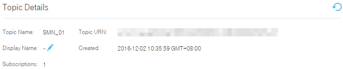

## Querying the Topic Details

### Scenarios

After you create a topic, the system generates a topic URN, which uniquely identifies the topic. All subscribers of a topic are displayed in the topic list. This section describes how to obtain the URN and subscribers of a topic.

### Querying the URN of a Topic

1.  Log in to the management console.

2.  Click . Under **Application**, click **Simple Message Notification**.

	The **Simple Message Notification** page is displayed.

1.  In the navigation tree on the left, choose **Topic**.

	The **Topic** page is displayed.

1.  Select a topic in the topic list and click its name.

	The **Topic Details** page is displayed.

1.  Obtain the topic URN.

	**Figure 1** Topic URN

	

### Obtaining the Subscription List of a Topic

1.  Log in to the management console.

2.  Click . Under **Application**, click **Simple Message Notification**.

	The **Simple Message Notification** page is displayed.

1.  In the navigation tree on the left, choose **Topic**.

	The **Topic** page is displayed.

1.  Click the topic name. The subscription list is displayed.
