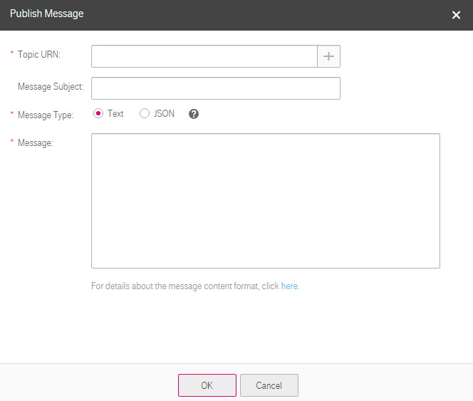

## Sending Messages to an Authorized Topic

### Scenarios

If another user creates a topic and grants you the message publishing permission, you can publish text or JSON messages to the topic.

### Prerequisites

You have obtained the URN of the authorized topic. For how to obtain the URN of a topic, see section 4.4 Querying the Topic Details.

### Procedure

1.  Log in to the management console.

2.  Click . Under **Application**, click **Simple Message Notification**.

	The **Simple Message Notification** page is displayed.

1.  On the **Dashboard** page, click **Publish Message**.

2.  Specify the topic URN, message subject, and message type and enter the message content.

	

	   Clicking  beside **Topic URN** only enables you to select a topic you created, instead of a topic authorized to you.

	**Figure 1** Publishing messages to an authorized topic

	

	For how to publish a text message, see section <a href="Publishing a Text Message">Publishing a Text Message</a>. 

    For how to publish a JSON message, see section <a href="Publishing a JSON Message">Publishing a JSON Message</a>.
