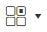
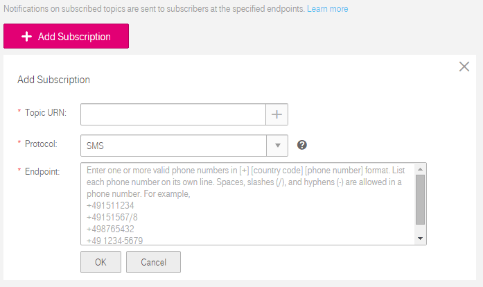

## Subscription Management

### Scenarios

To send messages published to a topic to an endpoint, you must add the subscription endpoint to the topic. The endpoint can be a mail address, a mobile phone number, or an HTTP/HTTPS URL. After you add the subscription endpoint to the topic and the subscriber confirms the subscription, the subscriber is able to receive messages published to the topic.

You can create multiple topics and add multiple subscriptions to a topic. This section describes how you can add a subscription to a topic you created or to a topic authorized to you and how to delete a subscription.

### Adding a Subscription
<ol>
<li>Log in to the management console.</li>
<li>Click . Under <b>Application</b>, click <b>Simple Message Notification</b>.
<dd>The <b>Simple Message Notification</b> page is displayed.</dd></li>
<li>In the navigation tree on the left, choose <b>Subscription</b>.</li>
<li>Click <b>Add Subscription</b>.
<dd>The <b>Add Subscription<b> page is displayed.</dd>
<dd><b>Figure 1</b> Add Subscription<dd>
</li>
<li>Specify the information required for adding a subscription.
<ul><li>To add a subscription to an authorized topic, enter the topic URN in the <b>Topic URN</b> box.</li>
<li>To add a subscription to a topic you created, click  beside the <b>Topic URN</b> box to select a topic URN.</li></ul>
<dd>After you specify the topic, the topic name is displayed under the <b>Topic URN</b> box. Specify the subscription protocol and endpoint.</dd>
<dd><b>Table 1</b> Information required for adding a subscription</dd>
<table>
 <tr>
    <th>Parameter</th>
   <th>Description</th>    
 </tr>
     <tr>
         <td>Topic URN</td>
         <td>Specifies the URN of the topic to be subscribed to. </td>
     </tr>
     <tr>
         <td>Protocol</td>
         <td>Specifies the protocol the subscription endpoint supports.                                                           
	 <dd>The available options include <b>SMS</b>, <b>Email</b>, <b>HTTP</b>, and <b>HTTPS</b>.</dd> 
         </td>
     </tr>
     <tr>
         <td>Endpoint</td>
         <td>Specifies the subscription endpoint. You can enter up to 10 endpoints, with every two separated with a line break.     
	 <ul>
	 <li><b>SMS</b>: Enter one or more valid phone numbers.                                                                 
	 <dd>The phone number must be preceded by a plus sign (+) and the country code.</dd>                                     
	 <dd>For example:                                                                                               
                  <ul>
                  <li><b>+4900000000</b></li>                                                                                                                                                                                                                     
                  <li><b>+4900000001</b></li>                                                                                                                                                                                                                      
                  <li><b>+4900000002</b></li>                                                                                                                                                                                                                     
                  <li><b>+4900000003</b></li>
                  </ul></dd>
             </li>                                                                                                                                                                                                                         
              <li><b>Email</b>: Enter one or more email addresses.                                                                                           
                  <dd>For example:                                                                                                                                                                                                                        
                  <ul>
                  <li><b>username@example.com</b></li>                                                                                                                                                                                                            
                  <li><b>username2@example.com</b></li>
                  </ul></dd>
              </li>                                                                                                                                                                                                                
              <li><b>HTTP</b> or <b>HTTPS</b>: Enter one or more public network URLs.                                                                                                                                                                           
	              <dd>For example:                                                                                                                                                                                                                      
	              <ul>
		<li><a href="http://example.com/notification/action">http://example.com/notification/action</a></li>                    
		<li><a href="http://example2.com/notification/action">http://example2.com/notification/action</a></li></dd>
				 </ul>
             </li>
			</ul>   
         </td>
     </tr>
     </table> </li>              
<li>Click **OK**.
<dd>The subscription you added is displayed in the subscription list. SMN automatically sends a confirmation message to the subscription endpoint, and the subscriber must confirm the subscription within 48 hours so that they can receive notification messages. Otherwise, you need to send a new confirmation message to the subscriber.</dd>

<ol>
<li>To prevent a malicious user from attacking subscription endpoints, SMN limits the number of confirmation messages that can be sent to an endpoint within a specified period of time. For details, see section <a href="Traffic Control on Subscription Confirmation.md">Traffic Control on Subscription Confirmation.</a></li>
<li>SMN does not check whether a subscription endpoint exists when you add a subscription. However, a subscriber can receive notification messages only when they confirm the subscription.</li>
<li>The token is valid only for 48 hours. Therefore, the subscriber must confirm the subscription within that time.</li></ol>

### Requesting Subscription Confirmation

You can send a subscription confirmation message to one or more subscription endpoints at a time.

To send a confirmation message to one subscription endpoint, perform the following steps:

<ol><li>In the subscription list, select a subscription whose status is <b>Unconfirmed</b>.</li>
<li>Click <b>Request Confirmation</b> under <b>Operation</b> to send a confirmation message.</li>
<li>The subscriber confirms the subscription.</li></ol>

To send a confirmation message to multiple subscription endpoints, perform the following steps:

<ol><li>In the subscription list, select subscriptions whose statuses are <b>Unconfirmed</b>.</li>
<li>Click <b>Request Confirmation</b> above the subscription list to send confirmation messages.</li>
<li>The subscribers confirm the subscription.</li></ol>

If a subscriber does not receive the confirmation message, you can request confirmation again. For details about how many confirmation messages you can send to one subscriber, see section <a href="Traffic Control on Subscription Confirmation.md">Traffic Control on Subscription Confirmation</a>.

### Deleting a Subscription

If you do not want to push messages to a subscription endpoint any more, you can delete the subscription.

To delete a single subscription, perform the following steps:

<ol><li>In the subscription list, select the subscription to be deleted.</li>
<li>Click <b>Delete</b> under <b>Operation</b> to delete the subscription.</li></ol>

To delete multiple subscriptions, perform the following steps:

<ol><li>In the subscription list, select the subscriptions to be deleted.</li>
<li>Click <b>Delete</b> above the subscription list.</li></ol>

### Confirming and Canceling a Subscription by the Subscriber

After you add a subscription to a topic, the subscriber will receive a confirmation message.

To subscribe to the topic, the subscriber needs to confirm the subscription based on the protocol:

- SMS: SMN sends a confirmation message to the specified phone number, and the subscriber accesses the link in the message to confirm the subscription.

- Email: SMN sends a confirmation message to the specified email address, and the subscriber clicks the link in the email to confirm the subscription.

- HTTP/HTTPS: SMN sends a confirmation message to the specified URL. The confirmation link is contained in the message body. For details about the confirmation message header and body, see section <a href="HTTPHTTPS Message Format.md">HTTP/HTTPS Message Format</a>.

After successfully subscribing to a topic, the subscriber can choose to cancel the subscription in the following ways based on the subscription protocol:

- SMS: SMN does not provide an unsubscription link in the SMS message because of the message length limit. To cancel an SMS subscription, the subscriber needs to access the link provided in the subscription confirmation message and cancels the subscription on the web page.

- Email: SMN encloses an unsubscription link in an email notification message. The subscriber can cancel the subscription by clicking the link. After the subscriber canceled the subscription successfully, SMN re-sends a subscription confirmation email, which is valid within 48 hours, so that the subscriber can re-subscribe to the topic if they have clicked the unsubscription link by mistake.

- HTTP/HTTPS: SMN provides an unsubscription link in the HTTP/HTTPS message body. The subscriber can cancel the subscription by clicking the link. If the subscriber cancels the subscription successfully, the system returns a **200** code over HTTP and re-sends the subscriber a subscription confirmation message, which is valid within 48 hours, in case that the subscriber has clicked the unsubscription link by mistake. For details about the HTTP/HTTPS message header and body, see section <a href="HTTPHTTPS Message Format.md">HTTP/HTTPS Message Format</a>.
 
