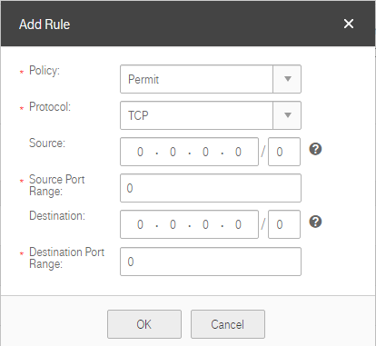

## Adding a Firewall Rule

### Scenarios

Add an inbound or outbound firewall rule based on your network security
requirements.

### Procedure

2.  Log in to the management console.

3.  On the console homepage, under **Network**, click **Virtual Private Cloud**.

4.  In the navigation tree on the left, click **Firewall**.

5.  Locate the target firewall in the right pane, and click the firewall name to
    switch to the page showing details of that particular firewall.

6.  On the displayed page, click the **Inbound** tab.

7.  Click **Add Rule**. In the displayed dialog box shown in <a href="#figure1">Figure 1</a>, configure the parameters as 	prompted. <a href="#table1">Table 1</a> lists the parameters to be configured.

    <a name="figure1">**Figure 1**</a> Add Rule

	

	<a name="table1">**Table 1**</a> Parameter description

	<table>
      <tr>
         <th>Parameter</th>
         <th>Description</th>
         <th>Example Value</th>         
      
     </tr>
     <tr>
        <td>Action</td>
         <td>Specifies the action in the firewall rule. The value can be **Permit**, **Deny**, or **Reject**. This parameter is mandatory. You can select a value from the drop-down list.</td>
         <td>VPC-001</td>
       
     </tr>
    <tr>
        <td>Protocol</td>
         <td>Specifies the protocol supported by the firewall. The value can be **TCP**, **UDP**, **ICMP**, or **ANY**. This parameter is mandatory. You can select a value from the drop-down list. If **ICMP** or **ANY** is selected, you do not need to specify port information.</td>
         <td>ANY</td>
       
     </tr>
	<tr>
        <td>Protocol</td>
         <td>Specifies the confirm pre-shared key.</td>
         <td>Test@123</td>
       
     </tr>
	<tr>
        <td>Source</td>
         <td>Specifies the VPN type. IPsec is selected by default.</td>
         <td>IPsec</td>
       
     </tr>
	<tr>
        <td>Local Subnets</td>
         <td>Specifies the source IP address from which the traffic is permitted.
		The default value is **0.0.0.0/0**, which indicates that traffic from all IP addresses is permitted.
		For example:
		 xxx.xxx.xxx.xxx/32 (IP address) 
		 xxx.xxx.xxx.0/24 (subnet) 
		 0.0.0.0/0 (any IP address) 
			</td>
         <td>0.0.0.0/0
		</td>
       
     </tr>
	<tr>
        <td>Source Port Range</td>
         <td>Specifies the source port number or port number range. The value ranges from 0 to 65535. For a port number range, enter two port numbers connected by a hyphen (-), for example 1-100. The range cannot start with 0.
		You must specify this parameter if **TCP** or **UDP** is selected for **Protocol**.
		</td>
         <td>22 or 22-30
		</td>
       
     </tr>
	<tr>
        <td>Destination</td>
         <td>Specifies the destination IP address to which the traffic is permitted.
			The default value is 0.0.0.0/0, which indicates that traffic to all IP addresses is permitted.
			 For example: 
			 xxx.xxx.xxx.xxx/32 (IP address) 
			 xxx.xxx.xxx.0/24 (subnet) 
			 0.0.0.0/0 (any IP address) 
		</td>
         <td>0.0.0.0/0
		</td>
       
     </tr>

	<tr>
        <td>Destination Port Range</td>
         <td>Specifies the destination port number or port number range. The value ranges from 0 to 65535. For a port number range, enter two port numbers connected by a hyphen (-), for example 1-100. The range cannot start with 0.
		 You must specify this parameter if **TCP** or **UDP** is selected for **Protocol**. 

	</td>
         <td>22 or 22-30
		</td>
       
     </tr>
	</table>

1. Click **OK**.
	The firewall rule is added. The procedure for adding an outbound rule is the same as that for adding an inbound rule.
