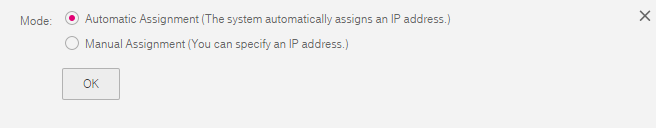

## Assigning a Private IP Address to an ECS

### Scenarios

When an ECS requires a floating IP address or a reserved IP address, you can
assign a private IP address from the subnet to the ECS.

### Procedure

2.  Log in to the management console.

3.  On the console homepage, under **Network**, click **Virtual Private Cloud**.

4.  In the navigation pane on the left, choose **Virtual Private Cloud**.

5.  On the **Subnet** page, locate the target subnet, and click **Manage Private
    IP Address**.

6.  Click **Assign Private IP Address** and set the parameters shown in <a href="#figure1">Figure 1</a> as prompted.

7.  Click **OK**.

	You can then query the assigned private IP address in the IP address list.

     <a name="figure1">**Figure 1**</a> Assigning a private IP address

	
