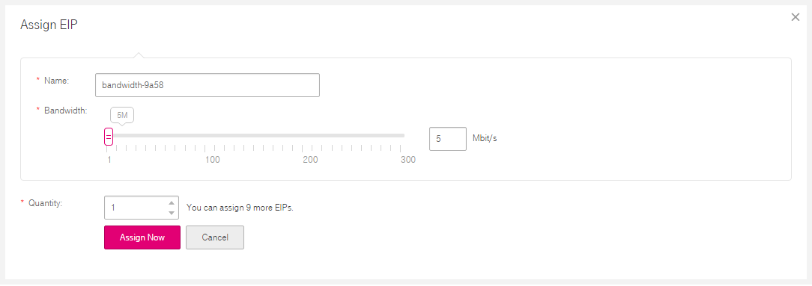
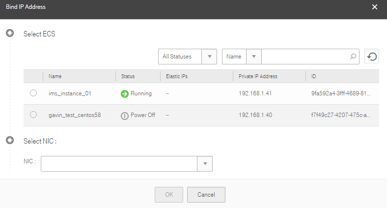

## Assigning an EIP and Binding It to an ECS

### Scenarios

You can assign an EIP and bind it to an ECS to enable the ECS to access the
Internet.
### Procedure

1.  Log in to the management console.

2.  On the console homepage, under **Network**, click **Virtual Private Cloud**.

3.  In the navigation pane on the left, choose **Elastic IP Address**.

4.  On the **Elastic IP Address** page, click **Assign EIP**.

5.  In the displayed **Assign EIP** area shown in <a href="#figure1">Figure 1</a>, set the parameters as prompted.

    <a name="figure1">**Figure 1**</a> Assign EIP

	

	 **Table 1**  Parameter description

	<table>
      <tr>
         <th>Parameter</th>
         <th>Description</th>
         <th>Example Value</th>         
      
     </tr>
     <tr>
        <td>Bandwidth Name</td>
         <td>Specifies the name of the bandwidth.</td>
         <td>bandwidth  </td>
       
     </tr>
     <tr>
            <td>Bandwidth Size </td>
         <td>Specifies the size of the bandwidth.  
		</td>
         <td>100  </td>
       
      
     </tr> 
     <tr>
           <td>Quantity </td>
         <td>Specifies the number of EIPs to be assigned.</td>
         <td> 1</td>

	</table>

	

	Only outbound bandwidth is limited.

1.  Click **Assign Now**.

2.  Click **Submit**.

1. On the **Elastic IP Address** page, locate the row that contains the target
    EIP, and click **Bind**.

2.  On the **Bind IP Address** page, select the required ECS and NIC.

   	**Figure 2** Bind IP Address

	

1.  Click **OK** in the displayed dialog box.
