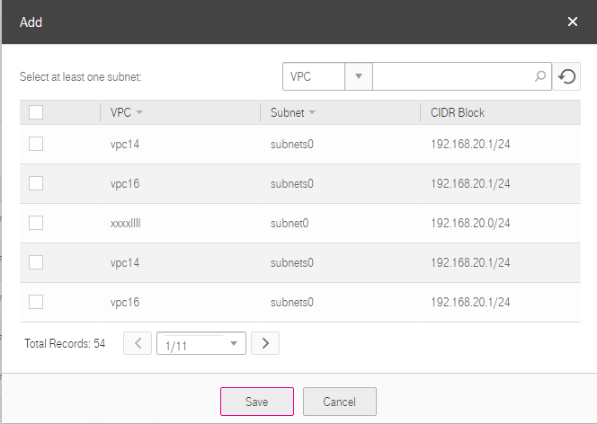

## Associating Subnets with a Firewall

### Scenarios

On the page showing firewall details, associate desired subnets with a firewall.

### Procedure

2.  Log in to the management console.

3.  On the console homepage, under **Network**, click **Virtual Private Cloud**.

4.  In the navigation tree on the left, click **Firewall**.

5.  Locate the target firewall in the right pane, and click the firewall name to
    switch to the page showing details of that particular firewall.

6.  On the displayed page, click the **Subnet Association** tab.

7.  On the **Subnet Association** page shown in <a href="#figure1">Figure 1</a>, click **Add**.

	<a name="figure1">**Figure 1**</a> Associating subnets
	

1.  On the displayed page, select the subnets to be associated with the
    firewall, and click **Save**.

	The selected subnets are associated with the firewall.

	

	Subnets that have already been associated with firewalls will not be displayed on the page for you to select. Currently, one-click subnet association and disassociation are not supported. Furthermore, a subnet can only be associated with one firewall. If you want to reassociate a subnet that has already been associated with another firewall, you must first disassociate the subnet from the original firewall.
