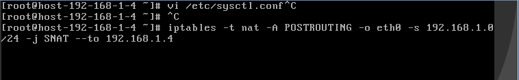
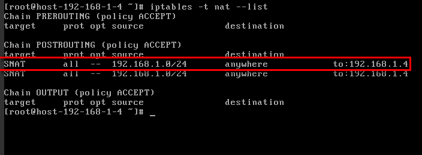

## Configuring the SNAT Server

### Scenarios

To use the route table function provided by the VPC service, you need to
configure the SNAT function on an ECS to enables other ECSs that do not have EIPs bound in a VPC to access the Internet through this ECS.

### Prerequisites

-   You have obtained the ECS where the SNAT function is to be deployed.

-   The ECS where the SNAT function is to be deployed runs the Linux OS.

-   The ECS where the SNAT function is to be deployed has only one network
    interface card (NIC) configured.

### Procedure

1.  Log in to the management console.

2.  On the console homepage, under **Computing**, click **Elastic Cloud Server**.

3.  On the displayed page, locate the target ECS in the ECS list and click the ECS name to switch to the page showing ECS details.

4.  Click **NIC** tab and disable the source/destination check function.

	By default, the source/destination check function is enabled. When this function is enabled, the system checks whether source IP addresses contained in the packets sent by ECSs are correct. If the IP addresses are incorrect, the system does not allow the ECSs to send the packets. This mechanism prevents packet spoofing, thereby improving system security. If the SNAT function is used, the SNAT server needs to forward packets. This mechanism prevents the packet sender from receiving returned packets. Therefore, you need to disable the source/destination check function for SNAT servers.

1.  Follow the steps provided in section Assigning an EIP and Binding It to an ECS to associate an EIP with the private IP address of the ECS.

	

	Do not associate the EIP with the floating private IP address.

1.  On the ECS console, use the remote login function to log in to the ECS for which the SNAT function is to be configured.

2.  Run the following command and enter the password of user **root** to switch to user **root**:

	**su - root**

1.  Run the following command to check whether the ECS can access the Internet.

	

	Before running the command, you must disable the response iptables rule on the ECS where the SNAT function is deployed and enable the security group rules.

	**ping www.google.com**

	The ECS can access the Internet if the following information is displayed:

	    [root\@localhost \~]\# ping www.google.com  
    	PING www.a.shifen.com (220.181.111.148) 56(84) bytes of data.  
    	64 bytes from 220.181.111.148: icmp_seq=1 ttl=51 time=9.34 ms  
    	64 bytes from 220.181.111.148: icmp_seq=2 ttl=51 time=9.11 ms  
    	64 bytes from 220.181.111.148: icmp_seq=3 ttl=51 time=8.99 ms

1.  Run the following command to check whether IP forwarding in Linux is
    enabled:

	**cat /proc/sys/net/ipv4/ip_forward**

	In the command output, **1** indicates enabled, and **0** indicates
**disabled**. The default value is **0**.

	-   If yes, go to step [11](#snat2).

	-   If no, perform step [10](#snat1) to enable IP forwarding in Linux.

	Many OSs support packet routing. Before forwarding packets, OSs change source IP addresses in the packets to OS IP addresses. Therefore, the forwarded packets contain the IP address of the public sender so that the response packets can be sent back in the same path to the initial packet sender. This method is called SNAT. The OSs need to keep track of the packets in which the IP addresses have been changed to ensure that the destination IP addresses in the packets can be rewritten and that packets can be forwarded to the initial packet sender. To achieve these purposes, you need to enable the IP forwarding function and configure SNAT rules.

1.  Use the vi editor to open **/etc/sysctl.conf** file, change the value of**net.ipv4.ip_forward** to **1**, enter **:wq** to save the change and exit.

	Run the following command to make the change take effect:

	**sysctl -p /etc/sysctl.conf**

1.  Configure the SNAT function.

	Run the following command to enable all ECSs on the network segment (for
	example, 192.168.1.0/24) to access the Internet using the SNAT function:

	**iptables -t nat -A POSTROUTING -o eth0 -s subnet -j SNAT --to nat-instance-ip**

	**Figure 1** Configuring the SNAT function

	

1.  Run the following command to check whether the operation is successful:

	**iptables -t nat --list**

	The operation is successful if information shown in Figure 2 (for example,192.168.1.0/24) is displayed.

	**Figure 2** Verifying configuration

	

	Add a route. For details, see section Adding a Route.

	The destination is **0.0.0.0/0**, and the next hop is the private IP address of the ECS where the SNAT function is deployed. For example, the next hop is **192.168.1.4**.
