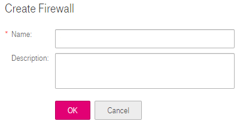

## Creating a Firewall

### Scenarios
Create a custom firewall. By default, a newly created firewall is disabled. It
does not have subnets associated with it nor does it have any inbound or
outbound rules. Each user can create a maximum of 200 firewalls by default.
### Procedure
2.  Log in to the management console.

3.  On the console homepage, under **Network**, click **Virtual Private Cloud**.

4.  In the navigation tree on the left, click **Firewall**.

5.  In the right pane displayed, click **Create Firewall**.

6.  In the displayed **Create Firewall** area shown in <a href="#figure1">Figure 1</a>, enter firewall information as prompted. <a href="#table1">Table 1</a> lists the parameters to be configured.

    <a name="figure1">**Figure 1**</a> Create Firewall

	

	<a name="table1">**Table 1**</a> Parameter description

	<table>
      <tr>
         <th>Parameter</th>
         <th>Description</th>
         <th>Example Value</th>         
      
     </tr>
     <tr>
        <td>Name</td>
         <td>Specifies the firewall name. This parameter is mandatory.
		The firewall name contains a maximum of 64 characters, which may consist of letters, digits, underscores (_), and hyphens (-). The name cannot contain spaces.
</td>
         <td>fw-34d6</td>
       
     </tr>
   	 <tr>
        <td>Description</td>
         <td>Provides supplementary information about the firewall. This parameter is optional.
			The firewall description can contain a maximum of 128 characters and cannot contain angle brackets (<) or (>).
</td>
         <td>N/A</td>
       
     </tr>
	
	</table>

2.  Click **OK**.

	The firewall is created.
