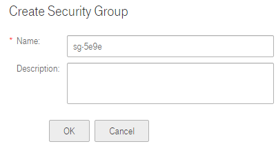
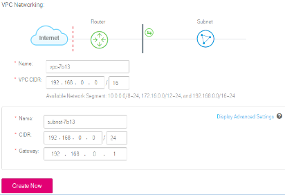

## Creating a Security Group

#### Scenarios

A security group is a collection of access control rules for ECSs that have the same security protection requirements and are mutually trusted in a VPC.

To improve ECS access security, you can create a security group and add ECSs in
the VPC to the security group.

After a security group is created, it comes with a default security group rule
if you do not specify a rule. The default security group rule allows all
outgoing data packets. ECSs in a security group can access each other without
the need to add rules. If the default rule meets your service requirements, you
do not need to add rules to the security group.

#### Procedure

2.  Log in to the management console.

3.  On the console homepage, under **Network**, click **Virtual Private Cloud**.

4.  In the navigation pane on the left, click **Security Group**.

5.  On the **Security Group** page, click **Create Security Group**.

6.  In the **Create Security Group** area as shown in <a href="#figure1">Figure 1</a>, set the parameters as prompted. <a href="#table1">Table 1</a> lists the parameters to be configured.

    <a name="figure1">**Figure 1**</a> Create Security Group

	

	**Figure 2** Parameter description

	

	 <a name="table1">**Table 1**</a> Parameter description

	<table>
      <tr>
         <th>Parameter</th>
         <th>Description</th>
         <th>Example Value</th>         
      
     </tr>
     <tr>
        <td>Name</td>
         <td>Specifies the security group name. This parameter is mandatory.The security group name contains a maximum of 64 characters, which consist of letters, digits, underscores (_), and hyphens (-). The name cannot contain spaces.
        
			 NOTE
			You can change the security group name after a security group is created. It is recommended that you use different names for different security groups.
</td>
         <td>sg-34d6</td>
       
     </tr>
     <tr>
            <td>Description</td>
         <td>Provides supplementary information about the security group. This parameter is optional.
			The security group description can contain a maximum of 128 characters and cannot contain angle brackets (<) or (>).
		</td>
         <td>N/A</td>
       
      
   
	</table>

2.  Click **OK**.
