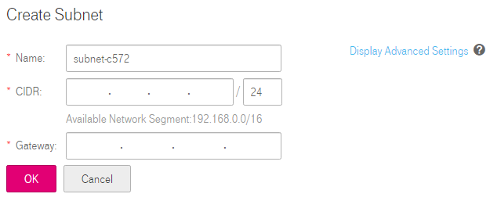

## Creating a Subnet for the VPC

### Scenarios

A subnet is automatically created by default when you create a VPC. If required,
you can create another subnet in the VPC.

#### Procedure

2.  Log in to the management console.

3.  On the console homepage, under **Network**, click **Virtual Private Cloud**.

4.  In the navigation pane on the left, select the VPC for which a subnet is to
    be created.

5.  On the **Subnet** page, click **Create Subnet**.

6.  In the **Create Subnet** area shown in <a href="#figure1">Figure 1</a>, set the parameters as prompted.

 	 <a name="figure1">**Figure 1**</a> Create Subnet

	
	

 	**Table 1**  Parameter description

	<table>
      <tr>
         <th>Parameter</th>
         <th>Description     </th>
         <th>Example Value</th>         
      
     </tr>
     <tr>
        <td>Name</td>
         <td>Specifies the subnet name.</td>
         <td>Subnet</td>
       
     </tr>
     <tr>
            <td>CIDR</td>
         <td>Specifies the CIDR block for the subnet. This value must be within the VPC CIDR range.
		</td>
         <td>192.168.0.0/24</td>
       
      
     </tr> 
     <tr>
           <td>Gateway</td>
         <td>Specifies the gateway address of the subnet.</td>
         <td>192.168.0.1</td>
       
       
        
     </tr> 

	</table>

2.  The external DNS server address is used by default. If you need to change
    the DNS server address, click **Show Advanced Settings** and configure the
    DNS server addresses. You must ensure that the configured DNS server
    addresses are available.

3.  Click **OK**.
