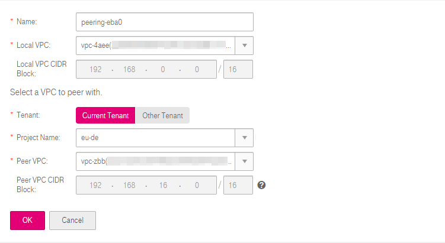
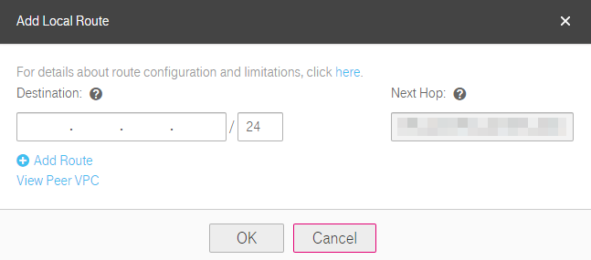

## Creating a VPC Peering Connection with Another VPC of Your Own

### Scenarios

To create a VPC peering connection, first create a request to peer with another
VPC. You can request a VPC peering connection with another VPC of your own in
the same region. The system automatically accepts the request.
### Prerequisites

Two VPCs in the same region have been created.

### Procedure

**Create a VPC peering connection.**

1.  Log in to the management console.

2.  On the console homepage, under **Network**, click **Virtual Private Cloud**.

3.  In the navigation pane on the left, choose **VPC Peering**.

4.  In the right pane displayed, click **Create VPC Peering Connection**.

5.  In the displayed area shown in Figure 1, configure parameters as prompted.You must select **Current Tenant** for **Tenant**. Table 1 lists the parameters to be configured.

    **Figure 1** Creating a VPC peering connection

	
	
	**Table 1** Parameter description
	<table>
      <tr>
         <th>Parameter</th>
         <th>Description     </th>
         <th>Example Value</th>         
      
     </tr>
     <tr>
        <td>Name</td>
         <td>Specifies the name of the VPC peering connection.The name contains a maximum of 64 characters, which consist of letters, digits, hyphens (-), and underscores (_).
	</td>
         <td>peering-001</td>
       
     </tr>
     <tr>
            <td>Local VPC</td>
         <td>Specifies the local VPC. You can select one from the drop-down list.
		</td>
         <td>vpc_002(0a396cff-8bc1-4509-98b9-267cae5ac460)</td>
       
      
     </tr> 
     <tr>
           <td>Local VPC CIDR Block</td>
         <td>Specifies the CIDR block for the local VPC.</td>
         <td>192.168.10.0/24</td>    
     </tr> 
	   <tr>
            <td>Tenant</td>
         <td>Specifies the tenant of the VPC to peer with.
			 -Current Tenant: The VPC peering connection will be created between your local VPC and a VPC of your own in the same region. 

			 -   Other Tenant: The VPC peering connection will be created between your local VPC and a VPC of another tenant in the same region. 
		</td>
         <td>N/A</td>

     </tr> 
  	<tr>
           <td>Project Name</td>
         <td>Specifies the project name. The project name of the current project is used by default. </td>
         <td>-</td>    
     </tr> 
	 	
	<tr>
           <td>Peer VPC</td>
         <td>Specifies the peer VPC. You can select one from the drop-down list if the VPC peering connection is created between two VPCs of your own. </td>
         <td>vpc_fab1(65d062b3-40fa-4204-8181-3538f527d2ab)</td>    
     </tr> 
	 	
	<tr>
           <td>Peer VPC CIDR Block</td>
         <td>Specifies the CIDR block for the peer VPC.The local and peer VPCs cannot have matching or overlapping CIDR blocks. Otherwise, the routes added for the VPC peering connection may not take effect.
 		</td>
         <td>92.168.2.0/24</td>    
     </tr> 
	</table>

1.  Click **OK**.

**Add routes for the VPC peering connection.**

If you request a VPC peering connection with a VPC of your own, the system automatically accepts the request. To enable communication between the two VPCs,you need to add routes for the VPC peering connection.

1.  On the console homepage, under **Network**, click **Virtual Private Cloud**.

2.  In the navigation pane on the left, choose **VPC Peering**.

3.  Locate the target VPC peering connection in the connection list shown in Figure 2.

    **Figure 2** VPC peering connection list

	

1.  Click the name of the VPC peering connection to switch to the page showing details about the connection.

2.  On the displayed page, click the **Local Route** tab.

3.  In the displayed **Local Route** area, click **Add Local Route**. In the displayed dialog box shown in Figure 3, add a local route. Table 2 lists the parameters to be configured.

    **Figure 3** Add Local Route

	

	**Table 2** Route parameter description

 	<table>
      <tr>
         <th>Parameter</th>
         <th>Description     </th>
         <th>Example Value</th>         
      
     </tr>
     <tr>
        <td>Destination</td>
         <td>Specifies the destination address. Set it to the peer VPC or subnet CIDR block.
	</td>
         <td>192.168.10.0/24</td>
       
     </tr>
     <tr>
            <td>Next Hop</td>
         <td>Specifies the next hop address. The default value is the VPC peering connection ID. Keep the default value.
		</td>
         <td>N/A</td>
       
      
     </tr> 
	</table>
2.  Click **OK** to switch to the page showing the VPC peering connection
    details.

3.  On the displayed page, click the **Peer Route** tab.

4.  In the displayed **Peer Route** area, click **Add Peer Route** and add a
    route.

5.  Click **OK** in the displayed dialog box.

After a VPC peering connection is created, the two VPCs can communicate with each other through private IP addresses.
