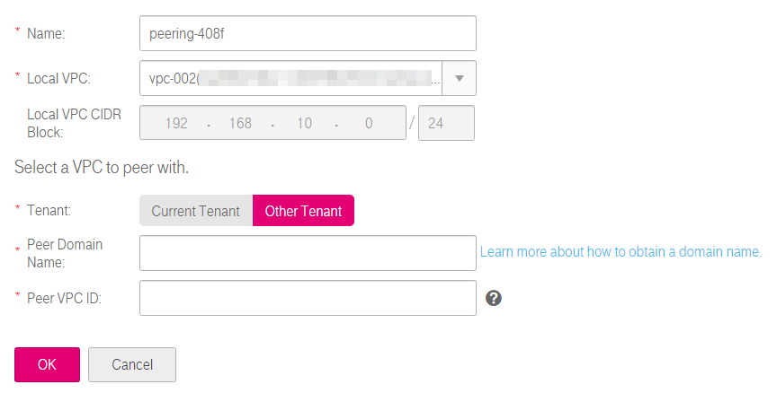
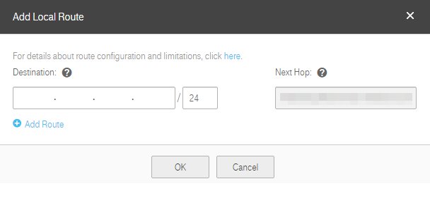
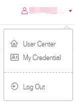
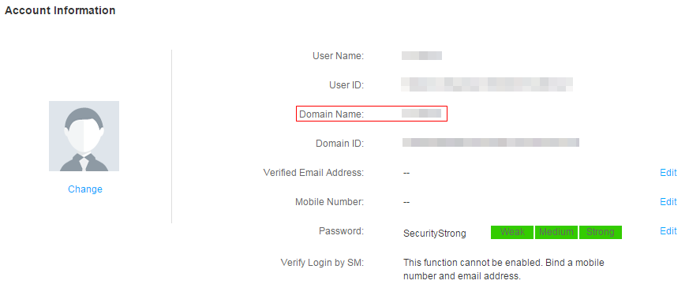

## Creating a VPC Peering Connection with a VPC of Another Tenant

### Scenarios

The VPC service also allows you to create a VPC peering connection with a VPC of another tenant. The two VPCs must be in the same region. If you request a VPC peering connection with a VPC of another tenant in the same region, the peer tenant must accept the request to activate the connection.

### Procedure

**Create a VPC peering connection.**

1.  Log in to the management console.

2.  On the console homepage, under **Network**, click **Virtual Private Cloud**.

3.  In the navigation pane on the left, choose **VPC Peering**.

4.  In the right pane displayed, click **Create VPC Peering Connection**.

5.  In the displayed area shown in Figure 1, configure parameters as
    prompted. You must select **Other Tenant** for **Tenant**. Table 1 lists the parameters to be configured.

    **Figure 1** Creating a VPC peering connection

	

	**Table 1** Parameter description

	<table>
      <tr>
         <th>Parameter</th>
         <th>Description     </th>
         <th>Example Value</th>         
      
     </tr>
     <tr>
        <td>Name</td>
         <td>Specifies the name of the VPC peering connection.The name contains a maximum of 64 characters, which consist of letters, digits, hyphens (-), and underscores (_).
	</td>
         <td>peering-001</td>
       
     </tr>
     <tr>
            <td>Local VPC</td>
         <td>Specifies the local VPC. You can select one from the drop-down list.
		</td>
         <td>vpc_002(0a396cff-8bc1-4509-98b9-267cae5ac460)</td>
       
      
     </tr> 
     <tr>
           <td>Local VPC CIDR Block</td>
         <td>Specifies the CIDR block for the local VPC.</td>
         <td>192.168.10.0/24</td>    
     </tr> 
	   <tr>
            <td>Tenant</td>
         <td>Specifies the tenant of the VPC to peer with.
			 -Current Tenant: The VPC peering connection will be created between your local VPC and a VPC of your own in the same region. 

			 -   Other Tenant: The VPC peering connection will be created between your local VPC and a VPC of another tenant in the same region. 
		</td>
         <td>N/A</td>

     </tr> 
  	<tr>
           <td>Project Name</td>
         <td>Specifies the project name. The project name of the current project is used by default. </td>
         <td>-</td>    
     </tr> 
	 	
	<tr>
           <td>Peer Domain Name</td>
         <td>For details about how to obtain a domain name, see section How to Obtain a Domain Name. </td>
         <td>N/A</td>    
     </tr> 
	 	
	<tr>
           <td>Peer VPC ID</td>
         <td>Specifies the ID of the peer VPC.
 		</td>
         <td>65d062b3-40fa-4204-8181-3538f527d2ab</td>    
     </tr> 
	</table>

1.  Click **OK**.

**Accept the VPC peering connection.**

To request a VPC peering connection with a VPC of another tenant, the peer
tenant must accept the request to activate the connection.

1.  The peer tenant logs in to the management console.

2.  On the console homepage, under **Network**, click **Virtual Private Cloud**.

3.  In the navigation pane on the left, choose **VPC Peering**.

4.  Locate the target VPC peering connection in the connection list shown in Figure 2.

  	**Figure 2** VPC peering connection list

	

1.  Locate the row that contains the target VPC peering connection in the
    connection list, and click **Accept Request** in the **Operation** column.

2.  Click **OK** in the displayed dialog box.

**Refuse a VPC peering connection.**

The peer tenant can reject any received VPC peering connection request. After a
VPC peering connection request is rejected, the connection will not be
established. You must delete the rejected VPC peering connection request before
creating a VPC peering connection between the same VPCs as those in the rejected
request.

1.  The peer tenant logs in to the management console.

2.  On the console homepage, under **Network**, click **Virtual Private Cloud**.

3.  In the navigation pane on the left, choose **VPC Peering**.

4.  In the right pane displayed, locate the target VPC peering connection in the
    connection list.

5.  Click **Reject Request** in the **Operation** column.

6.  Click **OK** in the displayed dialog box.

**Add routes for the VPC peering connection.**

If you request a VPC peering connection with a VPC of another tenant, the peer
tenant must accept the request. To enable communication between the two VPCs,
you need to add routes for the VPC peering connection. The local tenant can add
only the local route because the local tenant does not have the required
permission to perform operations on the peer VPC. The peer tenant must add the
peer route. The procedure for adding a local route is the same as that for
adding a peer route. The procedure is as follows:

1.  Log in to the management console.

2.  On the console homepage, under **Network**, click **Virtual Private Cloud**.

3.  In the navigation pane on the left, choose **VPC Peering**.

4.  Locate the target VPC peering connection in the connection list.

5.  Click the name of the VPC peering connection to switch to the page showing
    details about the connection.

6.  On the displayed page, click the **Local Route** tab.

7.  In the displayed **Local Route** area, click **Add Local Route**. In the
    displayed dialog box shown in Figure 3, add a local route. Table 2
    lists the parameters to be configured.

    **Figure 3** Add Local Route

	

	**Table 2** Route parameter description

 	<table>
      <tr>
         <th>Parameter</th>
         <th>Description     </th>
         <th>Example Value</th>         
      
     </tr>
     <tr>
        <td>Destination</td>
         <td>Specifies the destination address. Set it to the peer VPC or subnet CIDR block.
	</td>
         <td>192.168.10.0/24</td>
       
     </tr>
     <tr>
            <td>Next Hop</td>
         <td>Specifies the next hop address. The default value is the VPC peering connection ID. Keep the default value.
		</td>
         <td>N/A</td>
       
      
     </tr> 
	</table>

2.  Click **OK**.

	The routes are added for the VPC peering connection.

	After a VPC peering connection is created, the two VPCs can communicate with each other through private IP addresses. If the two VPC cannot communicate with each other, check the configuration by following the instructions provided in section 6.36 What Can I Do If VPCs in a VPC Peering Connection Cannot Communicate with Each Other?.
### How to Obtain a Domain Name

2.  Log in to the management console.

3.  Click the username in the upper right corner. In the displayed area shown in Figure 4, select **My Credential**.

    **Figure 4** My Credential
 
	  

1.  In the **Account Information** area shown in Figure 5, obtain the domain name of the user.

   	**Figure 5** Domain Name

	
