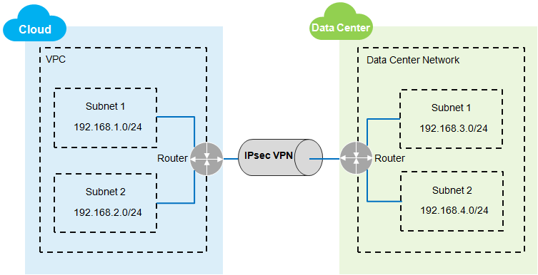
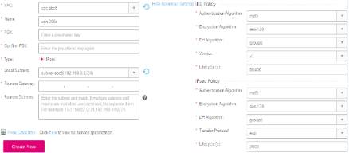
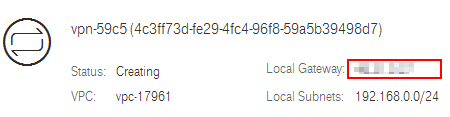

## Creating a VPN
### Overview

By default, ECSs in a VPC cannot communicate with your physical data center or
private network. To enable communication between them, enable the VPN function.
To enable the VPN function, you need to create a VPN in your VPC and update the
security group rules.

### Description of a Simple IPsec VPN Intranet Topology

As shown in <a href="#figure1">Figure 1</a>, you have created a VPC that has two subnets, 192.168.1.0/24 and 192.168.2.0/24, in the cloud. You also have two subnets, 192.168.3.0/24 and 192.168.4.0/24 on your router deployed in your physical data center. In this case, you can create a VPN to connect the VPC subnets to the data center subnets.

Currently, the site-to-site VPN and hub-spoke VPN are supported. In addition to
creating a VPN in your VPC, you also need to set up a VPN in your physical data
center to establish the VPN connection.

You must ensure that the VPN in your VPC and that in your physical data center
use the same IKE and IPsec policy configurations. Before creating a VPN,
familiarize yourself with the protocols described in <a href="#table1">Table 1</a> and ensure that your device meets the requirements and configuration constraints of the involved protocols.

<a name="table1">**Table 1**</a>  IPsec policy

<table>
      <tr>
         <th>RFC</th>
         <th>Description</th>
         <th>Example Value</th>         
      
     </tr>
     <tr>
        <td>RFC2409</td>
         <td>Defines the IKE protocol, which negotiates and verifies key information to safeguard VPN connections.</td>
         <td>
			<ul>
   				<li>Use the PSK to reach an IKE peer agreement.</li>
				<li>Use the main mode to perform the negotiation.</li>
			</ul>
</td>
       
     </tr>
   	 <tr>
        <td>RFC4301</td>
         <td>Defines the IPsec architecture, the security services that IPsec offers, and the collaboration between components.</td>
         <td>Set up a VPN connection using the IPsec tunnel.</td>
       
     </tr>
	</table>

<a name="figure1">**Figure 1**</a> IPsec VPN

### Scenarios

Perform the following steps to create an IPsec VPN that sets up a secure,
isolated communication tunnel between your data center and cloud services.

####Procedure#####

2.  Sign up and log in to the management console.

3.  On the console homepage, under **Network**, click **Virtual Private Cloud**.

4.  In the navigation pane on the left, choose **VPN**.

5.  On the **VPN** page, click **Create VPN**.

6.  Set the parameters as prompted and click **Create Now**.

	**Figure 2** Create VPN

	

	<a href="#table2">Table 2</a>, <a href="#table3">Table 3</a>, and <a href="#table4">Table 4</a> lists the parameters and their descriptions.

	 <a name="table2">**Table 2**</a>  Basic parameters

	<table>
      <tr>
         <th>RFC</th>
         <th>Description</th>
         <th>Example Value</th>         
      
     </tr>
     <tr>
        <td>VPC</td>
         <td>Specifies the VPC name.</td>
         <td>VPC-001</td>
       
     </tr>
   	 <tr>
        <td>Name</td>
         <td>Specifies the name of the VPN.</td>
         <td>VPN-001</td>
       
     </tr>
	<tr>
        <td>Confirm PSK</td>
         <td>Specifies the confirm pre-shared key.</td>
         <td>Test@123</td>
       
     </tr>
	<tr>
        <td>Type</td>
         <td>Specifies the VPN type. IPsec is selected by default.</td>
         <td>IPsec</td>
       
     </tr>
	<tr>
        <td>Local Subnets</td>
         <td>Specifies the VPC subnets that need to communicate with your data center or private network.</td>
         <td>192.168.1.0/24
			192.168.2.0/24
		</td>
       
     </tr>
	<tr>
        <td>Remote Gateway</td>
         <td>Specifies the public IP address of the VPN in your data center or on the private network. This IP address is used for communicating with the VPC VPN.</td>
         <td>88.88.88.88
		</td>
       
     </tr>
	<tr>
        <td>Remote Subnets</td>
         <td>Specifies the subnets of your data center or private network for communicating with the VPC.</td>
         <td>192.168.3.0/24
		192.168.4.0/24

		</td>
       
     </tr>
	</table>
 <a name="table3">**Table 3**</a>   IKE policy

	<table>
      <tr>
         <th>RFC</th>
         <th>Description</th>
         <th>Example Value</th>         
      
     </tr>
     <tr>
        <td>Authentication Algorithm</td>
         <td>Specifies the authentication hash algorithm. The value can be <b>sha1</b>, <b>sha2-256</b>, <b>sha2-384</b>, <b>sha2-512</b>, or <b>md5</b>.</td>
         <td>sha1</td>
       
     </tr>
   	 <tr>
        <td>Encryption Algorithm</td>
         <td>Specifies the encryption algorithm. The value can be <b>aes-128</b>, <b>aes-192</b>, <b>aes-256</b>, or <b>3des</b>. The 3des algorithm is not recommended because it is risky.</td>
         <td>aes-128</td>
       
     </tr>

	<tr>
        <td>DH Algorithm</td>
         <td>Specifies the Diffie-Hellman key exchange algorithm. The value can be <b>group2</b>, <b>group5</b>, or <b>group14</b>.</td>
         <td>group5</td>
       
     </tr>
	<tr>
        <td>Version</td>
         <td>Specifies the version of the IKE protocol. The value can be <b>V1</b> or <b>V2</b>.</td>
         <td>v1
		</td>
       
     </tr>
	<tr>
        <td>Lifecycle (s)</td>
         <td>Specifies the lifetime of the security association (SA), in seconds.
			The SA will be renegotiated if its lifetime expires.
		</td>
         <td>86,400
		</td>

	</table>
 
 	<a name="table4">**Table 4**</a>  IPsec policy

	<table>
      <tr>
         <th>RFC</th>
         <th>Description</th>
         <th>Example Value</th>         
      
     </tr>
     <tr>
        <td>Authentication Algorithm</td>
         <td>Specifies the authentication hash algorithm. The value can be <b>sha1</b>, <b>sha2-256</b>, <b>sha2-384</b>, <b>sha2-512</b>, or <b>md5<b>.</td>
         <td>sha1</td>
       
     </tr>
   	 <tr>
        <td>Encryption Algorithm</td>
         <td>Specifies the encryption algorithm. The value can be <b>aes-128</b>, <b>aes-192</b>, <b>aes-256</b>, or <b>3des</b>. The 3des algorithm is not recommended because it is risky.</td>
         <td>aes-128</td>
       
     </tr>

	<tr>
        <td>DH Algorithm</td>
         <td>Specifies the Diffie-Hellman key exchange algorithm. The value can be <b>group2</b>, <b>group5</b>, or <b>group14</b>.</td>
         <td>group5</td>
       
     </tr>
	<tr>
        <td>Transfer Protocol</td>
         <td>Specifies the security protocol used for IPsec to transmit and encapsulate user data. The value can be <b>ah</b>, <b>esp</b>, or <b>ah-esp</b>.</td>
         <td>esp
		</td>
       
     </tr>
	<tr>
        <td>Lifecycle (s)</td>
         <td>Specifies the lifetime of the SA, in seconds.
			The SA will be renegotiated if its lifetime expires.

		</td>
         <td>3600
		</td>

	</table>

	

	The IKE policy specifies the encryption and authentication algorithms to use in the negotiation phase of an IPsec tunnel. The IPsec policy specifies the protocol, encryption algorithm, and authentication algorithm to use in the data transmission phase of an IPsec tunnel. These parameters must be the same between your VPC VPN and your data center VPN. If they are different, the VPN tunnel cannot be set up.

1.  Click **Submit**.

	After the IPsec VPN is created, a public network egress IP address is assigned to the IPsec VPN. This IP address is the local gateway address of a created VPN on the VPN page shown in <a href="#figure3">Figure 3</a>. When configuring the peer tunnel in your data center, you must set the remote gateway address to this IP address.

	<a name="figure3">**Figure 3**</a> Gateway egress IP address

	

1.  Due to the symmetry of the tunnel, you also need to configure the IPsec VPN
    on your router or firewall in the data center.

