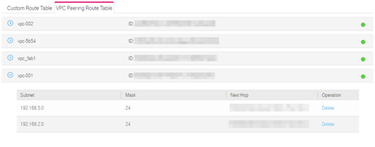

## Deleting a Route from the VPC Peering Route Table

### Scenarios

After routes are added for a VPC peering connection, both the local and peer
tenants can delete the routes of the VPC peering connection from the VPC peering route table.
### Procedure

2.  Log in to the management console.

3.  On the console homepage, under **Network**, click **Virtual Private Cloud**.

4.  In the navigation pane on the left, select a VPC from the VPC drop-down list.

5.  In the navigation pane on the left, choose **Route Table**.

6.  In the right pane displayed, click the **VPC Peering Route Table** tab and view routes configured for VPC peering connections.

7.  Click on the left of the VPC name to display route information about the VPC peering connection as shown in Figure 1.

    **Figure 1** VPC Peering Route Table

	

1.  Locate the row that contains the target route, and click **Delete** in the
    **Operation** column.

2.  Click **OK** in the displayed dialog box.
