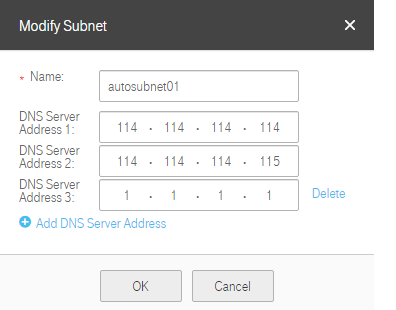

## Modifying a Subnet

### Scenarios

If the DNS server address configured for a subnet during subnet creation needs
to be modified, you can modify the subnet.
### Procedure

2.  Log in to the management console.

3.  On the console homepage, under **Network**, click **Virtual Private Cloud**.

4.  In the navigation pane on the left, select the VPC for which the subnet is
    to be modified.

5.  On the **Subnet** page, locate the target subnet, and click **Modify**.
    Modify the parameters as prompted in the dialog box shown in <a href="#figure1">Figure 1</a>.

    <a name="figure1">**Figure 1**</a>  Modify Subnet

	 

	**Table 1** Parameter description

	<table>
      <tr>
         <th>Parameter</th>
         <th>Description</th>
         <th>Example Value</th>         
      
     </tr>
     <tr>
        <td>Name</td>
         <td>Specifies the subnet name.</td>
         <td>Subnet</td>
       
     </tr>
   	 <tr>
        <td>DNS Server Address 1</td>
         <td>Specifies the IP address of DNS server 1. You can leave it blank. By default, the external DNS server address is used.</td>
         <td>N/A</td>
       
     </tr>

	<tr>
        <td>DNS Server Address 2</td>
         <td>Specifies the IP address of DNS server 2. You can leave it blank. By default, the external DNS server address is used.</td>
         <td>N/A</td>
       
     </tr>
	<tr>
        <td>Add DNS Server Address</td>
         <td>Two DNS server addresses are configured for a subnet by default. If you need more DNS servers, you can use this option to add DNS server addresses.</td>
         <td>N/A
		</td>
       
     </tr>

	</table>

2.  Click **OK**.
