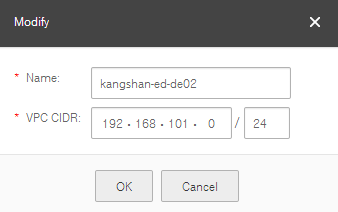

## Modifying a VPC

### Scenarios

If the VPC CIDR conflicts with the subnet of a VPN created in the VPC, you can
modify the VPC to change the VPC address range.

### Procedure

2.  Log in to the management console.

3.  On the console homepage, under **Network**, click **Virtual Private Cloud**.

4.  On the **Virtual Private Cloud** page, locate the VPC to be modified and
    click .

5.  On the **Modify** dialog box shown in <a href="#figure1">Figure 1</a>, set the parameters as
    prompted.

    <a name="figure1">**Figure 1**</a> Modifying a VPC

	

1.  Click **OK**.
