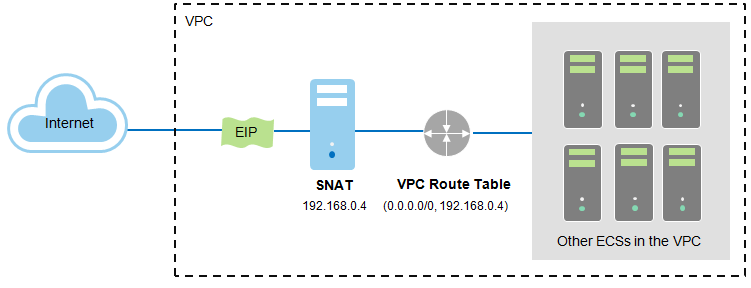
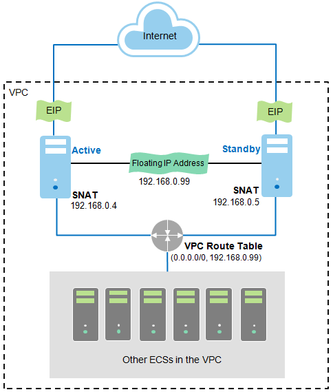

## Route Table

A route table contains a set of rules that are used to determine where network
traffic is directed. You can add routes to a route table to enable other ECSs in
a VPC to access the Internet through the ECS that has an EIP bound.

You can use the route table function configured in standalone or active/standby
mode.

-   Figure 1 shows the route table function configured in standalone mode.

	**Figure 1** Route table function configured in standalone mode

	

	In standalone mode, ECSs that do not have EIPs in a VPC access the Internet through an ECS that has an EIP bound and has the SNAT function configured.

	In standalone mode, you can add a route table for the VPC used by ECSs that do not have EIPs bound to enable these ECSs to access the Internet. The next hop in the route table is set to the private IP address of the ECS that has an EIP bound (that is the private IP address of the SNAT server).

-   Figure 2 shows the route table function configured in active/standby mode.

    **Figure 2** Route table function configured in active/standby mode

	

	In active/standby mode, ECSs that do not have EIPs in a VPC access the Internet through two ECSs that have EIPs bound and have the SNAT function configured.

	In active/standby mode, you can add a route table for the VPC used by ECSs that do not have EIPs bound to enable these ECSs to access the Internet. The next hop in the route table is set to the floating private IP address of the two ECSs that have EIPs bound.

In both the standalone and active/standby modes, the ECSs that have EIPs bound must have the SNAT function. For details about the SNAT function, see section
<a href="SNAT.md">SNAT</a>. For details about how to configure an ECS as the SNAT server, see section <a href="Configuring the SNAT Server.md">Configuring the SNAT Server</a>.

-   You need to deploy the source network address translation (SNAT) function.
    For details, see section <a href="Configuring the SNAT Server.md">Configuring the SNAT Server</a>.

-   The ECS providing the SNAT function can have only one network interface card
    (NIC).

-   The ECS providing the SNAT function must have the source/destination check
    function disabled.

-   In active/standby mode, if the floating private IP address is set to the
    next hop in a route table, EIPs bound with all floating private IP addresses
    in the VPC will become invalid.
