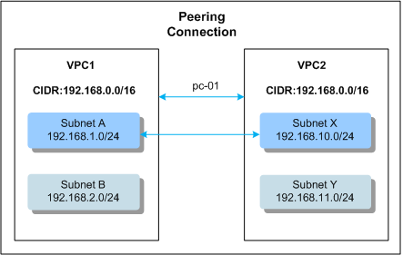
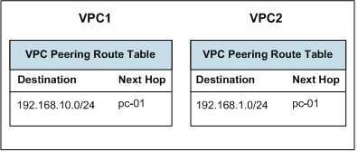
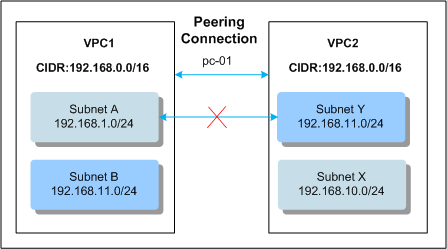

## VPC Peering Connection Configuration Plans

To enable two VPCs to communicate with each other, you can create a VPC peering
connection between the two VPCs. If the two VPCs have non-overlapping CIDR
blocks, you can configure routes that point to entire VPCs for the VPC peering
connection. If the two VPCs have overlapping CIDR blocks, you can only configure
routes that point to specific subnets of the VPCs for the VPC peering
connection.

-   Configurations with Routes to Entire VPCs

	-   Configurations with routes to entire VPCs include the following: two VPCs peered together and multiple VPCs peered together.

	-   No matter in which configuration, if you need to configure routes that point to entire VPCs in a VPC peering connection, none of the VPCs involved in the connection can have overlapping CIDR blocks. Otherwise, the VPC peering connection does not take effect because the routes are unreachable.

	-   The destination address of the route that points to an entire VPC is the CIDR block of the peer VPC, and the next hop is the VPC peering connection ID.

-   Configurations with Routes to Specific Subnets

	If VPCs in a VPC peering connection have overlapping CIDR blocks, the peering connection can only be created to enable communication between subnets in the VPCs. If subnets in the VPCs of a VPC peering connection have overlapping network segments, the peering connection does not take effect. To create a VPC peering connection, ensure that the VPCs involved do not contain overlapping subnets.

	For example, VPC1 and VPC2 have matching CIDR blocks, but the subnets in the two VPCs do not overlap. Then, a VPC peering connection can be created between two subnets that do not overlap with each other in the two VPCs. The route table is used to control the specific subnets for which the VPC peering connection is created. Figure 1 shows a VPC peering connection created between two subnets. Routes are required to enable communication between Subnet A in VPC1 and Subnet X in VPC2 in the figure.

	Figure 2 shows the routes configured for the VPC peering connection between Subnet A and Subnet X. After the routes are configured, Subnet A and Subnet X are peered with each other and can communicate with each other.
	
	**Figure 1** VPC peering connection

	

 	**Figure 2** VPC peering connection route table

 	

	If two VPCs have overlapping subnets, the VPC peering connection created between the two subnets does not take effect, and the subnets cannot communicate with each other.

	As shown in Figure 3, Subnet B and Subnet Y have matching network segments.Therefore, a VPC peering connection cannot be created between Subnet A and Subnet Y.

	**Figure 3** Invalid VPC peering connection

	

	If VPC1 is peered with multiple VPCs, such as VPC2, VPC3, and VPC4, the subnet CIDR blocks of VPC1 cannot overlap with those of the VPCs (VPC2, VPC3, and VPC4). If VPC2, VPC3, and VPC4 have overlapping subnets, a VPC peering connection can be created between only one of these overlapping subnets and a subnet of VPC1. If a VPC peering connection is created between a subnet and the other *N* subnets, all the subnets cannot have overlapping CIDR blocks.
