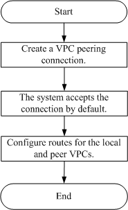

## VPC Peering Connection Creation Procedure

A VPC peering connection is a networking connection between two VPCs that
enables you to route traffic between them using private IP addresses. ECSs in either VPC can communicate with each other just as if they were in the same VPC. You can create a VPC peering connection between your own VPCs, or between your VPC and another tenant's VPC within the same region.

-   Procedure for creating a VPC peering connection with another VPC of your own

	

	If you create a VPC peering connection between two VPCs of your own, the system automatically accepts the connection by default. You need to create routes for the local and peer VPCs to enable communication between the two VPCs.

-   Procedure for creating a VPC peering connection with a VPC of another tenant

	

	If you create a VPC peering connection between your VPC and another tenant's VPC, the VPC peering connection is in the **Awaiting acceptance** state. After the peer tenant accepts the connection, the connection status changes to **Accepted**. The local and peer tenants must configure the routes required by the VPC peering connection to enable communication between the two VPCs.

	If the local and peer VPCs have overlapping CIDR blocks, the routes added for the VPC peering connection may be invalid. Before creating a VPC peering connection between two VPCs that have overlapping CIDR blocks, ensure that no subnets in the two VPCs have overlapping CIDR blocks. The created VPC peering connection enables communication between two subnets in the two VPCs.
