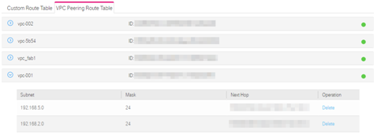

## Viewing Routes Configured for a VPC Peering Connection in the VPC Peering Route Table

### Scenarios

After routes are added for a VPC peering connection, both the local and peer
tenants can view information about routes of the VPC peering connection in the VPC peering route table.

### Procedure

2.  Log in to the management console.

3.  On the console homepage, under **Network**, click **Virtual Private Cloud**.

4.  In the navigation pane on the left, select a VPC from the VPC drop-down
    list.

5.  In the navigation pane on the left, choose **Route Table**.

6.  In the displayed right pane shown in Figure 1 , click the **VPC Peering Route Table** tab and view route information.

    **Figure 1** VPC Peering Route Table

	
