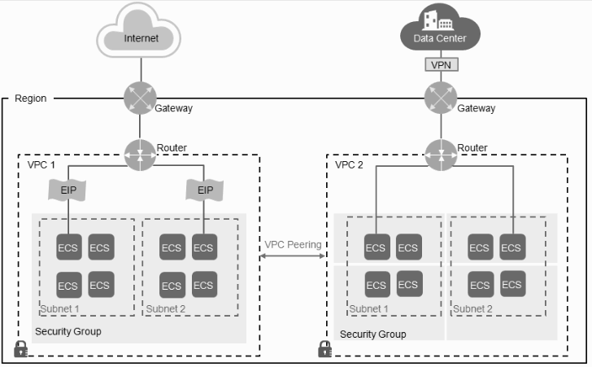

## Virtual Private Cloud

The Virtual Private Cloud (VPC) service enables you to provision logically
isolated, configurable, and manageable virtual networks for Elastic Cloud
Servers (ECSs), improving security of resources in the cloud system and
simplifying network deployment.

You can create security groups and VPNs, configure IP address segments, and
specify bandwidth sizes in your VPC. With a VPC, you can manage and configure
internal networks and change network configurations, simplifying network
management. You can also customize access rules to control ECS access within a
security group and across different security groups to enhance ECS security.

To be specific, a VPC enables you to:

<ul><li>Have full control over your virtual networks, for example, creating your own network.</li>
<li>Create security groups to improve your network security.</li>
<li>Assign elastic IP addresses (EIPs) for use in a VPC, and bind them to ECSs in your VPC to connect the ECSs to the Internet.</li>
<li>Use a VPN to connect a VPC to your physical data center for smooth application migration to the cloud.</li>
<li>Two VPCs can communicate with each other using the VPC peering connection.
<dd><b>Figure 1</b> VPC components</dd></li></ul>
  