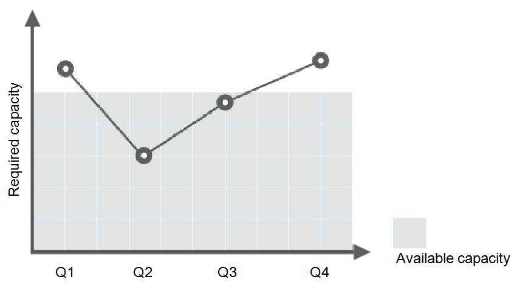
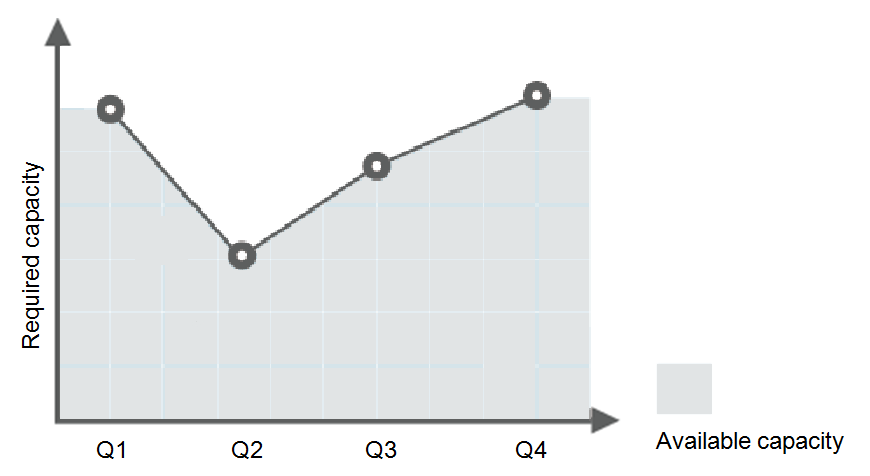
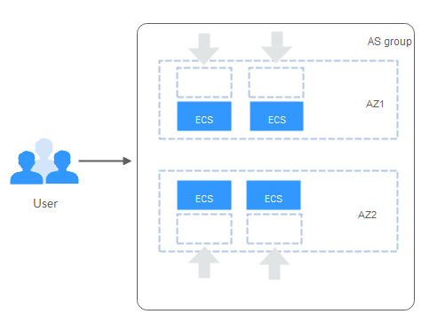

# AS Advantages

The AS service automatically adjusts service resources based on your service requirements and configured AS policies. It has the advantages of automatic resource adjustment, reduced cost, improved availability and fault tolerance. The AS service applies to the following scenarios:

-   Service load changes of a forum website with heavy access traffic are difficult to predict. ECS metrics, such as  **CPU Usage**  and  **Memory Usage**  are monitored in real time to dynamically adjust the number of ECSs.
-   During large-scale promotion campaigns on an e-commerce website, ECSs and the bandwidth need to be increased periodically to ensure that the campaigns go smooth.
-   A live video website broadcasts popular programs during 14:00-16:00 every day. ECSs and the bandwidth need to be increased during this period to ensure that services run stably.

## Automatic Resource Adjustment

AS adds instances and increases bandwidth for your application system when the access volume increases and reduces extra resources from the system when the access volume drops, ensuring stable system running.

-   Scaling ECSs on Demand

    AS adjusts resources for an application system based on demand, thereby enhancing cost management. Resources are adjusted in the following ways:

    -   Dynamic resource adjustment

        AS adjusts resources when an alarm policy is triggered. For details, see  [Dynamically Expanding Resources](dynamically-expanding-resources.md).

    -   Planned resource adjustment

        AS adjusts resources when a periodic or scheduled policy is triggered. For details, see  [Expanding Resources as Planned](expanding-resources-as-planned.md).

    -   Manual resource adjustment

        Resources are adjusted if you manually change the expected number of instances, or add instances to or remove instances from an AS group. For details, see  [Manually Expanding Resources](manually-expanding-resources.md).

    For example, there is a basic web application running on the public cloud. You can buy train tickets using this application. This application is rarely used during Q2 and Q3 because personnel mobility is weak. However, it is frequently used during Q1 and Q4 because personnel mobility is strong in these periods of time. Generally, a large number of servers are added to the system, as shown in  [Figure 1](#en-us_topic_0190953966_fig5650831994251). Alternatively, the capacity required for processing the average demand is added, as shown in  [Figure 2](#en-us_topic_0190953966_fig2116647195317). However, these two solutions may waste resources or cannot meet demand spikes. After you enable AS for your application, AS automatically adjusts the number of servers based on requirements to reduce cost and meet demand spikes, as shown in  [Figure 3](#en-us_topic_0190953966_fig2219215695354).

    **Figure  1**  Redundant server resources  
    

    **Figure  2**  Insufficient server resources  
    

    **Figure  3**  Auto-scaled service capacity  
    

-   Scaling Bandwidth on Demand

    AS adjusts bandwidth for an application system based on demand, thereby enhancing cost management.

    You can select the following scaling policies to adjust the IP bandwidth based on site requirements:

    -   Alarm Policy

        You can set the alarm triggering conditions such as outbound traffic and bandwidth. When the system detects that the triggering conditions are met, the system automatically adjusts the bandwidth.

    -   Scheduled Policy

        The system can automatically increase, decrease, or adjust the bandwidth to a fixed value at a fixed time according to the scheduled policy.

    -   Periodic Policy

        The system can periodically adjust the bandwidth based on the periodic policy, reducing the workload of manually setting the bandwidth.

    The following uses the alarm policy as an example:

    For example, the service load changes of a live video website in different time periods are difficult to predict. Therefore, the bandwidth needs to be dynamically adjusted between 10 Mbit/s and 30 Mbit/s based on metrics such as outbound traffic and inbound traffic. AS can automatically adjust the bandwidth to meet requirements. You need to select the target EIP and create two alarm policies. One policy is to add 2 Mbit/s when the outbound traffic is greater than  _xxx_  bytes, with the limit set to 30 Mbit/s. The other policy is to reduce 2 Mbit/s when the outbound traffic is less than  _xxx_  bytes, with the limit set to 10 Mbit/s.

-   Evenly Distributing Instances by AZ

    Instances are evenly distributed in different AZs to reduce the impacts of power and network faults on the stability of the system.

    A region is a geographic area where resources used by your ECSs are located. Each region contains many AZs where power and networks are physically isolated. AZs in the same region can communicate with each other over an intranet. Each AZ provides cost-effective and low-latency network connections that are unaffected by faults in other AZs.

    An AS group can contain ECS instances from one or more AZs in a region. To adjust resources, AS evenly distributes ECS instances in AZs in any of the following cases:

    **Evenly distributing new instances to balanced AZs**

    AS can evenly distribute ECS instances among the AZs used by an AS group. To this end, AS moves new instances to the AZs with the least instances.

    For example, four instances are evenly distributed in two AZs used by an AS group. If a scaling action is triggered to add four more instances to the AS group, AS adds two to each AZ.

    **Figure  4**  Evenly distributing instances  
    

    **Re-balancing instances in unbalanced AZs**

    After you manually add or reduce instances in one of the balanced AZs, these AZs become unbalanced. The next scaling action will preferentially re-balance the instances in the AZs.

    For example, three instances are distributed in AZ 1 and AZ 2 used by an AS group, two in AZ 1 and one in AZ 2. If a scaling action is triggered to add five more instances to the AS group, AS adds two to AZ 1 and three to AZ 2.

    **Figure  5**  Re-balancing instances  
    

## Enhanced Cost Management

AS enables you to use instances and bandwidth on demand by automatically adjusting resources in the system, thus eliminating waste of resources and reducing costs for you.

## Improved Availability

AS ensures that the application system consistently has a proper resource capacity to comply with access volume requirements. When AS is used with ELB, the AS group automatically binds the load balancing listener to the newly added instances. Access traffic is automatically distributed to all the instances of an AS group through the listener.

**Using ELB with AS**

AS automatically adds resources when services increase and reduces resources when services decrease. Ensure that traffic of applications are distributed to all instances of an AS group. This problem can be solved by using ELB with AS.

After ELB is enabled in an AS group, AS automatically binds the instances newly added to the AS group to a load balancing listener. Then, ELB automatically distributes access traffic to all ECS instances in the AS group through the listener, improving system availability. If the instances in the AS group are carrying multiple services, you can add multiple load balancing listeners to the AS group to listen to each of these services, improving service scalability.

## High Error Tolerance

AS monitors instance status in the application system. After detecting an unhealthy instance, AS replaces it with a new one. In addition, AS evenly distributes instances between AZs to ensure system stability.

