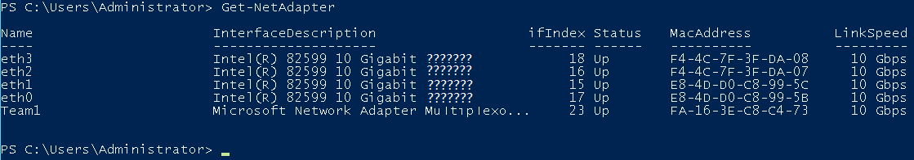
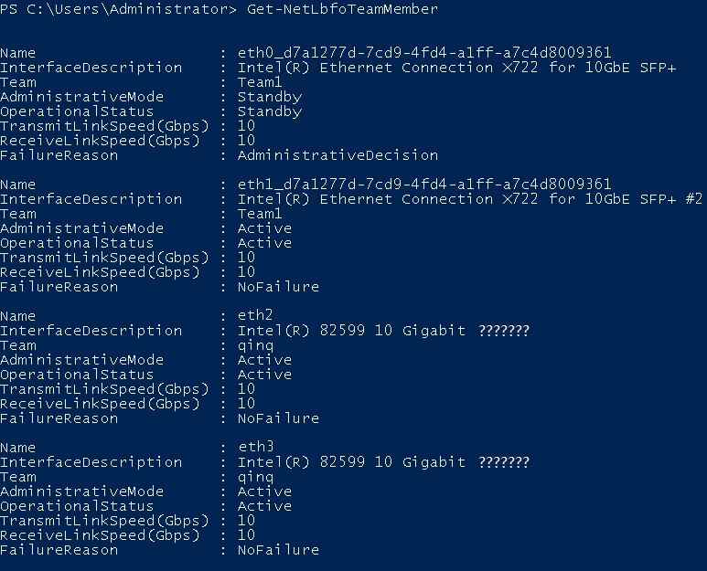
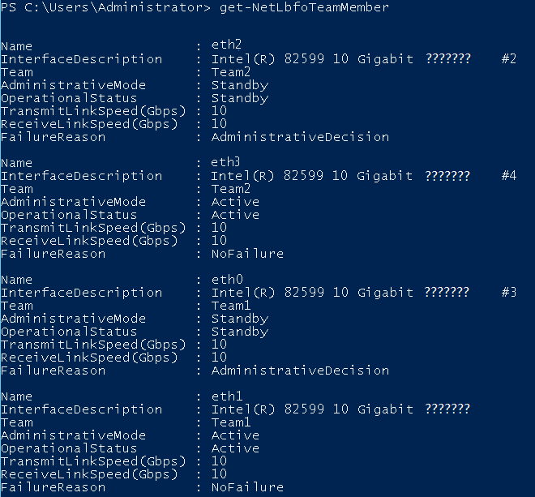
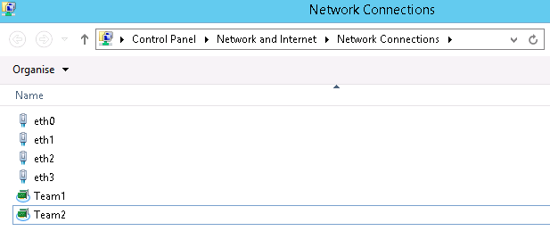

# Configuring a User-defined VLAN \(Windows Server\)

This section uses Windows Server 2012 R2 Standard as an example to describe how to configure a user-defined VLAN for BMSs.

> **NOTE:**   
>The configuration methods of other Windows Server OSs are similar to that of Windows Server 2012 R2 Standard.  

1.  Log in to a Windows BMS.
2.  On the Windows PowerShell CLI of the BMS, run the following command to check the NIC information:

    **Get-NetAdapter**

    Information similar to the following is displayed.

    

    > **NOTE:**   
    >Among the devices, eth0 and eth1 bear the VPC, and eth2 and eth3 bear the user-defined VLAN. The following steps use eth2 and eth3 to configure a user-defined VLAN.   

3.  To improve the outbound traffic on the OS, perform the operations in  [Method 1](#li7981720132719). If there is no special requirement on traffic, perform the operations in  [Method 2](#li15395216102810).
    -   **Method 1: Use the switch independent mode for the team in the OS. The outbound traffic is distributed across all active NICs, and the inbound traffic is received through one of the NICs in the team.**

    1.  Run the following command to create a port group for the user-defined VLAN:

        **New-NetLbfoTeam -Name** _qinq_ **-TeamMembers** **"**_eth2_**","**_eth3_**"** **-TeamingMode SwitchIndependent -LoadBalancingAlgorithm Dynamic -Confirm:$false**

        

        > **NOTE:**   
        >In the command,  _qinq_  is the name of the port group planned for the user-defined VLAN, and  _eth2_  and  _eth3_  are the network devices that bear the user-defined VLAN obtained in step  [2](#li11441348154412).   

    2.  Run the following command to query the network adapters:

        **Get-NetLbfoTeamMember**

        

        **Get-NetAdapter**

        

    -   **Method 2: Use the active-active mode for the team in the OS.**

    1.  Run the following command to create a port group for the user-defined VLAN:

        **New-NetLbfoTeam -Name** _Team2_ **-TeamMembers** **"**_eth2_**","**_eth3_**" -TeamingMode SwitchIndependent -LoadBalancingAlgorithm IPAddresses -Confirm:$false**

        

        > **NOTE:**   
        >In the command,  _Team2_  is the name of the port group planned for the user-defined VLAN, and  _eth2_  and  _eth3_  are the network devices that bear the user-defined VLAN obtained in step  [2](#li11441348154412).   

    2.  Run the following command to set a network port of port group Team2 created in  [3.a](#li125519380337)  to the standby port:

        **Set-NetLbfoTeamMember -Name "**_eth2_**"** **-AdministrativeMode Standby -Confirm:$false**

        > **NOTE:**   
        >The port group configured for the user-defined VLAN supports only the active/standby mode.  _eth2_  is one of the ports of the port group. You can determine which port is configured as the standby port based on your planning.   

        **get-NetLbfoTeamMember**

        

        **Get-NetAdapter**

        

4.  Run the following command to enter the  **Network Connections**  page:

    **ncpa.cpl**

    Then enter the following page.

    

5.  Configure a user-defined VLAN.
    
    1.  On the  **Network Connections**  page, double-click port group  **Team2**  created in  [3](#li202764020268)  to switch to the  **Team2 Status**  page.
    2.  Click  **Next**  to switch to the  **Team2 Properties**  page.
    3.  On the  **Networking**  tab page, double-click  **Internet Protocol Version 4 \(TCP/IPv4\)**  to switch to the  **Internet Protocol Version 4 \(TCP/IPv4\) Properties**  page.
4.  Select  **Use the following IP address**, configure the IP address and subnet mask, and click  **OK**.
    
    
    
        > **NOTE:**   
        >If the IP address planned for the user-defined VLAN does not conflict with the VPC network segment, you can plan the IP address as needed, only to ensure that BMSs communicating through the user-defined VLAN are in the same network segment as the user-defined VLAN.  

6.  Perform the preceding operations to configure other BMSs.
7.  After all BMSs are configured, ping the IP addresses of other BMSs from each BMS.

    

8.  If you want to configure VLAN sub-interfaces to isolate network planes, perform the following operations:

    Run the following command to create a VLAN sub-interface based on the existing Team2:

    **Add-NetLbfoTeamNIC** **-Team** **"Team2"** **-VlanID** _XXX_ **-Confirm:$false**

    In the preceding command,  **Team2**  indicates the bond name, and  _XXX_  indicates the VLAN ID.

    

    After the VLAN sub-interface is created, configure the IP address and subnet mask of network port Team2-VLAN 500 by referring to  [4](#li1133314684418)  and  [5](#li129292252615).

