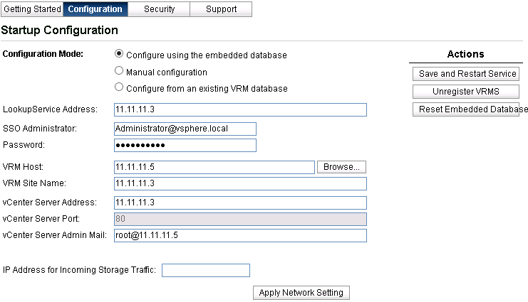

# Deploying Other VMware Components

## Deploying VMware vSphere Replication

1.  Log in to vCenter \(Mozilla Firefox is recommended\) and deploy vSphere Replication.
    1.  Mount the downloaded ISO image to the jump VM. Right-click  **Data Center**  and select  **Deploy OVF Template**. Select files  **vSphere\_Replication\_OVF10.ovf**,  **vSphere\_Replication-system.vmdk**, and  **vSphere\_Replication-support.vmdk**  in the  **/bin**  directory.
    2.  The configurations are as follows:
        -   **Download Size**:  **868.3 MB**
        -   **Disk Space**:  **18.0 GB**
        -   **Name**:  **vSphere\_Replication\_SRM**
        -   **Data Center**:  **DataCenter**
        -   **Destination**:  **11.11.11.101**
        -   **Disk Storage**:  **thick provisioning lazy zeroed**
        -   **Network Mapping**:  **Management Network to DPortGroup-mgmt**
        -   **IP Address Assignment Mode**:  **static-manual, IPv4**
        -   Properties:

            Domain name server=replication

            Network 1 IPv4 address=11.11.11.5

            Network 1 subnet mask=255.255.255.0

            Default IPv4 gateway: 11.11.11.1

            NTP server list=172.16.0.102

2.  Power on the vSphere Replication device and log in to the NSX Manager GUI through a browser.

    Login address:  **https://**_vr-applicance-address:5480_

    Log in to the GUI as user  **root**  and using the password you set during installation.

3.  Register vCenter Single Sign-On for vSphere Replication.

    On the  **Configuration**  page, enter an IP address for  **LookupService Address**, enter  **administrator@vsphere.local**  for  **SSO Administrator**  and its password, save the change, and restart the service.

    

4.  Log in to the vSphere Web Client again. vSphere Replication is displayed on the homepage.
5.  Repeat the preceding steps at the target site to install vSphere Replication. Click the  **Configuration**  tab. In the navigation pane on the left, choose  **vSphere Replication**  \>  **Target Site**  and click  . In the displayed dialog box, enter the username and password of the target site and click  **Log In**. Select the remote site you want to connect to and click  **OK**.
6.  If the target site is in the  **Connected**  state, the source and target sites are connected successfully.
7.  To isolate vSphere Replication and other networks, see  [Isolating the Network Traffic of vSphere Replication](https://docs.vmware.com/en/vSphere-Replication/6.5/com.vmware.vsphere.replication-admin.doc/GUID-16677363-4265-4815-9C1C-DAAA3AE500CD.html).

## Deploying VMware vCenter Site Recovery Manager

1.  Upload the SRM installation package through the jump VM, double-click the installation program, select the language, and click  **OK**.
2.  Select the target folder. During the installation, register Site Recovery Manager with vSphere Platform Services Controller. Enter the address, username, and password, and click  **Next**.
3.  After the installation is complete, log in to vCenter again.  **Site Restoration**  is displayed on the homepage.
4.  Select  **Site Restoration**. On the displayed page, pair Site Recovery Manager of the target site, enter the IP address of the vCenter Server that matches SRM extension, and enter the username and password.
5.  After connecting to the Site Recovery Manager Server, you need to establish a connection between the SRM and the remote SRM Server. Log in to the vSphere Web Client at one site, choose  **Site Restoration**  \>  **Sites**, right-click the remote site, enter the SSO username and password, and click  **Log In**.

