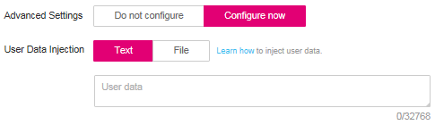

# Injecting User Data into BMSs<a name="EN-US_TOPIC_0083737011"></a>

## Application Scenarios<a name="section114413173019"></a>

Use the user data injection function to inject user data into BMSs to:

-   Use scripts to simplify BMS configuration.
-   Use scripts to initialize the BMS OS configuration.
-   Upload your scripts to BMSs during BMS creation.
-   Use scripts to perform other operations.

## Restrictions<a name="section152433348328"></a>

-   For Linux:
    -   The image that is used to create BMSs must have Cloud-Init installed.
    -   The user data to be injected must be less than or equal to 32 KB.
    -   User data uploaded as text can contain only ASCII characters. User data uploaded as a file can contain any characters, and the file size must be less than or equal to 32 KB.
    -   The image that is used to create ECSs must be a public image, a private image created based on a public image, or a private image with Cloud-Init installed.
    -   The format of the customized scripts must comply with user data script specifications.
    -   DHCP must be enabled for the VPC, and port 80 must be enabled for the security group in the outbound direction.

-   For Windows:
    -   The image that is used to create BMSs must have Cloudbase-Init installed.
    -   The user data to be injected must be less than or equal to 32 KB.
    -   User data uploaded as text can contain only ASCII characters. User data uploaded as a file can contain any characters, and the file size must be less than or equal to 32 KB.
    -   The image that is used to create ECSs must be a public image, a private image created based on a public image, or a private image with Cloudbase-Init installed.
    -   DHCP must be enabled for the VPC, and port 80 must be enabled for the security group in the outbound direction.


## Use Methods<a name="section1864520172424"></a>

1.  Create a user data script, the format of which complies with user data script specifications. For details, see section  [Related Links](#section1753215178819).
2.  When creating a BMS, set  **Advanced Settings**  to  **Configure now**, and paste the content of the user data script to the  **User Data Injection**  text box or upload the user data file.

    **Figure  1**  Injecting user data<a name="fig5574112882011"></a>  
    

3.  The created BMS automatically runs Cloud-Init or Cloudbase-Init to read the user data script upon startup.

## User Data Scripts of Linux BMSs<a name="section197491352211"></a>

Customized user data scripts of Linux BMSs are based on the open-source Cloud-Init architecture. This architecture uses BMS metadata as the data source for automatically configuring the BMSs. The customized script types are compatible with open-source Cloud-Init. For details about Cloud-Init, see  [http://cloudinit.readthedocs.io/en/latest/topics/format.html](http://cloudinit.readthedocs.io/en/latest/topics/format.html).

-   Script execution time: A customized user data script is executed after the time when the status of the target BMS changes to  **Running**  and before the time when  **/etc/init**  is executed.

    > **NOTE:**   
    >By default, the scripts are executed as user  **root**.  

-   Script type: Both user-data scripts and Cloud-Config data scripts are supported.

    **Table  1**  Linux BMS script types

    <a name="table039994053718"></a>
    <table><thead align="left"><tr id="row4399194017376"><th class="cellrowborder" valign="top" width="9%" id="mcps1.2.4.1.1"><p id="p1239916402370"><a name="p1239916402370"></a><a name="p1239916402370"></a>-</p>
    </th>
    <th class="cellrowborder" valign="top" width="43%" id="mcps1.2.4.1.2"><p id="p1939914407374"><a name="p1939914407374"></a><a name="p1939914407374"></a>User-Data Script</p>
    </th>
    <th class="cellrowborder" valign="top" width="48%" id="mcps1.2.4.1.3"><p id="p1439913405374"><a name="p1439913405374"></a><a name="p1439913405374"></a>Cloud-Config Data</p>
    </th>
    </tr>
    </thead>
    <tbody><tr id="row3399194012374"><td class="cellrowborder" valign="top" width="9%" headers="mcps1.2.4.1.1 "><p id="p3399174019374"><a name="p3399174019374"></a><a name="p3399174019374"></a>Description</p>
    </td>
    <td class="cellrowborder" valign="top" width="43%" headers="mcps1.2.4.1.2 "><p id="p239984053714"><a name="p239984053714"></a><a name="p239984053714"></a>Scripts, such as Shell and Python scripts, are used for custom configurations.</p>
    </td>
    <td class="cellrowborder" valign="top" width="48%" headers="mcps1.2.4.1.3 "><p id="p839964053718"><a name="p839964053718"></a><a name="p839964053718"></a>Methods pre-defined in Cloud-Init, such as the Yum source and SSH key, are used for configuring certain BMS applications.</p>
    </td>
    </tr>
    <tr id="row73991405372"><td class="cellrowborder" valign="top" width="9%" headers="mcps1.2.4.1.1 "><p id="p1399174073719"><a name="p1399174073719"></a><a name="p1399174073719"></a>Format</p>
    </td>
    <td class="cellrowborder" valign="top" width="43%" headers="mcps1.2.4.1.2 "><p id="p7604786420"><a name="p7604786420"></a><a name="p7604786420"></a>A script must be started with <span class="parmvalue" id="parmvalue25671095321313"><a name="parmvalue25671095321313"></a><a name="parmvalue25671095321313"></a><b>#!</b></span>, for example, <span class="parmvalue" id="parmvalue1569820674213056"><a name="parmvalue1569820674213056"></a><a name="parmvalue1569820674213056"></a><b>#!/bin/bash</b></span> and <span class="parmvalue" id="parmvalue982854425213127"><a name="parmvalue982854425213127"></a><a name="parmvalue982854425213127"></a><b>#!/usr/bin/env python</b></span>.</p>
    <p id="p173991540123716"><a name="p173991540123716"></a><a name="p173991540123716"></a>When a script is started for the first time, it will be executed at the rc.local-like level, indicating a low priority in the boot sequence.</p>
    </td>
    <td class="cellrowborder" valign="top" width="48%" headers="mcps1.2.4.1.3 "><p id="p113991340193713"><a name="p113991340193713"></a><a name="p113991340193713"></a>The first line must be <span class="parmvalue" id="parmvalue65262554154555"><a name="parmvalue65262554154555"></a><a name="parmvalue65262554154555"></a><b>#cloud-config</b></span>, and no space is allowed in front of it.</p>
    </td>
    </tr>
    <tr id="row3399114093716"><td class="cellrowborder" valign="top" width="9%" headers="mcps1.2.4.1.1 "><p id="p73991440103715"><a name="p73991440103715"></a><a name="p73991440103715"></a>Constraint</p>
    </td>
    <td class="cellrowborder" valign="top" width="43%" headers="mcps1.2.4.1.2 "><p id="p7399104013377"><a name="p7399104013377"></a><a name="p7399104013377"></a>Before Base64 encoding, the size of the script, including the first line, cannot exceed 32 KB.</p>
    </td>
    <td class="cellrowborder" valign="top" width="48%" headers="mcps1.2.4.1.3 "><p id="p5400134023711"><a name="p5400134023711"></a><a name="p5400134023711"></a>Before Base64 encoding, the size of the script, including the first line, cannot exceed 32 KB.</p>
    </td>
    </tr>
    <tr id="row11400540123715"><td class="cellrowborder" valign="top" width="9%" headers="mcps1.2.4.1.1 "><p id="p7599171419383"><a name="p7599171419383"></a><a name="p7599171419383"></a>Frequency</p>
    </td>
    <td class="cellrowborder" valign="top" width="43%" headers="mcps1.2.4.1.2 "><p id="p144004404378"><a name="p144004404378"></a><a name="p144004404378"></a>The script is executed only once when the BMS is started for the first time.</p>
    </td>
    <td class="cellrowborder" valign="top" width="48%" headers="mcps1.2.4.1.3 "><p id="p7400164012372"><a name="p7400164012372"></a><a name="p7400164012372"></a>The execution frequency varies according to the applications configured on the BMS.</p>
    </td>
    </tr>
    </tbody>
    </table>

-   How can I view the customized user data injected into a Linux BMS?
    1.  Log in to the BMS.
    2.  Run the following command to view the customized user data as user  **root**:

        **curl** **http://169.254.169.254/openstack/latest/user\_data**


-   Script usage examples

    This section describes how to inject scripts in different formats into Linux BMSs and view script execution results.

    **Example 1: Inject a User-Data script.**

    When creating a BMS, set  **User Data Injection**  to  **Text**  and enter the customized user data script.

    ```
    #!/bin/bash
    echo "Hello, the time is now $(date -R)" | tee /root/output.txt
    ```

    After the BMS is created, start it and run the  **cat  _\[file\]_**  command to check the script execution result.

    ```
    [root@XXXXXXXX ~]# cat /root/output.txt
    Hello, the time is now Mon, 16 Jul 2016 16:03:18+0800
    ```

    **Example 2: Inject a Cloud-Config Data script.**

    When creating a BMS, set  **User Data Injection**  to  **Text**  and enter the customized user data script.

    ```
    #cloud-config
    bootcmd:
    - echo 192.168.1.130 us.archive.ubuntu.com >> /etc/hosts
    ```

    After the BMS is created, start it and run the  **cat** **/etc/hosts**  command to check the script execution result.

    **Figure  2**  Viewing the running result<a name="fig1787242875415"></a>  
    


## User Data Scripts of Windows BMSs<a name="section104581829185617"></a>

Customized user data scripts of Windows BMSs are based on the open-source Cloudbase-Init architecture. This architecture uses BMS metadata as the data source for initializing and automatically configuring the BMSs. The customized script types are compatible with open-source Cloudbase-Init. For details about Cloudbase-Init, see  [https://cloudbase-init.readthedocs.io/en/latest/userdata.html](https://cloudbase-init.readthedocs.io/en/latest/userdata.html).

-   Script type: Both batch-processing program scripts and PowerShell scripts are supported.

    **Table  2**  Windows BMS script types

    <a name="table17839134102219"></a>
    <table><thead align="left"><tr id="row168401412224"><th class="cellrowborder" valign="top" width="8.91089108910891%" id="mcps1.2.4.1.1"><p id="p9840194120228"><a name="p9840194120228"></a><a name="p9840194120228"></a>-</p>
    </th>
    <th class="cellrowborder" valign="top" width="43.56435643564357%" id="mcps1.2.4.1.2"><p id="p1584013415223"><a name="p1584013415223"></a><a name="p1584013415223"></a>Batch-Processing Program Script</p>
    </th>
    <th class="cellrowborder" valign="top" width="47.524752475247524%" id="mcps1.2.4.1.3"><p id="p884014192212"><a name="p884014192212"></a><a name="p884014192212"></a>PowerShell Script</p>
    </th>
    </tr>
    </thead>
    <tbody><tr id="row1384019418223"><td class="cellrowborder" valign="top" width="8.91089108910891%" headers="mcps1.2.4.1.1 "><p id="p784064142212"><a name="p784064142212"></a><a name="p784064142212"></a>Format</p>
    </td>
    <td class="cellrowborder" valign="top" width="43.56435643564357%" headers="mcps1.2.4.1.2 "><p id="p984016414220"><a name="p984016414220"></a><a name="p984016414220"></a>The script must be started with <span class="parmvalue" id="parmvalue76648425916272"><a name="parmvalue76648425916272"></a><a name="parmvalue76648425916272"></a><b>rem cmd</b></span>, which is the first line of the script. No space is allowed at the beginning of the first line.</p>
    </td>
    <td class="cellrowborder" valign="top" width="47.524752475247524%" headers="mcps1.2.4.1.3 "><p id="p138409411221"><a name="p138409411221"></a><a name="p138409411221"></a>The script must be started with <span class="parmvalue" id="parmvalue975646085162756"><a name="parmvalue975646085162756"></a><a name="parmvalue975646085162756"></a><b>#ps1</b></span>, which is the first line of the script. No space is allowed at the beginning of the first line.</p>
    </td>
    </tr>
    <tr id="row11840841202215"><td class="cellrowborder" valign="top" width="8.91089108910891%" headers="mcps1.2.4.1.1 "><p id="p1840174162220"><a name="p1840174162220"></a><a name="p1840174162220"></a>Constraint</p>
    </td>
    <td class="cellrowborder" valign="top" width="43.56435643564357%" headers="mcps1.2.4.1.2 "><p id="p19840184112223"><a name="p19840184112223"></a><a name="p19840184112223"></a>Before Base64 encoding, the size of the script, including the first line, cannot exceed 32 KB.</p>
    </td>
    <td class="cellrowborder" valign="top" width="47.524752475247524%" headers="mcps1.2.4.1.3 "><p id="p384017415229"><a name="p384017415229"></a><a name="p384017415229"></a>Before Base64 encoding, the size of the script, including the first line, cannot exceed 32 KB.</p>
    </td>
    </tr>
    </tbody>
    </table>

-   How can I view the customized user data injected into a Windows BMS?
    1.  Log in to the BMS.
    2.  Access the following URL in the address box of the browser and view the injected user data:

        **http://169.254.169.254/openstack/latest/user\_data**


-   Script usage examples

    This section describes how to inject scripts in different formats into Windows BMSs and view script execution results.

    **Example 1: Inject a batch-processing program script.**

    When creating a BMS, set  **User Data Injection**  to  **Text**  and enter the customized user data script.

    ```
    rem cmd
    echo "Hello, BAT Test" > C:\1111.txt
    ```

    After the BMS is created, start it and check the script execution result. In this example, a text file named  **1111**  is added to disk C:\\.

    **Figure  3**  Creating text file  **1111**<a name="fig8622411077"></a>  
    

    To view the user data injected into the Windows BMS, log in at http://169.254.169.254/openstack/latest/user\_data.

    **Figure  4**  Viewing user data 1111<a name="fig14281122141212"></a>  
    

    **Example 2: Inject a PowerShell script.**

    When creating a BMS, set  **User Data Injection**  to  **Text**  and enter the customized user data script.

    ```
    #ps1
    echo "Hello, Powershell Test" > C:\aaaa.txt
    ```

    After the BMS is created, start it and check the script execution result. In this example, a text file named  **aaaa**  is added to disk C:\\.

    **Figure  5**  Creating text file  **aaaa**<a name="fig103618447159"></a>  
    

    To view the user data injected into the Windows BMS, log in at http://169.254.169.254/openstack/latest/user\_data.

    **Figure  6**  Viewing user data aaaa<a name="fig124617204176"></a>  
    


## Case 1<a name="section6298124315470"></a>

This case illustrates how to use the user data injection function to simplify BMS configuration.

In this example, vim is configured to enable syntax highlighting, display line numbers, and set the tab stop to  **4**. Configuration file  **.vimrc**  is created and injected into the  **/root/.vimrc**  directory during BMS creation. After the BMS is created, vim is automatically configured based on your requirements. This helps to improve BMS configuration efficiency, especially in batch ECS creation scenarios.

The content of the script file to be injected is as follows:

```
#cloud-config
write_files:
  - path: /root/.vimrc
    content: |
      syntax on
      set tabstop=4
      set number      
```

## Case 2<a name="section93711419175416"></a>

This case illustrates how to use the user data injection function to reset the password for logging in to a Linux BMS.

In this example, the password of user  **root**  is reset to "\*\*\*\*\*\*".

> **NOTE:**   
>The new password must meet the password complexity requirements listed in  [Table 3](#table17998105810568).  

**Table  3**  Password requirements

<a name="table17998105810568"></a>
<table><thead align="left"><tr id="row169981758195617"><th class="cellrowborder" valign="top" width="20%" id="mcps1.2.4.1.1"><p id="p18998155814569"><a name="p18998155814569"></a><a name="p18998155814569"></a>Parameter</p>
</th>
<th class="cellrowborder" valign="top" width="60%" id="mcps1.2.4.1.2"><p id="p299925805610"><a name="p299925805610"></a><a name="p299925805610"></a><strong id="b842352706174218"><a name="b842352706174218"></a><a name="b842352706174218"></a>Requirements</strong></p>
</th>
<th class="cellrowborder" valign="top" width="20%" id="mcps1.2.4.1.3"><p id="p69991585565"><a name="p69991585565"></a><a name="p69991585565"></a>Example Value</p>
</th>
</tr>
</thead>
<tbody><tr id="row11999115816565"><td class="cellrowborder" valign="top" width="20%" headers="mcps1.2.4.1.1 "><p id="p199975816561"><a name="p199975816561"></a><a name="p199975816561"></a>Password</p>
</td>
<td class="cellrowborder" valign="top" width="60%" headers="mcps1.2.4.1.2 "><a name="ul887614358573"></a><a name="ul887614358573"></a><ul id="ul887614358573"><li>Consists of 8 characters to 26 characters.</li><li>Must contain at least three of the following character types:<a name="ul16512152335816"></a><a name="ul16512152335816"></a><ul id="ul16512152335816"><li>Uppercase letters</li><li>Lowercase letters</li><li>Digits</li><li>Special characters !@$%^-_=+[]{}:,./?</li></ul>
</li><li>Cannot contain the username or the username in reverse.</li><li>Cannot contain more than two characters in the same sequence as they appear in the username. (This requirement applies only to Windows BMSs.)</li></ul>
</td>
<td class="cellrowborder" valign="top" width="20%" headers="mcps1.2.4.1.3 "><p id="p699916580568"><a name="p699916580568"></a><a name="p699916580568"></a>Test12$@</p>
</td>
</tr>
</tbody>
</table>

The content of the script file to be injected is as follows. \(Retain the indentation in the following script.\)

```
#cloud-config
chpasswd:
  list: |
    root:******
  expire: False
```

After the BMS is created, you can use the reset password to log in to it. To ensure system security, change the password of user  **root**  after logging in to the BMS for the first time.

## Case 3<a name="section12403842045"></a>

This case illustrates how to use the user data injection function to create a user on a Windows BMS and configure the password for the user.

In this example, the user's username is  **abc**, its password is  **\*\*\*\*\*\***, and the user is added to the  **administrators**  user group.

> **NOTE:**   
>The new password must meet the password complexity requirements listed in  [Table 4](#table82807424619).  

**Table  4**  Password requirements

<a name="table82807424619"></a>
<table><thead align="left"><tr id="en-us_topic_0083737011_row169981758195617"><th class="cellrowborder" valign="top" width="20%" id="mcps1.2.4.1.1"><p id="en-us_topic_0083737011_p18998155814569"><a name="en-us_topic_0083737011_p18998155814569"></a><a name="en-us_topic_0083737011_p18998155814569"></a>Parameter</p>
</th>
<th class="cellrowborder" valign="top" width="60%" id="mcps1.2.4.1.2"><p id="en-us_topic_0083737011_p299925805610"><a name="en-us_topic_0083737011_p299925805610"></a><a name="en-us_topic_0083737011_p299925805610"></a><strong id="en-us_topic_0083737011_b842352706174218"><a name="en-us_topic_0083737011_b842352706174218"></a><a name="en-us_topic_0083737011_b842352706174218"></a>Requirements</strong></p>
</th>
<th class="cellrowborder" valign="top" width="20%" id="mcps1.2.4.1.3"><p id="en-us_topic_0083737011_p69991585565"><a name="en-us_topic_0083737011_p69991585565"></a><a name="en-us_topic_0083737011_p69991585565"></a>Example Value</p>
</th>
</tr>
</thead>
<tbody><tr id="en-us_topic_0083737011_row11999115816565"><td class="cellrowborder" valign="top" width="20%" headers="mcps1.2.4.1.1 "><p id="en-us_topic_0083737011_p199975816561"><a name="en-us_topic_0083737011_p199975816561"></a><a name="en-us_topic_0083737011_p199975816561"></a>Password</p>
</td>
<td class="cellrowborder" valign="top" width="60%" headers="mcps1.2.4.1.2 "><a name="en-us_topic_0083737011_ul887614358573"></a><a name="en-us_topic_0083737011_ul887614358573"></a><ul id="en-us_topic_0083737011_ul887614358573"><li>Consists of 8 characters to 26 characters.</li><li>Must contain at least three of the following character types:<a name="en-us_topic_0083737011_ul16512152335816"></a><a name="en-us_topic_0083737011_ul16512152335816"></a><ul id="en-us_topic_0083737011_ul16512152335816"><li>Uppercase letters</li><li>Lowercase letters</li><li>Digits</li><li>Special characters !@$%^-_=+[]{}:,./?</li></ul>
</li><li>Cannot contain the username or the username in reverse.</li><li>Cannot contain more than two characters in the same sequence as they appear in the username. (This requirement applies only to Windows BMSs.)</li></ul>
</td>
<td class="cellrowborder" valign="top" width="20%" headers="mcps1.2.4.1.3 "><p id="en-us_topic_0083737011_p699916580568"><a name="en-us_topic_0083737011_p699916580568"></a><a name="en-us_topic_0083737011_p699916580568"></a>Test12$@</p>
</td>
</tr>
</tbody>
</table>

The content of the script file to be injected is as follows:

```
rem cmd
net user abc ****** /add
net localgroup administrators abc /add
```

After the BMS is created, you can use the created username and password to log in to it.

## Case 4<a name="section9250241316"></a>

This case illustrates how to use the user data injection function to update system software packages for a Linux BMS and enable the HTTPd service. After the user data is injected, you can use the HTTPd service.

The content of the script file to be injected is as follows:

```
#!/bin/bash
yum update -y
service httpd start
chkconfig httpd on
```

## Case 5<a name="section1053071411620"></a>

This case illustrates how to use the user data injection function to assign user  **root**  permission for remotely logging in to a Linux BMS. After injecting the file, you can log in to the BMS as user  **root**  in SSH key authentication mode.

The content of the script file to be injected is as follows:

```
#cloud-config
disable_root: false
runcmd:
- sed -i 's/^PermitRootLogin.*$/PermitRootLogin without-password/' /etc/ssh/sshd_config
- sed -i '/^KexAlgorithms.*$/d' /etc/ssh/sshd_config
- service sshd restart
```

## Related Links<a name="section1753215178819"></a>

For more information about user data injection cases, visit the official Cloud-init/Cloudbase-init website:

-   [https://cloudinit.readthedocs.io/en/latest/](https://cloudinit.readthedocs.io/en/latest/)

-   [https://cloudbase-init.readthedocs.io/en/latest/](https://cloudbase-init.readthedocs.io/en/latest/)

