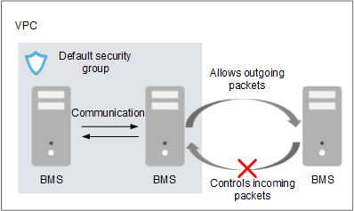

# Security Group

## What Is a Security Group?

A security group is a virtual firewall that detects status and filters data packets. It is an important network isolation method used to set access control for ECSs, BMSs, load balancers, and database instances.

You can configure security group rules to allow instances in a security group to access the public or private network.

-   A security group is a logical group. You can add BMSs with the same security protection requirements in a region to the same security group.
-   By default, BMSs in a security group can communicate with each other through an internal network, and BMSs in different security groups cannot.
-   You can modify a security group rule at any time, and the modification takes effect immediately.

## Default Security Group

When you create a BMS in a region, the system will create a default security group if no security group has been created in the region.

The default security group rule allows all outgoing data packets and controls incoming data packets. BMSs in a security group can access each other without requiring any access rule.

**Figure  1**  Default security group  

[Table 1](#table57441530644)  lists the rules for a default security group.

**Table  1**  Default security group rules

<table><thead align="left"><tr id="row87461030648"><th class="cellrowborder" valign="top" width="13.639999999999999%" id="mcps1.2.6.1.1">
Direction

</th>
<th class="cellrowborder" valign="top" width="13.530000000000001%" id="mcps1.2.6.1.2">
Protocol

</th>
<th class="cellrowborder" valign="top" width="14.360000000000001%" id="mcps1.2.6.1.3">
Port Range

</th>
<th class="cellrowborder" valign="top" width="23%" id="mcps1.2.6.1.4">
Source/Destination

</th>
<th class="cellrowborder" valign="top" width="35.47%" id="mcps1.2.6.1.5">
Description

</th>
</tr>
</thead>
<tbody><tr id="row674616301415"><td class="cellrowborder" valign="top" width="13.639999999999999%" headers="mcps1.2.6.1.1 ">
Outbound

</td>
<td class="cellrowborder" valign="top" width="13.530000000000001%" headers="mcps1.2.6.1.2 ">
All

</td>
<td class="cellrowborder" valign="top" width="14.360000000000001%" headers="mcps1.2.6.1.3 ">
All

</td>
<td class="cellrowborder" valign="top" width="23%" headers="mcps1.2.6.1.4 ">
Destination: 0.0.0.0/0

</td>
<td class="cellrowborder" valign="top" width="35.47%" headers="mcps1.2.6.1.5 ">
Allow all outbound traffic.

</td>
</tr>
<tr id="row147461630449"><td class="cellrowborder" valign="top" width="13.639999999999999%" headers="mcps1.2.6.1.1 ">
Inbound

</td>
<td class="cellrowborder" valign="top" width="13.530000000000001%" headers="mcps1.2.6.1.2 ">
All

</td>
<td class="cellrowborder" valign="top" width="14.360000000000001%" headers="mcps1.2.6.1.3 ">
All

</td>
<td class="cellrowborder" valign="top" width="23%" headers="mcps1.2.6.1.4 ">
Source: current security group ID (for example, sg-<em id="i19385142014618">xxxxx</em>)

</td>
<td class="cellrowborder" valign="top" width="35.47%" headers="mcps1.2.6.1.5 ">
Allow inbound traffic from BMSs added to the same security group.

</td>
</tr>
<tr id="row174653015415"><td class="cellrowborder" valign="top" width="13.639999999999999%" headers="mcps1.2.6.1.1 ">
Inbound

</td>
<td class="cellrowborder" valign="top" width="13.530000000000001%" headers="mcps1.2.6.1.2 ">
TCP

</td>
<td class="cellrowborder" valign="top" width="14.360000000000001%" headers="mcps1.2.6.1.3 ">
22

</td>
<td class="cellrowborder" valign="top" width="23%" headers="mcps1.2.6.1.4 ">
Source: 0.0.0.0/0

</td>
<td class="cellrowborder" valign="top" width="35.47%" headers="mcps1.2.6.1.5 ">
Allows all IP addresses to access Linux BMSs over SSH.

</td>
</tr>
<tr id="row117470305417"><td class="cellrowborder" valign="top" width="13.639999999999999%" headers="mcps1.2.6.1.1 ">
Inbound

</td>
<td class="cellrowborder" valign="top" width="13.530000000000001%" headers="mcps1.2.6.1.2 ">
TCP

</td>
<td class="cellrowborder" valign="top" width="14.360000000000001%" headers="mcps1.2.6.1.3 ">
3389

</td>
<td class="cellrowborder" valign="top" width="23%" headers="mcps1.2.6.1.4 ">
Source: 0.0.0.0/0

</td>
<td class="cellrowborder" valign="top" width="35.47%" headers="mcps1.2.6.1.5 ">
Allows all IP addresses to access Linux BMSs over RDP.

</td>
</tr>
</tbody>
</table>

For more information, see  _Virtual Private Cloud User Guide_.

