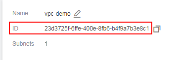

# Creating a VPC and Subnet

## Context

To provide a secure and isolated network environment for CCE, create a VPC before creating a cluster.

If you have already created a VPC, you do not need to create it again.

## Creating a VPC

1.  On the management console, click  **Service List**, and choose  **Network**  \>  **Virtual Private Cloud**  to launch the VPC console.
2.  On the VPC console, click  **Create VPC**.
3.  The created VPC is displayed in the list. Click its name and obtain the VPC ID, which will be required in  [Creating a Cluster](creating-a-cluster.md).

    **Figure  1**  Obtaining the VPC ID  
    

## Creating a Subnet

1.  On the management console, click  **Service List**, and choose  **Network**  \>  **Virtual Private Cloud**  to launch the VPC console.
2.  In the VPC list, click the VPC name. Then, click  **Create Subnet**  on the  **Subnets**  tab.
3.  After the subnet is created, click its name to obtain the network ID, which will be required in  [Creating a Cluster](creating-a-cluster.md).

    **Figure  2**  Obtaining the network ID of a subnet  
    

