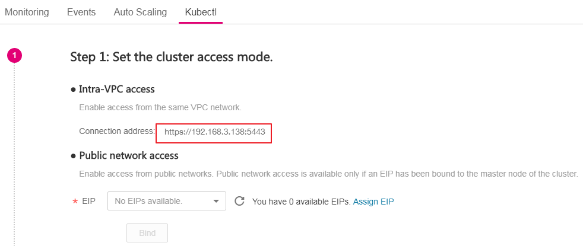

# Cluster Management Permission Control<a name="cce_01_0085"></a>

To perform  permission control  on resources in a cluster \(for example, user A can only read and write applications in a namespace, while user B can only read resources in a cluster\), perform the operations described in this section.

## Procedure<a name="section12024043015"></a>

1.  To perform permission control on a cluster, select  **Enhanced authentication capability**  for  **Authentication Mode**  and then select  **Authenticating Proxy**. Click  **Upload**  next to  **CA root certificate**  to upload a qualified and valid certificate. For details, see  [Table 2](creating-a-hybrid-cluster.md#table8638121213265).
2.  Create a role using kubectl.

    The following example shows how to create a  **role**  and allow the role to read all pods in the default namespace. For details about the parameters, see the  [official Kubernetes documentation](https://kubernetes.io/docs/reference/).

    ```
    kind: Role
    apiVersion: rbac.authorization.k8s.io/v1
    metadata:
      namespace: default
      name: pod-reader
    rules:
    - apiGroups: [""]
      resources: ["pods"]
      verbs: ["get", "watch", "list"]
    ```

3.  Bind the role to a user by using kubectl.

    In the following example, the  **RoleBinding**  assigns the role of  **pod-reader**  in the default namespace to user  **jane**. This policy allows user  **jane**  to read all pods in the default namespace. For details about the parameters, see the  [official Kubernetes documentation](https://kubernetes.io/docs/reference/).

    ```
    kind: RoleBinding
    apiVersion: rbac.authorization.k8s.io/v1
    metadata:
      name: read-pods
      namespace: default
    subjects:
    - kind: User
      name: jane   #the cloud username
      apiGroup: rbac.authorization.k8s.io
    roleRef:
      kind: Role
      name: pod-reader    #Name of the role that is created
      apiGroup: rbac.authorization.k8s.io
    ```

4.  After a role is created and bound to a user, call a Kubernetes API by initiating an API request message where headers carry user information and the certificate uploaded during cluster creation. For example, to call the pod query API, run the following command:

    **curl -H "X-Remote-User:  _jane_" --cacert /root/tls-ca.crt --key /root/tls.key --cert /root/tls.crt https://**_192.168.3.138:5443_**/api/v1/namespaces/default/pods**

    If  **200**  is returned, user  **jane**  is authorized to read pods in the cluster's default namespace. If  **403**  is returned, user  **jane**  is not authorized to read pods in the cluster's default namespace.

    > **NOTE:** 
    >To prevent the command execution failure, upload the certificate to the  **/root**  directory in advance.

    The parameter descriptions are as follows:

    -   **X-Remote-User:  _jane_**: The request header is fixed at  **X-Remote-User**, and  **jane**  is the username.
    -   **_tls-ca.crt_**: CA root certificate uploaded during cluster creation.
    -   **tls.crt**: Client certificate that matches the CA root certificate uploaded during cluster creation.
    -   **tls.key**: Client key corresponding to the CA root certificate uploaded during cluster creation.
    -   **192.168.3.138.:5443**: Address for connecting to the cluster. To obtain the address, perform the following steps:

        Log in to the CCE console. In the navigation pane, choose  **Resource Management**  \>  **Clusters**, click  **Kubectl**  in the cluster card, and select the IP address and port number next to the  **Connection address**, as shown in the following figure.

        **Figure  1**  Obtaining the access address<a name="fig743763911913"></a>  
        

    In addition, the  **X-Remote-Group**  header field, that is, the user group name, is supported. During RoleBinding, a role can be bound to a group and carry user group information when you access the cluster.


