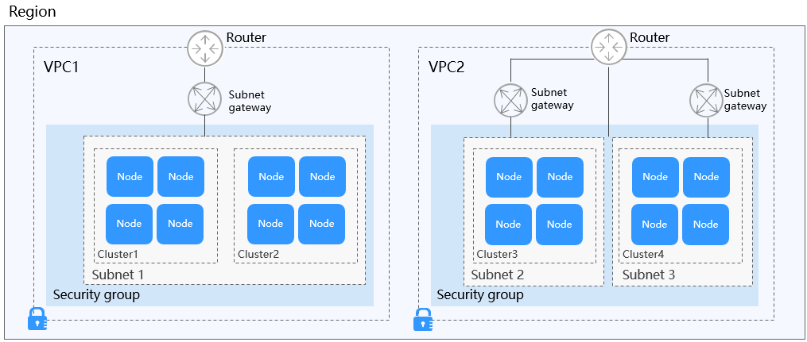

# Cluster Overview

The clustering technology improves performance, reliability, and flexibility at an affordable cost. Task scheduling is essential to clusters.

A  cluster  is a collection of cloud resources required for container running. A cluster is associated with cloud resources such as cloud server nodes, load balancers, and virtual private clouds \(VPCs\). A cluster can be seen as one or more elastic cloud servers \(nodes\) in a same subnet. It provides computing resource pool for the container running through computer groups formed by relevant technologies.

## Relationship Between a Cluster, VPC, and Subnet

-   A  **VPC**  is similar to a private local area network \(LAN\) managed by a home gateway whose IP address is 192.168.0.0/16. A VPC is a private network built on the cloud and provides basic network environment for running elastic cloud servers \(ECSs\), elastic load balances \(ELBs\), and middleware. Networks of different scales can be set according to the actual service requirements. Generally, the networks can be 10.0.0.0/8–24, 172.16.0.0/12–24, or 192.168.0.0/16–24. The largest network is the class-A address network of 10.0.0.0/8.
-   A  subnet  is a subset of a VPC. A VPC can be divided into one or more subnets. Security groups are configured to determine whether these subnets can communicate with each other. This ensures that subnets can be isolated from each other, so that you can deploy different services on different subnets.
-   A  cluster  consists of one or more ECSs \(also known as  nodes\) in the same subnet. It provides a computing resource pool for running containers.

As shown in the following figure, multiple VPCs are configured in a region. A VPC consists of one or more subnets. The subnets communicate with each other through the subnet gateway. A cluster is created in a subnet. Therefore, there are three scenarios:

-   Different clusters are created in different VPCs.
-   Different clusters are created in the same subnet.
-   Different clusters are created in different subnets.

**Figure  1**  Relationship between a cluster, VPC, and subnet  

## Precautions for Using a Cluster

-   When performing operations such as creating, deleting, and scaling clusters, do not change user permission in the Identity and Access Management \(IAM\) console. Otherwise, these operations may fail.
-   The containerized network canal of CCE nodes uses a CIDR block as the CIDR block of the container network. This CIDR block can be configured during cluster creation and defaults to 172.16.0.0/16. The Docker service creates a docker0 bridge by default. The default docker0 address is 172.17.0.1. When creating a cluster, ensure that the CIDR block of the VPC in the cluster is different from the CIDR blocks of the container network docker0 bridge. If VPC peering connections are used, also ensure that the CIDR block of the peer VPC is different from the CIDR blocks of the container network docker0 bridge.

-   Do not modify the security groups, Elastic Volume Service \(EVS\) disks, and other resources created by CCE. Otherwise, clusters may not function properly. The resources created by CCE are labeled  **cce**, for example,  **cce-evs-jwh9pcl7-\*\*\*\***.

