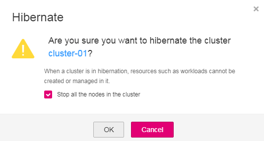
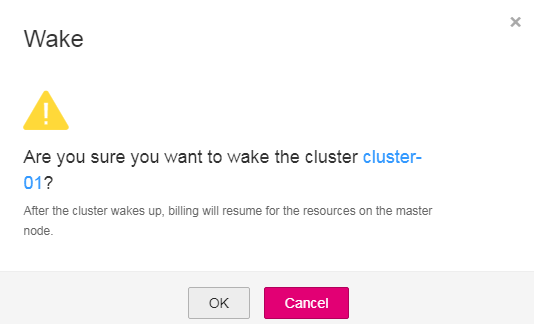

# Deleting, Hibernating, and Waking Up a Cluster

After a cluster is created, you can delete, hibernate, or wake up the cluster.

## Deleting a Cluster

> **NOTICE:**   
>Exercise caution when deleting a cluster because this operation will destroy the nodes in the cluster and running services.  

This section takes VM clusters as an example. The procedure for BMS clusters is the same.

1.  Log in to the CCE console. In the navigation pane, choose  **Resource Management**  \>  **Clusters**.
2.  Choose  **More \> Delete**.
3.  The  **Delete Cluster**  dialog box then appears.

    > **NOTE:**   
    >-   Deleting the cluster will delete all nodes in the cluster and the running workloads and services.  
    >-   The delete operation takes 1 to 3 minutes to complete.  
    >-   Enter  **DELETE**  into the text box below to confirm that the delete operation will continue.  
    >-   If a cluster whose status is Unavailable is deleted, some storage resources of the cluster may need to be manually deleted.  

4.  Click  **OK**  to start deleting the cluster.

## Hibernating a Cluster

If you do not need to use a cluster temporarily, you are advised to hibernate the cluster to save cluster management costs.

After a cluster is hibernated, resources such as workloads cannot be created or managed in the cluster.

1.  Log in to the CCE console. In the navigation pane, choose  **Resource Management**  \>  **Clusters**.
2.  Choose  **More**  \>  **Hibernate**  for the target cluster.
3.  In the  **Hibernate**  dialog box, read the precautions and select  **Stop all the nodes in the cluster**, and click  **OK**.

    Wait until the cluster hibernation is complete.

    **Figure  1**  Hibernating a Cluster  
    

## Waking Up a Cluster

A hibernated cluster can be quickly woken up and used normally.

1.  Log in to the CCE console. In the navigation pane, choose  **Resource Management**  \>  **Clusters**.
2.  Choose  **More**  \>  **Wake**.
3.  In the displayed dialog box, click  **OK**.

    Wait until the cluster is woken up.

    **Figure  2**  Waking up a cluster  
    

