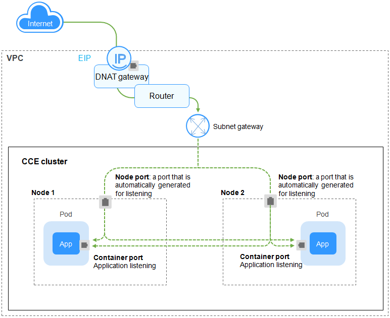
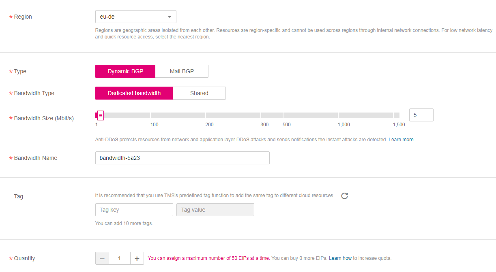

# DNAT<a name="cce_01_0058"></a>

A  **destination network address translation \(DNAT\) gateway**  is situated between  cluster nodes  and public networks and assigned an EIP. After receiving inbound requests from public networks, the NAT gateway translates the EIP \(destination address in the inbound requests\) into a cluster-internal address. It appears to workload users as if all nodes running the workload share the same EIP.

DNAT provides higher reliability than EIP-based NodePort in which the EIP is bound to a single node and once the node is down, all inbound requests to the workload will not be distributed. The access address is in the format of <EIP\>:<access port\>, for example, 10.117.117.117:80.

**Figure  1**  DNAT<a name="fig1623231054319"></a>  


## Constraints<a name="section1153345812121"></a>

Observe the following constraints when using the NAT Gateway service:

-   Multiple rules for one NAT gateway can reuse the same EIP, but the rules for different NAT gateways must use different EIPs.
-   Each VPC can have only one NAT gateway.
-   Users cannot manually add the default route in a VPC.
-   Only one SNAT rule can be added to a subnet in a VPC.
-   SNAT and DNAT rules are designed for different functions. If SNAT and DNAT rules reuse the same EIP, resource preemption will occur. An SNAT rule cannot share an EIP with a DNAT rule with  **Port Type**  set to  **All ports**.
-   DNAT rules do not support binding an EIP to a virtual IP address.
-   When both the EIP and NAT Gateway services are configured for a server, data will be forwarded through the EIP.
-   The custom CIDR block must be a subset of the VPC subnet CIDR blocks.
-   The custom CIDR block must be a CIDR block of Direct Connect and cannot conflicts with VPC's existing subnet CIDR blocks.
-   When you perform operations on underlying resources of an ECS, for example, changing its specifications, the configured NAT gateway rules become invalid. You need to delete the rules and reconfigure them.

## Prerequisites<a name="section15345195764111"></a>

You have created a NAT Gateway and an elastic IP address. The specific procedure is as follows:

1.  Log in to the management console and choose  **Service List \> Network**  \>  **NAT Gateway**  from the service list. Click  **Create NAT Gateway**  in the upper right corner of the page.

    > **NOTE:**   
    >When creating a NAT gateway, ensure that the NAT gateway belongs to the same VPC and subnet as the CCE cluster where the workload is running.  

    **Figure  2**  Creating a NAT Gateway<a name="fig65141147164317"></a>  
    

2.  On the management console, choose  **Service List \> Network**  \>  **Elastic IP**  from the service list and click  **Assign EIP**.

    **Figure  3**  Assigning an elastic IP address<a name="fig1665717534483"></a>  
    


## Setting the Access Type on the Console<a name="section744117150366"></a>

You can set the service access type when creating a workload on the CCE console. An Nginx workload is used as an example. The procedure is as follows:

1.  In the  **Set Application Access**  step of  [Creating a Deployment](creating-a-deployment.md)  or  [Creating a StatefulSet](creating-a-statefulset.md), click  **Add Service**  and set the following parameters:
    -   **Access Type**: set to  **LoadBalancer \(DNAT\)**.
    -   **Service Name**: can be the same as the workload name.
    -   **Service Affinity**
        -   **Cluster level**: External traffic is routed to all nodes in the cluster while masking clients' source IP addresses.
        -   **Node level**: External traffic is routed to the node where the workload targeted by the service is located, without masking clients' source IP addresses.

    -   **NAT Gateway**:
        -   Select a NAT gateway. If no NAT gateways are available, click  **Create a NAT gateway**  to create one. The NAT gateway must be in the same VPC as the current cluster.
        -   Select an EIP for the NAT gateway. If no EIPs are available, click  **Create an EIP**  to create one.
        -   Select  **I have read and agree to the NAT Gateway Usage Restrictions**.

    -   **Port Settings**
        -   **Protocol**: a protocol used by the service.
        -   **Container Port**: a port that is defined in the  container image  and on which the workload listens. The Nginx workload listens on port 80.
        -   **Access Port**: a port mapped to the container port. The port number range is 1–65535.

2.  After the configuration is complete, click  **OK**.
3.  On the workload creation page, click  **Next**. On the  **Configure Advanced Settings**  page, click  **Create**.
4.  After the workload is successfully created, choose  **Workloads**  \>  **Deployments**  or  **Workloads**  \>  **StatefulSets**  on the CCE console. Click the name of the workload to show more details of the workload. On the workload details page, click the  **Services**  tab and obtain the access address, for example, 10.154.78.160:2.
5.  Click the access address.

    **Figure  4**  Accessing Nginx through a NAT gateway<a name="fig1543716518012"></a>  
    


## Setting the Access Type Using kubectl<a name="section9206192110206"></a>

You can set the service access type when creating a workload using kubectl. This section uses an Nginx workload as an example to describe how to implement intra-cluster access using kubectl.

**Prerequisites**

You have configured the kubectl and connected an ECS to the cluster. For details, see  [Connecting to a Kubernetes Cluster Using kubectl](connecting-to-a-kubernetes-cluster-using-kubectl.md).

**Procedure**

1.  Log in to the ECS on which the kubectl has been configured. For details, see  [Logging In to a Linux ECS](https://docs.otc.t-systems.com/en-us/usermanual/ecs/en-us_topic_0013771089.html).
2.  Create and edit the  **nginx-deployment.yaml**  and  **nginx-nat-svc.yaml**  files.

    The file names are user-defined.  **nginx-deploym\`ent.yaml**  and  **nginx-nat-svc.yaml**  are merely example file names.

    **vi nginx-deployment.yaml**

    ```
    apiVersion: extensions/v1beta1
    kind: Deployment
    metadata:
      name: nginx
    spec:
      replicas: 1
      selector:
        matchLabels:
          app: nginx
      strategy:
        type: RollingUpdate
      template:
        metadata:
          labels:
            app: nginx
        spec:
          containers:
          - image: nginx 
            imagePullPolicy: Always
            name: nginx
          imagePullSecrets:
          - name: default-secret
    ```

    For descriptions of the preceding fields, see  [Table 3](creating-a-deployment.md#table132326831016).

    **vi nginx-nat-svc.yaml**

    ```
    apiVersion: v1 
    kind: Service 
    metadata: 
      labels: 
        app: nginx 
      name: nginx 
      annotations:
        kubernetes.io/elb.class: dnat
        kubernetes.io/natgateway.id: e4a1cfcf-29df-4ab8-a4ea-c05dc860f554
    spec: 
      loadBalancerIP: 10.78.42.242
      ports: 
      - name: service0 
        port: 80 
        protocol: TCP 
        targetPort: 80 
      selector: 
        app: nginx 
      type: LoadBalancer
    ```

    **Table  1**  Key parameters

    <a name="table1819001615355"></a>
    <table><thead align="left"><tr id="row1519121663519"><th class="cellrowborder" valign="top" width="30.416958304169583%" id="mcps1.2.4.1.1"><p id="p18191161619356"><a name="p18191161619356"></a><a name="p18191161619356"></a>Parameter</p>
    </th>
    <th class="cellrowborder" valign="top" width="17.98820117988201%" id="mcps1.2.4.1.2"><p id="p1191141613357"><a name="p1191141613357"></a><a name="p1191141613357"></a>Type</p>
    </th>
    <th class="cellrowborder" valign="top" width="51.594840515948405%" id="mcps1.2.4.1.3"><p id="p1919116161353"><a name="p1919116161353"></a><a name="p1919116161353"></a>Description</p>
    </th>
    </tr>
    </thead>
    <tbody><tr id="row15191171618357"><td class="cellrowborder" valign="top" width="30.416958304169583%" headers="mcps1.2.4.1.1 "><p id="p102011514170"><a name="p102011514170"></a><a name="p102011514170"></a>kubernetes.io/elb.class</p>
    </td>
    <td class="cellrowborder" valign="top" width="17.98820117988201%" headers="mcps1.2.4.1.2 "><p id="p1090683224719"><a name="p1090683224719"></a><a name="p1090683224719"></a>String</p>
    </td>
    <td class="cellrowborder" valign="top" width="51.594840515948405%" headers="mcps1.2.4.1.3 "><p id="p16904132104710"><a name="p16904132104710"></a><a name="p16904132104710"></a>This parameter is set to <strong id="b144674516219"><a name="b144674516219"></a><a name="b144674516219"></a>dnat</strong> so CCE can work with a NAT Gateway and DNAT rules can be added.</p>
    </td>
    </tr>
    <tr id="row81941516153513"><td class="cellrowborder" valign="top" width="30.416958304169583%" headers="mcps1.2.4.1.1 "><p id="p4764162894719"><a name="p4764162894719"></a><a name="p4764162894719"></a>kubernetes.io/natgateway.id</p>
    </td>
    <td class="cellrowborder" valign="top" width="17.98820117988201%" headers="mcps1.2.4.1.2 "><p id="p77621528184710"><a name="p77621528184710"></a><a name="p77621528184710"></a>String</p>
    </td>
    <td class="cellrowborder" valign="top" width="51.594840515948405%" headers="mcps1.2.4.1.3 "><p id="p416573016509"><a name="p416573016509"></a><a name="p416573016509"></a>ID of a NAT gateway.</p>
    </td>
    </tr>
    <tr id="row201957167350"><td class="cellrowborder" valign="top" width="30.416958304169583%" headers="mcps1.2.4.1.1 "><p id="p18966182113208"><a name="p18966182113208"></a><a name="p18966182113208"></a>loadBalancerIP</p>
    </td>
    <td class="cellrowborder" valign="top" width="17.98820117988201%" headers="mcps1.2.4.1.2 "><p id="p336744055219"><a name="p336744055219"></a><a name="p336744055219"></a>String</p>
    </td>
    <td class="cellrowborder" valign="top" width="51.594840515948405%" headers="mcps1.2.4.1.3 "><p id="p2075662814474"><a name="p2075662814474"></a><a name="p2075662814474"></a>EIP ID.</p>
    </td>
    </tr>
    <tr id="row17773517113812"><td class="cellrowborder" valign="top" width="30.416958304169583%" headers="mcps1.2.4.1.1 "><p id="p17120639161311"><a name="p17120639161311"></a><a name="p17120639161311"></a>port</p>
    </td>
    <td class="cellrowborder" valign="top" width="17.98820117988201%" headers="mcps1.2.4.1.2 "><p id="p1120939161311"><a name="p1120939161311"></a><a name="p1120939161311"></a>Integer</p>
    </td>
    <td class="cellrowborder" valign="top" width="51.594840515948405%" headers="mcps1.2.4.1.3 "><p id="p1120163961310"><a name="p1120163961310"></a><a name="p1120163961310"></a>Access port set on the console. The value ranges from 1 to 65535.</p>
    </td>
    </tr>
    <tr id="row2339171473819"><td class="cellrowborder" valign="top" width="30.416958304169583%" headers="mcps1.2.4.1.1 "><p id="p2022520488387"><a name="p2022520488387"></a><a name="p2022520488387"></a>targetPort</p>
    </td>
    <td class="cellrowborder" valign="top" width="17.98820117988201%" headers="mcps1.2.4.1.2 "><p id="p522534816381"><a name="p522534816381"></a><a name="p522534816381"></a>String</p>
    </td>
    <td class="cellrowborder" valign="top" width="51.594840515948405%" headers="mcps1.2.4.1.3 "><p id="p52251448103812"><a name="p52251448103812"></a><a name="p52251448103812"></a>Container port set on the console. The value ranges from 1 to 65535.</p>
    </td>
    </tr>
    <tr id="row02694357138"><td class="cellrowborder" valign="top" width="30.416958304169583%" headers="mcps1.2.4.1.1 "><p id="p627233515132"><a name="p627233515132"></a><a name="p627233515132"></a>type</p>
    </td>
    <td class="cellrowborder" valign="top" width="17.98820117988201%" headers="mcps1.2.4.1.2 "><p id="p19272143531318"><a name="p19272143531318"></a><a name="p19272143531318"></a>String</p>
    </td>
    <td class="cellrowborder" valign="top" width="51.594840515948405%" headers="mcps1.2.4.1.3 "><p id="p8272035161316"><a name="p8272035161316"></a><a name="p8272035161316"></a>NAT gateway service type must be set to <strong id="b1575141110411"><a name="b1575141110411"></a><a name="b1575141110411"></a>LoadBalancer</strong>.</p>
    </td>
    </tr>
    </tbody>
    </table>

3.  Create a workload.

    **kubectl create -f nginx-deployment.yaml**

    If information similar to the following is displayed, the workload is being created.

    ```
    deployment "nginx" created
    ```

    **kubectl get po**

    If information similar to the following is displayed, the workload is running.

    ```
    NAME                     READY     STATUS             RESTARTS   AGE
    etcd-0                   0/1       ImagePullBackOff   0          59m
    icagent-m9dkt            0/0       Running            0          3d
    nginx-2601814895-sf71t   1/1       Running            0          8s
    ```

4.  Create a service.

    **kubectl create -f nginx-nat-svc.yaml**

    If information similar to the following is displayed, the service has been created.

    ```
    service "nginx-eip" created
    ```

    **kubectl get svc**

    If the following information is displayed, the service access mode has been set successfully, and the workload is accessible.

    ```
    NAME         TYPE        CLUSTER-IP       EXTERNAL-IP   PORT(S)        AGE 
    etcd-svc     ClusterIP   None             <none>        3120/TCP       59m 
    kubernetes   ClusterIP   10.247.0.1       <none>        443/TCP        3d 
    nginx-nat    LoadBalancer 10.247.226.2  10.154.74.98   80:30589/TCP  5s
    ```

5.  In the address bar of your browser, enter  **10.154.74.98:80**  and press  **Enter**.

    In this example,  **10.154.74.98**  is the elastic IP address and  **80**  is the port number obtained in the previous step.


## Setting the Access Type After Creating a Workload<a name="section156711537124016"></a>

You can set the access type after creating a workload. This has no impact on the workload status and takes effect immediately. The procedure is as follows:

1.  Log in to the CCE console. In the navigation pane, choose  **Workloads**  \>  **Deployments**. On the workload list, click the name of the workload for which you will create a service.
2.  On the  **Services**  tab page, click  **Create Service**.
3.  On the  **Create Service**  page, set  **Access Type**  to  **LoadBalancer \(DNAT\)**.
4.  Set DNAT gateway parameters.
    -   **Service Name**: can be the same as the workload name.
    -   **Cluster Name**: name of the cluster where the workload runs. The value is inherited from the workload creation page and cannot be changed.
    -   **Namespace**: namespace where the workload is located. The value is inherited from the workload creation page and cannot be changed.
    -   **Workload**: a workload for which you want to add a service.
    -   **Service Affinity**
        -   **Cluster level**: External traffic is routed to all nodes in the cluster while masking clients' source IP addresses.
        -   **Node level**: External traffic is routed to the node where the workload targeted by the service is located, without masking clients' source IP addresses.

    -   **NAT Gateway**
        -   Select a NAT gateway. If no NAT gateways are available, click  **Create a NAT gateway**  to create one. The NAT gateway must be in the same VPC as the current cluster.
        -   Select an EIP for the NAT gateway. If no EIPs are available, click  **Create an EIP**  to create one.
        -   Select  **I have read and agree to the NAT Gateway Usage Restrictions**.

    -   **Port Settings**
        -   **Protocol**: a protocol used by the service.
        -   **Container Port**: a port on which the workload in the container image listens. The Nginx workload listens on port 80.
        -   **Access Port**: a port mapped to the container port. The port number range is 1–65535.

5.  Click  **Create**. A DNAT gateway \(DNAT\) service will be added for the workload.

## Updating a Service<a name="section66147391556"></a>

After adding a service, you can update the port configuration of the service. The procedure is as follows:

1.  Log in to the CCE console. In the navigation pane, choose  **Resource Management**  \>  **Network**. On the  **Services**  tab page, filter services by cluster and namespace, and click  **Update**  for the service to be updated.
2.  On the  **Update Service**  page, set  **Access Type**  to  **LoadBalancer \(DNAT\)**.
3.  Update load balancing parameters.
    -   **Cluster Name**: name of the cluster where the workload runs. The value is inherited from the workload creation page and cannot be changed.
    -   **Namespace**: namespace where the workload is located. The value is inherited from the workload creation page and cannot be changed.
    -   **Workload**: a workload for which you want to update the service.
    -   **Service Affinity**
        -   **Cluster level**: External traffic is routed to all nodes in the cluster while masking clients' source IP addresses.
        -   **Node level**: External traffic is routed to the node where the workload targeted by the service is located, without masking clients' source IP addresses.

    -   **NAT Gateway**: The value is inherited from the workload creation page and cannot be changed.
    -   **Port Settings**
        -   **Protocol**: a protocol used by the service.
        -   **Container Port**: a port on which the workload in the container image listens. The Nginx workload listens on port 80.
        -   **Access Port**: a port mapped to the container port. The port number range is 1–65535.

4.  Click  **Update**. The service will be updated for the workload.

