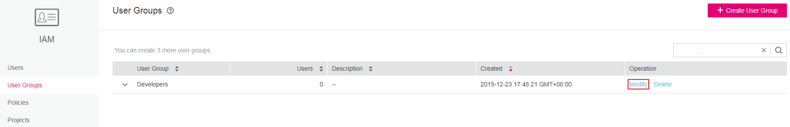
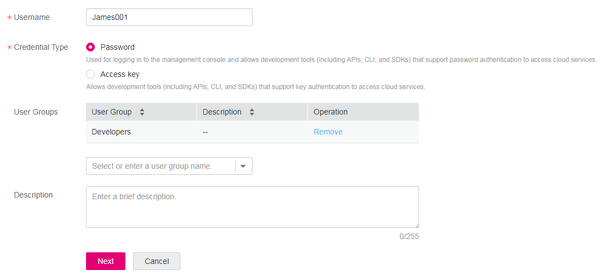

# Granting Cluster-Level Permissions \(IAM Fine-Grained Authorization\)

This section describes how to use a group to grant permissions to an IAM user.  [Process Flow](#section41056841)  shows the process for granting permissions. By way of example, the CCE Viewer role will be granted to the user group Developers and the IAM user James will be added to the user group so that James will inherit the read-only access to CCE.

> **NOTICE:** 
>CCE provides two default roles: CCE Admin and CCE Viewer. It is advisable to grant default roles rather than custom roles. Note that role and permissions policy are interchangeable in this chapter. Both represent a set of permissions.

## Preparations

-   **CCE Viewer**  is a fine-grained policy that can be used only if fine-grained access control is enabled in IAM.
-   Before assigning permissions to user groups, you should learn about the system policies.

## Configuration

-   The  **Permissions Management**  page on the CCE console is displayed only to accounts and the IAM users with the CCE Administrator role or the global Security Administrator role. This means that only accounts and specified IAM users can grant permissions. Note that IAM users are created by accounts.
-   Only accounts can grant IAM users the permissions required for reading and writing IAM resources.
-   To ensure IAM user security, if permissions management on the CE console involves changing permissions of an IAM user, you must manually change the permissions through the IAM console according to on-screen instructions.

## Process Flow

User groups facilitate centralized user management and streamlined permissions management. Users in the same user group have the same permissions. IAM users inherit permissions from the groups to which they belong.

To create a user group and grant it permissions, perform the following steps:

**Figure  1**  Process for granting cluster-level permissions \(fine-grained policies\)  
.png "process-for-granting-cluster-level-permissions-(fine-grained-policies)")

## Step 1: Create a User Group and Grant Permissions

Create a user group on the IAM console, and grant the  **CCE Viewer**  role to the group.

1.  Log in to the CCE console. In the navigation pane, choose  **Permissions Management**.
2.  Click the  **Cluster-Level Permissions**  tab and then  **Create User Group**.

    **Figure  2**  Creating a user group  
    

3.  Enter the user group name and optimally group description. Then, click  **OK**. The name  **Developers**  is used as an example.

    **Figure  3**  Creating a user group  
    

    The user group is then displayed in the user group list.

4.  In the same row as the user group, click  **Modify**. In the  **Group Permissions**  area, click  **Attach Policy**  next to the region for which you want to assign permissions to the user group.

    CCE is a project-level service. Therefore, you need to assign permissions in the projects in which users in the group need to access CCE resources.

    **Figure  4**  Modifying a user group  
    

    **Figure  5**  Assigning permissions to the user group  
    

5.  In the  **Attach Policy**  dialog box, search for and select  **CCE Viewer**.

    **Figure  6**  Modifying policies  
    

6.  Click  **OK**.

## Step 2: Create an IAM User and Add It to the Group

IAM users can be created for employees or applications of an enterprise. Each IAM user has their own security credentials, and inherits permissions from the groups it is a member of. To create an IAM user, perform the following steps:

1.  Log in to the IAM console. In the navigation pane, choose  **Users**. Then, click  **Create User**.
2.  Set user information.

    **Figure  7**  Creating a user  
    

    -   **Username**: Used for logging in to the cloud. For this example, enter  **James001**.
    -   **Credential Type**: Identity credential for authentication. For this example, select  **Password**.
        -   **Password**: Used for accessing the cloud using the console or development tools \(including APIs, CLI, and SDKs\).
        -   **Access Key**: Used for logging to the cloud using development tools. This credential type is more secure, and is recommended if the IAM user does not need to use the console.

    -   \(Optional\)  **User Groups**: Select  **Developers**. The IAM user will inherit the permissions granted to the user group. The default user group is  **admin**, which has the administrator permissions and all of the permissions required to use all cloud resources.
    -   \(Optional\)  **Description**: Description of the IAM user.

3.  Click  **Next**. In the dialog box that is displayed, set the parameters.
    -   **Password Type**: Three password types are available. In this example,  **Set manually**  is selected.
        -   **Set by user**: Select this option if you are not the entity using the IAM user  **James001**. James001 will receive a one-time login URL of the cloud by email and can set a password at first login.
        -   **Automatically generated**: Select this option if James001 accesses the cloud using a development tool. The cloud will generate a random 10-digit password.
        -   **Set now**: Select this option if you are the entity using the IAM user  **James001**. Then set a password for login.

    -   **Password Reset**: By default, this option is selected, which means that the user will be required to set a new password at next login. In this example, this option is selected.
    -   **Email**: This parameter is configurable only if  **Password Type**  is  **Set now**.
    -   \(Optional\)  **Mobile Number**: Enter a mobile number.
    -   **Password**  and  **Confirm Password**: Enter the initial password of the IAM user James001.

4.  Click  **OK**.

## Step 3: Log In and Verify Permissions

After the IAM user is created, use the username and identity credential to log in to the cloud, and verify that the IAM user has the permissions defined by the  **CCE Viewer**  policy.

1.  On the cloud login page, click  **API Login**  in the upper right corner.
2.  Enter the account name, username, and password, and click  **Log In**.

    -   The account name is the name of the cloud account that created the IAM user.
    -   The username and password are those set by the account when creating the IAM user James001. You will be prompted to change the initial password at initial login.

    If the login fails, contact the entity owning the account to verify the username and password. Alternatively, you can reset the password.

3.  After successful login, switch to a region where the user has been granted permissions on the management console. The default region is eu-de.
4.  Choose  **Service List**  \>  **Computing \> Cloud Container Engine**  to launch the CCE console. Then verify James001's cluster permissions.

