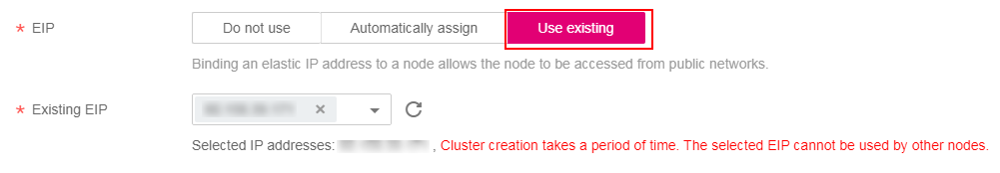

# How Do I Troubleshoot Insufficient EIPs When a Node Is Added?

## Symptom

When a node is added,  **EIP**  is set to  **Automatically assign**. The node cannot be created, and a message indicating that EIPs are insufficient is displayed.

**Figure  1**  Purchasing an EIP  

## Solution

Two methods are available to solve the problem.

-   Method 1: Unbind the VMs bound with EIPs and add a node again.
    1.  Log in to the management console.
    2.  Choose  **Service List \> Computing**  \>  **Elastic Cloud Server**.
    3.  In the ECS list, locate the target ECS and click its name.
    4.  On the ECS details page, click the  **EIPs**  tab. In the EIP list, click  **Unbind**  at the row of the target ECS and click  **Yes**.

        **Figure  2**  Unbinding an EIP  
        

    5.  Return to the  **Create Node**  page on the CCE console and click  **Use existing**  to add an EIP.

        **Figure  3**  Using an unbound EIP  
        

-   Method 2: Increase the EIP quota.

    Quotas are used to limit the number of resources available to users. If the existing resource quota cannot meet your service requirements, you can increase your quota.

