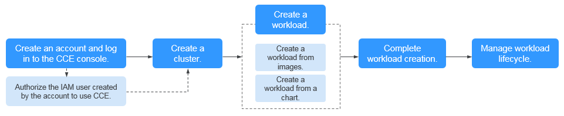

# Instruction

This document provides instructions for getting started with the Cloud Container Engine \(CCE\).

## Procedure

Complete the following tasks to get started with CCE.

**Figure  1**  Procedure for getting started with CCE  

1.  **Authorize an IAM user to use CCE.**

    The accounts have the permission to use CCE. However, IAM users created by the accounts do not have the permission. You need to manually assign the permission to IAM users.

2.  **Create a cluster.**

    For details on how to create a regular Kubernetes cluster, see  [Creating a Hybrid Cluster](creating-a-hybrid-cluster.md).

3.  **Create a workload from images or a chart.**

    Select existing images/chart, or create new images/chart.

    -   For details on how to create a workload from images, see  [Workload](workload.md).
    -   For details on how to create a workload from a chart, see  [Charts](charts.md).

4.  **View workload status and logs. Upgrade, scale, and monitor the workload.**

    For details, see  [Managing a Deployment](managing-a-deployment.md).

## FAQs

1.  **Is CCE suitable for users who are not familiar with Kubernetes?**

    Yes. The CCE console is easy-to-use.

2.  **Is CCE suitable for users who have little experience in building images?**

    Yes. You can select images from  **Third-party Images**, and  **Shared Images**  pages on the CCE console. The  **My Images**  page displays only the images created by you. For details, see  [Workload](workload.md).

3.  **How do I create a workload using CCE?**

    Create a cluster and then create a workload in the cluster.

4.  **How do I create a workload accessible to public networks?**

    CCE provides different workload access types to address diverse scenarios. Currently, CCE provides three access types to expose a workload to public networks: NodePort, LoadBalancer, and DNAT. For details, see  [Network Management](network-management.md).

5.  **How can I allow multiple workloads in the same cluster to access each other?**

    Select the access type ClusterIP, which allows workloads in the same cluster to use their cluster-internal domain names to access each other.

    Cluster-internal domain names are in the format of <self-defined service name\>.<workload's namespace\>.svc.cluster.local:<port number\>. For example, nginx.default.svc.cluster.local:80.

    Example:

    Assume that workload A needs to access workload B in the same cluster. Then, you can create a  [ClusterIP](intra-cluster-access-(clusterip).md)  Service for workload B. After the ClusterIP Service is created, workload B is reachable at <self-defined service name\>.<workload B's namespace\>.svc.cluster.local:<port number\>.

