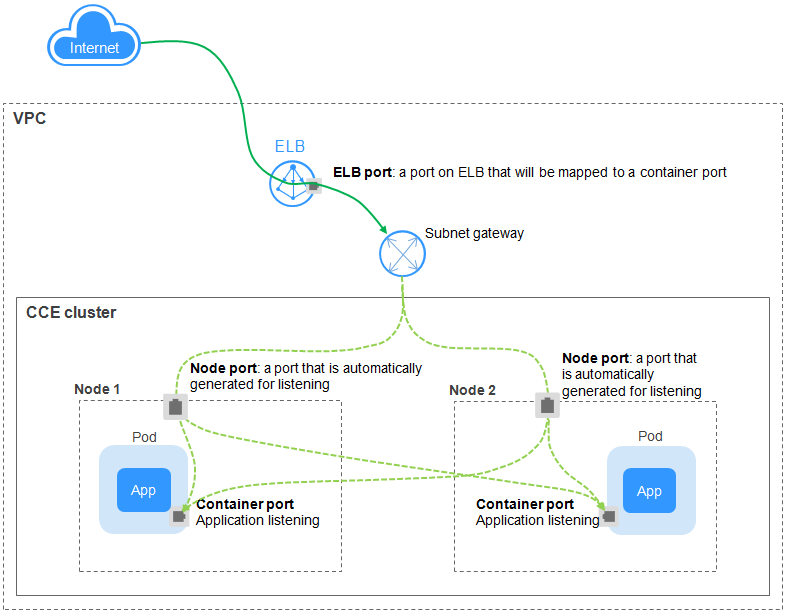

# LoadBalancer<a name="cce_01_0014"></a>

A workload can be accessed from  public networks  through a  load balancer. LoadBalancer provides higher reliability than EIP-based NodePort because an EIP is no longer bound to a single node. The LoadBalancer access type is applicable to the scenario in which a service exposed to public networks is required.

The access address is in the format of <IP address of public network  load balancer\>:<access port\>. For example, 10.117.117.117:80.

**Figure  1**  LoadBalancer<a name="fig1454926316508"></a>  


> **NOTE:** 
>The LoadBalancer access type allows workloads to be accessed from public networks through ELB. This access type has the following restrictions:
>-   It is recommended that automatically created load balancers not be used by other resources. Otherwise, these load balancers cannot be completely deleted, causing residual resources.
>-   Do not change the listener name for the load balancer in use. Otherwise, the load balancer cannot be accessed.

## Setting the Access Type on the Console<a name="section744117150366"></a>

You can set the service access type when creating a workload on the CCE console. An Nginx workload is used as an example.

1.  In the  **Set Application Access**  step of  [Creating a Deployment](creating-a-deployment.md)  or  [Creating a StatefulSet](creating-a-statefulset.md), click  **Add Service**  and set the following parameters:
    -   **Access Type**: Select  **LoadBalancer \(ELB\)**.
    -   **Service Name**: can be the same as the workload name.
    -   **Service Affinity**
        -   **Cluster level**: External traffic is routed to all nodes in the cluster while masking clients' source IP addresses.
        -   **Node level**: External traffic is routed to the node where the workload targeted by the service is located, without masking clients' source IP addresses.

    -   **Elastic Load Balancer**: A load balancer automatically distributes Internet access traffic to multiple nodes running the workload.

        -   **Public network**: You can select an existing public network load balancer or have the system automatically create a new public network load balancer.

            If you have the system automatically create a public network load balancer, you can click  **Change Configuration**  to modify its name, EIP type, and bandwidth.

        -   **Private network**: You can select an existing private network load balancer or have the system automatically create a new private network load balancer.

        The selected or created load balancer must be in the same VPC as the current cluster, and it must match the load balancer type \(private or public network\).

        **Other configurations**

        -   **Specifications**: This field is displayed only when you select  **Public network**  and  **Automatic creation**  for  **Elastic Load Balancer**. You can click  **Change configuration**  to modify the name, specifications, and bandwidth of the load balancer.
        -   **Algorithm Type**:  **Weighted round robin**,  **Weighted least connections**, and  **Source IP hash**  are available. The weight is dynamically adjusted based on the number of pods of the workload associated with the service on each node.
            -   **Weighted round robin**: Requests are forwarded to different servers based on their weights, which indicate server processing performance. Backend servers with higher weights receive proportionately more requests, whereas equal-weighted servers receive the same number of requests. This algorithm is often used for short connections, such as HTTP services.
            -   **Weighted least connections**: In addition to the weight assigned to each server, the number of connections processed by each backend server is also considered. Requests are forwarded to the server with the lowest connections-to-weight ratio. Building on  **least connections**, the  **weighted least connections**  algorithm assigns a weight to each server based on their processing capability. This algorithm is often used for persistent connections, such as database connections.
            -   **Source IP hash**: The source IP address of each request is calculated using the hash algorithm to obtain a unique hash key, and all backend servers are numbered. The generated key allocates the client to a particular server. This enables requests from different clients to be distributed in load balancing mode and ensures that requests from the same client are forwarded to the same server. This algorithm applies to TCP connections without cookies.

        -   **Sticky Session**: Listeners ensure session stickiness based on IP addresses. Requests from the same IP address will be forwarded to the same backend server. This feature is disabled by default. You can specify a source IP address when this feature is enabled.
        -   **Health Check**: This option is enabled by default. Configure health check parameters as prompted.

    -   **Port Settings**
        -   **Protocol**: a protocol used by the service.
        -   **Container Port**: a port that is defined in the  container image  and on which the workload listens. The Nginx workload listens on port 80.
        -   **Access Port**: a port to which the container port will be mapped when the load balancer IP address is used for accessing the workload. The port number range is 1–65535.

2.  After the configuration is complete, click  **OK**.
3.  On the workload creation page, click  **Next: Configure Advanced Settings**. On the  **Configure Advanced Settings**  page, click  **Create**.
4.  After the workload is successfully created, choose  **Workloads**  \>  **Deployments**  or  **Workloads**  \>  **StatefulSets**  on the CCE console. Click the name of the workload to show more details of the workload. On the workload details page, click the  **Services**  tab and obtain the access address.
5.  Click the access address.

## Setting the Access Type Using kubectl<a name="section55123716168"></a>

You can set the service access type when creating a workload using kubectl. This section uses an Nginx workload as an example to describe how to set LoadBalancer access using kubectl.

**Prerequisites**

You have configured the kubectl and connected an ECS to the cluster. For details, see  [Connecting to a Kubernetes Cluster Using kubectl](connecting-to-a-kubernetes-cluster-using-kubectl.md).

**Procedure**

1.  Log in to the  ECS  on which the  kubectl  has been configured. For details, see  [Logging In to a Linux ECS](https://docs.otc.t-systems.com/en-us/usermanual/ecs/en-us_topic_0013771089.html).
2.  Create and edit the  **nginx-deployment.yaml**  and  **nginx-elb-svc.yaml**  files.

    The file names are user-defined.  **nginx-deployment.yaml**  and  **nginx-elb-svc.yaml**  are merely example file names.

    **vi nginx-deployment.yaml**

    ```
    apiVersion: extensions/v1beta1
    kind: Deployment
    metadata:
      name: nginx
    spec:
      replicas: 1
      selector:
        matchLabels:
          app: nginx
      strategy:
        type: RollingUpdate
      template:
        metadata:
          labels:
            app: nginx
        spec:
          containers:
          - image: nginx 
            imagePullPolicy: Always
            name: nginx
          imagePullSecrets:
          - name: default-secret
    ```

    **vi nginx-elb-svc.yaml**

    > **NOTE:** 
    >Before enabling session stickness, ensure that the following conditions are met:
    >-   The workload protocol is TCP.
    >-   Anti-affinity has been configured between pods of the workload. That is, all pods of the workload are deployed on different nodes.

    -   Automatically creating load balancer

        ```
        apiVersion: v1 
        kind: Service 
        metadata: 
          annotations:   
            kubernetes.io/elb.class: union
            kubernetes.io/session-affinity-mode: SOURCE_IP
            kubernetes.io/elb.subnet-id: 5083f225-9bf8-48fa-9c8b-67bd9693c4c0
            kubernetes.io/elb.enterpriseID: debb7ae2-6d2f-4e6c-a0aa-1ccafd92b8eb
            kubernetes.io/elb.autocreate: '{"type":"public","bandwidth_name":"cce-bandwidth-1551163379627","bandwidth_chargemode":"traffic","bandwidth_size":5,"bandwidth_sharetype":"PER","eip_type":"5_bgp","name":"james"}'
          labels: 
            app: nginx 
          name: nginx 
        spec: 
          externalTrafficPolicy: Local
          ports: 
          - name: service0 
            port: 80
            protocol: TCP 
            targetPort: 80
          selector: 
            app: nginx 
          type: LoadBalancer
        ```

    -   Using existing load balancer

        ```
        apiVersion: v1 
        kind: Service 
        metadata: 
          annotations:   
            kubernetes.io/elb.class: union
            kubernetes.io/session-affinity-mode: SOURCE_IP
            kubernetes.io/elb.id: 3c7caa5a-a641-4bff-801a-feace27424b6
            kubernetes.io/elb.subnet-id: 5083f225-9bf8-48fa-9c8b-67bd9693c4c0
          labels: 
            app: nginx 
          name: nginx 
        spec: 
          loadBalancerIP: 10.78.42.242
          externalTrafficPolicy: Local
          ports: 
          - name: service0 
            port: 80
            protocol: TCP 
            targetPort: 80
          selector: 
            app: nginx 
          type: LoadBalancer
        ```

    **Table  1**  Key parameters

    <a name="table1819001615355"></a>
    <table><thead align="left"><tr id="row1519121663519"><th class="cellrowborder" valign="top" width="34.28657134286571%" id="mcps1.2.4.1.1"><p id="p18191161619356"><a name="p18191161619356"></a><a name="p18191161619356"></a>Parameter</p>
    </th>
    <th class="cellrowborder" valign="top" width="14.118588141185882%" id="mcps1.2.4.1.2"><p id="p1191141613357"><a name="p1191141613357"></a><a name="p1191141613357"></a>Type</p>
    </th>
    <th class="cellrowborder" valign="top" width="51.594840515948405%" id="mcps1.2.4.1.3"><p id="p1919116161353"><a name="p1919116161353"></a><a name="p1919116161353"></a>Description</p>
    </th>
    </tr>
    </thead>
    <tbody><tr id="row7430236123515"><td class="cellrowborder" valign="top" width="34.28657134286571%" headers="mcps1.2.4.1.1 "><p id="p2430336153520"><a name="p2430336153520"></a><a name="p2430336153520"></a>kubernetes.io/elb.class</p>
    </td>
    <td class="cellrowborder" valign="top" width="14.118588141185882%" headers="mcps1.2.4.1.2 "><p id="p19430103693512"><a name="p19430103693512"></a><a name="p19430103693512"></a>String</p>
    </td>
    <td class="cellrowborder" valign="top" width="51.594840515948405%" headers="mcps1.2.4.1.3 "><p id="p1380805311426"><a name="p1380805311426"></a><a name="p1380805311426"></a>Mandatory and must be set to <span class="uicontrol" id="uicontrol349572644413"><a name="uicontrol349572644413"></a><a name="uicontrol349572644413"></a><b>union</b></span> if an enhanced load balancer is in use.</p>
    </td>
    </tr>
    <tr id="row15191171618357"><td class="cellrowborder" valign="top" width="34.28657134286571%" headers="mcps1.2.4.1.1 "><p id="p204451615124716"><a name="p204451615124716"></a><a name="p204451615124716"></a>kubernetes.io/session-affinity-mode</p>
    </td>
    <td class="cellrowborder" valign="top" width="14.118588141185882%" headers="mcps1.2.4.1.2 "><p id="p1090683224719"><a name="p1090683224719"></a><a name="p1090683224719"></a>String</p>
    </td>
    <td class="cellrowborder" valign="top" width="51.594840515948405%" headers="mcps1.2.4.1.3 "><p id="p12830929125713"><a name="p12830929125713"></a><a name="p12830929125713"></a>Optional. If session stickness is enabled, add this parameter.</p>
    <p id="p16904132104710"><a name="p16904132104710"></a><a name="p16904132104710"></a>The value <strong id="b685316914111"><a name="b685316914111"></a><a name="b685316914111"></a>SOURCE_IP</strong> indicates that listeners ensure session stickiness based on source IP addresses.</p>
    </td>
    </tr>
    <tr id="row1344715307219"><td class="cellrowborder" valign="top" width="34.28657134286571%" headers="mcps1.2.4.1.1 "><p id="p15350191634913"><a name="p15350191634913"></a><a name="p15350191634913"></a>kubernetes.io/elb.session-affinity-option</p>
    </td>
    <td class="cellrowborder" valign="top" width="14.118588141185882%" headers="mcps1.2.4.1.2 "><p id="p244814306210"><a name="p244814306210"></a><a name="p244814306210"></a><a href="#table1920573716128">elb.session-affinity-option</a> Object</p>
    </td>
    <td class="cellrowborder" valign="top" width="51.594840515948405%" headers="mcps1.2.4.1.3 "><p id="p587816237406"><a name="p587816237406"></a><a name="p587816237406"></a>Optional. This parameter indicates the configuration items for the ELB sticky session.</p>
    </td>
    </tr>
    <tr id="row81941516153513"><td class="cellrowborder" valign="top" width="34.28657134286571%" headers="mcps1.2.4.1.1 "><p id="p4764162894719"><a name="p4764162894719"></a><a name="p4764162894719"></a>kubernetes.io/elb.id</p>
    </td>
    <td class="cellrowborder" valign="top" width="14.118588141185882%" headers="mcps1.2.4.1.2 "><p id="p77621528184710"><a name="p77621528184710"></a><a name="p77621528184710"></a>String</p>
    </td>
    <td class="cellrowborder" valign="top" width="51.594840515948405%" headers="mcps1.2.4.1.3 "><p id="p59344376579"><a name="p59344376579"></a><a name="p59344376579"></a>Optional. This parameter is mandatory if an existing load balancer is used.</p>
    <p id="p416573016509"><a name="p416573016509"></a><a name="p416573016509"></a>It indicates the ID of an enhanced load balancer.</p>
    <p id="p22711213162219"><a name="p22711213162219"></a><a name="p22711213162219"></a>The value is a string of 1 to 100 characters.</p>
    </td>
    </tr>
    <tr id="row201957167350"><td class="cellrowborder" valign="top" width="34.28657134286571%" headers="mcps1.2.4.1.1 "><p id="p18758202864719"><a name="p18758202864719"></a><a name="p18758202864719"></a>kubernetes.io/elb.subnet-id</p>
    </td>
    <td class="cellrowborder" valign="top" width="14.118588141185882%" headers="mcps1.2.4.1.2 "><p id="p336744055219"><a name="p336744055219"></a><a name="p336744055219"></a>String</p>
    </td>
    <td class="cellrowborder" valign="top" width="51.594840515948405%" headers="mcps1.2.4.1.3 "><p id="p2075662814474"><a name="p2075662814474"></a><a name="p2075662814474"></a>Optional. This parameter is mandatory only if a load balancer will be automatically created. For clusters of v1.11.7-r2 or later, this parameter can be left unspecified.</p>
    <p id="p10141026202214"><a name="p10141026202214"></a><a name="p10141026202214"></a>The value is a string of 1 to 100 characters.</p>
    </td>
    </tr>
    <tr id="row10571051633"><td class="cellrowborder" valign="top" width="34.28657134286571%" headers="mcps1.2.4.1.1 "><p id="p443916465535"><a name="p443916465535"></a><a name="p443916465535"></a>kubernetes.io/elb.enterpriseID</p>
    </td>
    <td class="cellrowborder" valign="top" width="14.118588141185882%" headers="mcps1.2.4.1.2 "><p id="p35719516319"><a name="p35719516319"></a><a name="p35719516319"></a>String</p>
    </td>
    <td class="cellrowborder" valign="top" width="51.594840515948405%" headers="mcps1.2.4.1.3 "><p id="p1289195831211"><a name="p1289195831211"></a><a name="p1289195831211"></a>Optional. This parameter is mandatory if a public/private network load balancer will be automatically created.</p>
    <p id="p32891458151220"><a name="p32891458151220"></a><a name="p32891458151220"></a>This parameter indicates the name of the ELB enterprise project in which the ELB will be created.</p>
    <p id="p10289175881211"><a name="p10289175881211"></a><a name="p10289175881211"></a>The value is a string of 1 to 100 characters.</p>
    </td>
    </tr>
    <tr id="row96344411319"><td class="cellrowborder" valign="top" width="34.28657134286571%" headers="mcps1.2.4.1.1 "><p id="p18720112215522"><a name="p18720112215522"></a><a name="p18720112215522"></a>kubernetes.io/elb.lb-algorithm</p>
    </td>
    <td class="cellrowborder" valign="top" width="14.118588141185882%" headers="mcps1.2.4.1.2 "><p id="p196412449318"><a name="p196412449318"></a><a name="p196412449318"></a>String</p>
    </td>
    <td class="cellrowborder" valign="top" width="51.594840515948405%" headers="mcps1.2.4.1.3 "><p id="p201837486115"><a name="p201837486115"></a><a name="p201837486115"></a>Optional. This parameter indicates the algorithm used the ELB.</p>
    <p id="p21831489111"><a name="p21831489111"></a><a name="p21831489111"></a>Default value: <strong id="b151832048121119"><a name="b151832048121119"></a><a name="b151832048121119"></a>ROUND_ROBIN</strong></p>
    <p id="p101831948201115"><a name="p101831948201115"></a><a name="p101831948201115"></a>Value options: ROUND_ROBIN, LEAST_CONNECTIONS, SOURCE_IP, or left blank</p>
    </td>
    </tr>
    <tr id="row1873934814310"><td class="cellrowborder" valign="top" width="34.28657134286571%" headers="mcps1.2.4.1.1 "><p id="p17720112205215"><a name="p17720112205215"></a><a name="p17720112205215"></a>kubernetes.io/elb.health-check-flag</p>
    </td>
    <td class="cellrowborder" valign="top" width="14.118588141185882%" headers="mcps1.2.4.1.2 "><p id="p1771591681020"><a name="p1771591681020"></a><a name="p1771591681020"></a>String</p>
    </td>
    <td class="cellrowborder" valign="top" width="51.594840515948405%" headers="mcps1.2.4.1.3 "><p id="p1192611418122"><a name="p1192611418122"></a><a name="p1192611418122"></a>Optional. This parameter indicates that whether the ELB health check function is enabled. The default value is <strong id="b29261451218"><a name="b29261451218"></a><a name="b29261451218"></a>on</strong>.</p>
    <p id="p1792619471213"><a name="p1792619471213"></a><a name="p1792619471213"></a>Value options: on, off, or left blank</p>
    </td>
    </tr>
    <tr id="row10498194616317"><td class="cellrowborder" valign="top" width="34.28657134286571%" headers="mcps1.2.4.1.1 "><p id="p107206227525"><a name="p107206227525"></a><a name="p107206227525"></a>kubernetes.io/elb.health-check-option</p>
    </td>
    <td class="cellrowborder" valign="top" width="14.118588141185882%" headers="mcps1.2.4.1.2 "><p id="p1773916481539"><a name="p1773916481539"></a><a name="p1773916481539"></a><a href="#table329102513130">elb.health-check-option</a> object</p>
    </td>
    <td class="cellrowborder" valign="top" width="51.594840515948405%" headers="mcps1.2.4.1.3 "><p id="p1149813469314"><a name="p1149813469314"></a><a name="p1149813469314"></a>Optional. This parameter indicates the ELB health check configuration items.</p>
    </td>
    </tr>
    <tr id="row1719518169356"><td class="cellrowborder" valign="top" width="34.28657134286571%" headers="mcps1.2.4.1.1 "><p id="p9754162844712"><a name="p9754162844712"></a><a name="p9754162844712"></a>kubernetes.io/elb.autocreate</p>
    </td>
    <td class="cellrowborder" valign="top" width="14.118588141185882%" headers="mcps1.2.4.1.2 "><p id="en-us_topic_0079615000_p32706975"><a name="en-us_topic_0079615000_p32706975"></a><a name="en-us_topic_0079615000_p32706975"></a><a href="#table19417184671919">elb.autocreate</a> object</p>
    </td>
    <td class="cellrowborder" valign="top" width="51.594840515948405%" headers="mcps1.2.4.1.3 "><p id="p127521028194718"><a name="p127521028194718"></a><a name="p127521028194718"></a>Optional. This parameter is mandatory if a public network load balancer will be automatically created. The system will create an enhanced load balancer and an EIP. This parameter is also mandatory if a private network load balancer will be automatically created. The system will create an enhanced load balancer.</p>
    <p id="p115519391615"><a name="p115519391615"></a><a name="p115519391615"></a><strong id="b11252194113380"><a name="b11252194113380"></a><a name="b11252194113380"></a>Example:</strong></p>
    <a name="ul286913611614"></a><a name="ul286913611614"></a><ul id="ul286913611614"><li>Value for a public network load balancer that is automatically created: "{\"type\":\"public\",\"bandwidth_name\":\"cce-bandwidth-1551163379627\",\"bandwidth_chargemode\":\"traffic\",\"bandwidth_size\":5,\"bandwidth_sharetype\":\"PER\",\"eip_type\":\"5_bgp\",\"name\":\"james\"}"</li><li>Value for a private network load balancer that is automatically created: "{\"type\":\"inner\"}"</li></ul>
    </td>
    </tr>
    <tr id="row121515334113"><td class="cellrowborder" valign="top" width="34.28657134286571%" headers="mcps1.2.4.1.1 "><p id="p92162033131111"><a name="p92162033131111"></a><a name="p92162033131111"></a>loadBalancerIP</p>
    </td>
    <td class="cellrowborder" valign="top" width="14.118588141185882%" headers="mcps1.2.4.1.2 "><p id="en-us_topic_0079615000_p47822814"><a name="en-us_topic_0079615000_p47822814"></a><a name="en-us_topic_0079615000_p47822814"></a>String</p>
    </td>
    <td class="cellrowborder" valign="top" width="51.594840515948405%" headers="mcps1.2.4.1.3 "><p id="p7217113331120"><a name="p7217113331120"></a><a name="p7217113331120"></a>Private IP address of a private network load balancer or public IP address of a public network load balancer.</p>
    </td>
    </tr>
    <tr id="row14980162901115"><td class="cellrowborder" valign="top" width="34.28657134286571%" headers="mcps1.2.4.1.1 "><p id="p398162913117"><a name="p398162913117"></a><a name="p398162913117"></a>externalTrafficPolicy</p>
    </td>
    <td class="cellrowborder" valign="top" width="14.118588141185882%" headers="mcps1.2.4.1.2 "><p id="p142173231413"><a name="p142173231413"></a><a name="p142173231413"></a>String</p>
    </td>
    <td class="cellrowborder" valign="top" width="51.594840515948405%" headers="mcps1.2.4.1.3 "><p id="p119811329111112"><a name="p119811329111112"></a><a name="p119811329111112"></a>Optional. If session stickness is enabled, add this parameter so requests are transferred to a fixed node. If a LoadBalancer service with this parameter set to <strong id="b109081376109"><a name="b109081376109"></a><a name="b109081376109"></a>Local</strong> is created for a workload, the workload can be accessed only when the client is installed on the same node as the server.</p>
    </td>
    </tr>
    <tr id="row17120113981313"><td class="cellrowborder" valign="top" width="34.28657134286571%" headers="mcps1.2.4.1.1 "><p id="p17120639161311"><a name="p17120639161311"></a><a name="p17120639161311"></a>port</p>
    </td>
    <td class="cellrowborder" valign="top" width="14.118588141185882%" headers="mcps1.2.4.1.2 "><p id="p1120939161311"><a name="p1120939161311"></a><a name="p1120939161311"></a>Integer</p>
    </td>
    <td class="cellrowborder" valign="top" width="51.594840515948405%" headers="mcps1.2.4.1.3 "><p id="p1120163961310"><a name="p1120163961310"></a><a name="p1120163961310"></a>Access port that is registered on the load balancer and mapped to the cluster-internal IP address.</p>
    </td>
    </tr>
    <tr id="row02694357138"><td class="cellrowborder" valign="top" width="34.28657134286571%" headers="mcps1.2.4.1.1 "><p id="p627233515132"><a name="p627233515132"></a><a name="p627233515132"></a>targetPort</p>
    </td>
    <td class="cellrowborder" valign="top" width="14.118588141185882%" headers="mcps1.2.4.1.2 "><p id="p19272143531318"><a name="p19272143531318"></a><a name="p19272143531318"></a>String</p>
    </td>
    <td class="cellrowborder" valign="top" width="51.594840515948405%" headers="mcps1.2.4.1.3 "><p id="p8272035161316"><a name="p8272035161316"></a><a name="p8272035161316"></a>Container port on the CCE console.</p>
    </td>
    </tr>
    </tbody>
    </table>

    **Table  2**  elb.autocreate parameters

    <a name="table19417184671919"></a>
    <table><thead align="left"><tr id="row14418174611912"><th class="cellrowborder" valign="top" width="29.727027297270276%" id="mcps1.2.4.1.1"><p id="p1141924611199"><a name="p1141924611199"></a><a name="p1141924611199"></a>Parameter</p>
    </th>
    <th class="cellrowborder" valign="top" width="18.678132186781323%" id="mcps1.2.4.1.2"><p id="p1641911466191"><a name="p1641911466191"></a><a name="p1641911466191"></a>Type</p>
    </th>
    <th class="cellrowborder" valign="top" width="51.594840515948405%" id="mcps1.2.4.1.3"><p id="p1941920463197"><a name="p1941920463197"></a><a name="p1941920463197"></a>Description</p>
    </th>
    </tr>
    </thead>
    <tbody><tr id="row194191846181915"><td class="cellrowborder" valign="top" width="29.727027297270276%" headers="mcps1.2.4.1.1 "><p id="p152321411112318"><a name="p152321411112318"></a><a name="p152321411112318"></a>name</p>
    </td>
    <td class="cellrowborder" valign="top" width="18.678132186781323%" headers="mcps1.2.4.1.2 "><p id="p7419646171920"><a name="p7419646171920"></a><a name="p7419646171920"></a>String</p>
    </td>
    <td class="cellrowborder" valign="top" width="51.594840515948405%" headers="mcps1.2.4.1.3 "><p id="p87791494919"><a name="p87791494919"></a><a name="p87791494919"></a>Name of the load balancer that is automatically created.</p>
    <p id="p9912132016296"><a name="p9912132016296"></a><a name="p9912132016296"></a>The value is a string of 1 to 64 characters that consist of letters, digits, underscores (_), and hyphens (-).</p>
    </td>
    </tr>
    <tr id="row142064681919"><td class="cellrowborder" valign="top" width="29.727027297270276%" headers="mcps1.2.4.1.1 "><p id="p20862285225"><a name="p20862285225"></a><a name="p20862285225"></a>type</p>
    </td>
    <td class="cellrowborder" valign="top" width="18.678132186781323%" headers="mcps1.2.4.1.2 "><p id="p8420746101918"><a name="p8420746101918"></a><a name="p8420746101918"></a>String</p>
    </td>
    <td class="cellrowborder" valign="top" width="51.594840515948405%" headers="mcps1.2.4.1.3 "><p id="p4703183013491"><a name="p4703183013491"></a><a name="p4703183013491"></a>Network type of the load balancer.</p>
    <a name="ul152311045124913"></a><a name="ul152311045124913"></a><ul id="ul152311045124913"><li><strong id="b1121645643414"><a name="b1121645643414"></a><a name="b1121645643414"></a>public</strong>: public network load balancer.</li><li><strong id="b645862915356"><a name="b645862915356"></a><a name="b645862915356"></a>inner</strong>: private network load balancer.</li></ul>
    </td>
    </tr>
    <tr id="row194201046151910"><td class="cellrowborder" valign="top" width="29.727027297270276%" headers="mcps1.2.4.1.1 "><p id="p128042817221"><a name="p128042817221"></a><a name="p128042817221"></a>bandwidth_name</p>
    </td>
    <td class="cellrowborder" valign="top" width="18.678132186781323%" headers="mcps1.2.4.1.2 "><p id="p1142084619195"><a name="p1142084619195"></a><a name="p1142084619195"></a>String</p>
    </td>
    <td class="cellrowborder" valign="top" width="51.594840515948405%" headers="mcps1.2.4.1.3 "><p id="p6964103318220"><a name="p6964103318220"></a><a name="p6964103318220"></a>Bandwidth name. The default value is <strong id="b10901181916366"><a name="b10901181916366"></a><a name="b10901181916366"></a>cce-bandwidth-******</strong>.</p>
    <p id="p1236952875020"><a name="p1236952875020"></a><a name="p1236952875020"></a>The value is a string of 1 to 64 characters that consist of letters, digits, underscores (_), hyphens (-), and periods (.).</p>
    </td>
    </tr>
    <tr id="row942194619199"><td class="cellrowborder" valign="top" width="29.727027297270276%" headers="mcps1.2.4.1.1 "><p id="p77502811221"><a name="p77502811221"></a><a name="p77502811221"></a>bandwidth_chargemode</p>
    </td>
    <td class="cellrowborder" valign="top" width="18.678132186781323%" headers="mcps1.2.4.1.2 "><p id="p11421446191914"><a name="p11421446191914"></a><a name="p11421446191914"></a>String</p>
    </td>
    <td class="cellrowborder" valign="top" width="51.594840515948405%" headers="mcps1.2.4.1.3 "><p id="p3178181495216"><a name="p3178181495216"></a><a name="p3178181495216"></a>Bandwidth billing mode.</p>
    <p id="p17993157195913"><a name="p17993157195913"></a><a name="p17993157195913"></a>The value is <strong id="b267410514014"><a name="b267410514014"></a><a name="b267410514014"></a>traffic</strong>, indicating that the billing is based on traffic.</p>
    </td>
    </tr>
    <tr id="row124211046101910"><td class="cellrowborder" valign="top" width="29.727027297270276%" headers="mcps1.2.4.1.1 "><p id="p187492819229"><a name="p187492819229"></a><a name="p187492819229"></a>bandwidth_size</p>
    </td>
    <td class="cellrowborder" valign="top" width="18.678132186781323%" headers="mcps1.2.4.1.2 "><p id="p114229463196"><a name="p114229463196"></a><a name="p114229463196"></a>Integer</p>
    </td>
    <td class="cellrowborder" valign="top" width="51.594840515948405%" headers="mcps1.2.4.1.3 "><p id="p12958233152218"><a name="p12958233152218"></a><a name="p12958233152218"></a>Bandwidth size. Set this parameter based on the bandwidth range supported by the region. </p>
    </td>
    </tr>
    <tr id="row1942224601917"><td class="cellrowborder" valign="top" width="29.727027297270276%" headers="mcps1.2.4.1.1 "><p id="p16731228202214"><a name="p16731228202214"></a><a name="p16731228202214"></a>bandwidth_sharetype</p>
    </td>
    <td class="cellrowborder" valign="top" width="18.678132186781323%" headers="mcps1.2.4.1.2 "><p id="p84221246111913"><a name="p84221246111913"></a><a name="p84221246111913"></a>String</p>
    </td>
    <td class="cellrowborder" valign="top" width="51.594840515948405%" headers="mcps1.2.4.1.3 "><p id="p188864421731"><a name="p188864421731"></a><a name="p188864421731"></a>Bandwidth sharing mode.</p>
    <a name="ul51872412"></a><a name="ul51872412"></a><ul id="ul51872412"><li><strong id="b1753918428519"><a name="b1753918428519"></a><a name="b1753918428519"></a>PER</strong>: dedicated bandwidth.</li><li><strong id="b18927182220514"><a name="b18927182220514"></a><a name="b18927182220514"></a>WHOLE</strong>: shared bandwidth.</li></ul>
    </td>
    </tr>
    <tr id="row1242219461193"><td class="cellrowborder" valign="top" width="29.727027297270276%" headers="mcps1.2.4.1.1 "><p id="p1972102872220"><a name="p1972102872220"></a><a name="p1972102872220"></a>eip_type</p>
    </td>
    <td class="cellrowborder" valign="top" width="18.678132186781323%" headers="mcps1.2.4.1.2 "><p id="p132201811174611"><a name="p132201811174611"></a><a name="p132201811174611"></a>String</p>
    </td>
    <td class="cellrowborder" valign="top" width="51.594840515948405%" headers="mcps1.2.4.1.3 "><p id="p11956103372218"><a name="p11956103372218"></a><a name="p11956103372218"></a>EIP type. Set this parameter based on the EIP types supported by ELB. For details, see the <strong id="b1626952962613"><a name="b1626952962613"></a><a name="b1626952962613"></a>type</strong> field in <strong id="b1626952952619"><a name="b1626952952619"></a><a name="b1626952952619"></a>Table 3 Description of the publicip field</strong> in <a href="https://docs.otc.t-systems.com/en-us/api/vpc/en-us_topic_0020090596.html" target="_blank" rel="noopener noreferrer">Assigning an EIP</a>.</p>
    </td>
    </tr>
    </tbody>
    </table>

    **Table  3**  elb.session-affinity-option parameters

    <a name="table1920573716128"></a>
    <table><thead align="left"><tr id="row18242183711210"><th class="cellrowborder" valign="top" width="29.59%" id="mcps1.2.4.1.1"><p id="p151804419526"><a name="p151804419526"></a><a name="p151804419526"></a>Parameter</p>
    </th>
    <th class="cellrowborder" valign="top" width="18.37%" id="mcps1.2.4.1.2"><p id="p218004117527"><a name="p218004117527"></a><a name="p218004117527"></a>Type</p>
    </th>
    <th class="cellrowborder" valign="top" width="52.04%" id="mcps1.2.4.1.3"><p id="p1718184118521"><a name="p1718184118521"></a><a name="p1718184118521"></a>Description</p>
    </th>
    </tr>
    </thead>
    <tbody><tr id="row52427371121"><td class="cellrowborder" valign="top" width="29.59%" headers="mcps1.2.4.1.1 "><p id="p12242937101214"><a name="p12242937101214"></a><a name="p12242937101214"></a>persistence_timeout</p>
    </td>
    <td class="cellrowborder" valign="top" width="18.37%" headers="mcps1.2.4.1.2 "><p id="p20242837141216"><a name="p20242837141216"></a><a name="p20242837141216"></a>String</p>
    </td>
    <td class="cellrowborder" valign="top" width="52.04%" headers="mcps1.2.4.1.3 "><p id="p18683174013429"><a name="p18683174013429"></a><a name="p18683174013429"></a>Sticky session timeout, in seconds. This parameter is valid only when <strong id="b1968412409423"><a name="b1968412409423"></a><a name="b1968412409423"></a>elb.session-affinity-mode</strong> is set to <strong id="b13278143417180"><a name="b13278143417180"></a><a name="b13278143417180"></a>SOURCE_IP</strong>.</p>
    <p id="p116849405422"><a name="p116849405422"></a><a name="p116849405422"></a>Default value: <strong id="b544213422184"><a name="b544213422184"></a><a name="b544213422184"></a>60</strong></p>
    <p id="p9684640194210"><a name="p9684640194210"></a><a name="p9684640194210"></a>Value range: 1 to 60</p>
    </td>
    </tr>
    </tbody>
    </table>

    **Table  4**  elb.health-check-option parameters

    <a name="table329102513130"></a>
    <table><thead align="left"><tr id="row682132520131"><th class="cellrowborder" valign="top" width="29.59%" id="mcps1.2.4.1.1"><p id="p10719144410521"><a name="p10719144410521"></a><a name="p10719144410521"></a>Parameter</p>
    </th>
    <th class="cellrowborder" valign="top" width="18.37%" id="mcps1.2.4.1.2"><p id="p207195448526"><a name="p207195448526"></a><a name="p207195448526"></a>Type</p>
    </th>
    <th class="cellrowborder" valign="top" width="52.04%" id="mcps1.2.4.1.3"><p id="p4719144455210"><a name="p4719144455210"></a><a name="p4719144455210"></a>Description</p>
    </th>
    </tr>
    </thead>
    <tbody><tr id="row38212257136"><td class="cellrowborder" valign="top" width="29.59%" headers="mcps1.2.4.1.1 "><p id="p18262501315"><a name="p18262501315"></a><a name="p18262501315"></a>delay</p>
    </td>
    <td class="cellrowborder" valign="top" width="18.37%" headers="mcps1.2.4.1.2 "><p id="p17821525191319"><a name="p17821525191319"></a><a name="p17821525191319"></a>String</p>
    </td>
    <td class="cellrowborder" valign="top" width="52.04%" headers="mcps1.2.4.1.3 "><p id="p14629135194318"><a name="p14629135194318"></a><a name="p14629135194318"></a>Optional. Initial wait time (in seconds) for starting the health check.</p>
    <p id="p156291653438"><a name="p156291653438"></a><a name="p156291653438"></a>Default value: <strong id="b56293574310"><a name="b56293574310"></a><a name="b56293574310"></a>5</strong></p>
    <p id="p662920513433"><a name="p662920513433"></a><a name="p662920513433"></a>Value range: 1 to 50</p>
    </td>
    </tr>
    <tr id="row118282511139"><td class="cellrowborder" valign="top" width="29.59%" headers="mcps1.2.4.1.1 "><p id="p1582122531317"><a name="p1582122531317"></a><a name="p1582122531317"></a>timeout</p>
    </td>
    <td class="cellrowborder" valign="top" width="18.37%" headers="mcps1.2.4.1.2 "><p id="p58242515132"><a name="p58242515132"></a><a name="p58242515132"></a>String</p>
    </td>
    <td class="cellrowborder" valign="top" width="52.04%" headers="mcps1.2.4.1.3 "><p id="p771191220431"><a name="p771191220431"></a><a name="p771191220431"></a>Optional. Health check timeout, in seconds.</p>
    <p id="p187112012154316"><a name="p187112012154316"></a><a name="p187112012154316"></a>Default value: <strong id="b1711171213439"><a name="b1711171213439"></a><a name="b1711171213439"></a>10</strong></p>
    <p id="p1971141217439"><a name="p1971141217439"></a><a name="p1971141217439"></a>Value range: 1 to 50</p>
    </td>
    </tr>
    <tr id="row982825181310"><td class="cellrowborder" valign="top" width="29.59%" headers="mcps1.2.4.1.1 "><p id="p382182517136"><a name="p382182517136"></a><a name="p382182517136"></a>max_retries</p>
    </td>
    <td class="cellrowborder" valign="top" width="18.37%" headers="mcps1.2.4.1.2 "><p id="p1082122541314"><a name="p1082122541314"></a><a name="p1082122541314"></a>String</p>
    </td>
    <td class="cellrowborder" valign="top" width="52.04%" headers="mcps1.2.4.1.3 "><p id="p157647192430"><a name="p157647192430"></a><a name="p157647192430"></a>ptional. Maximum number of health check retries.</p>
    <p id="p197644196437"><a name="p197644196437"></a><a name="p197644196437"></a>Default value: <strong id="b176481915432"><a name="b176481915432"></a><a name="b176481915432"></a>3</strong></p>
    <p id="p57641219164311"><a name="p57641219164311"></a><a name="p57641219164311"></a>Value range: 1 to 10</p>
    </td>
    </tr>
    <tr id="row10821625131313"><td class="cellrowborder" valign="top" width="29.59%" headers="mcps1.2.4.1.1 "><p id="p1182025131315"><a name="p1182025131315"></a><a name="p1182025131315"></a>protocol</p>
    </td>
    <td class="cellrowborder" valign="top" width="18.37%" headers="mcps1.2.4.1.2 "><p id="p1082192581314"><a name="p1082192581314"></a><a name="p1082192581314"></a>String</p>
    </td>
    <td class="cellrowborder" valign="top" width="52.04%" headers="mcps1.2.4.1.3 "><p id="p72041282438"><a name="p72041282438"></a><a name="p72041282438"></a>Optional. Protocol used for health check.</p>
    <p id="p1204628144314"><a name="p1204628144314"></a><a name="p1204628144314"></a>Default value: protocol of the associated service</p>
    <p id="p9204162824310"><a name="p9204162824310"></a><a name="p9204162824310"></a>Value options: TCP, UDP_CONNECT or HTTP</p>
    </td>
    </tr>
    <tr id="row14820253132"><td class="cellrowborder" valign="top" width="29.59%" headers="mcps1.2.4.1.1 "><p id="p4821725161319"><a name="p4821725161319"></a><a name="p4821725161319"></a>path</p>
    </td>
    <td class="cellrowborder" valign="top" width="18.37%" headers="mcps1.2.4.1.2 "><p id="p1482152517132"><a name="p1482152517132"></a><a name="p1482152517132"></a>String</p>
    </td>
    <td class="cellrowborder" valign="top" width="52.04%" headers="mcps1.2.4.1.3 "><p id="p1964323513432"><a name="p1964323513432"></a><a name="p1964323513432"></a>Optional. Health check URL. This parameter is optional when <strong id="b1464383515435"><a name="b1464383515435"></a><a name="b1464383515435"></a>protocol</strong> is <strong id="b19643173574311"><a name="b19643173574311"></a><a name="b19643173574311"></a>HTTP</strong>.</p>
    <p id="p864313517432"><a name="p864313517432"></a><a name="p864313517432"></a>Default value: <strong id="b464333518437"><a name="b464333518437"></a><a name="b464333518437"></a>/</strong></p>
    <p id="p464333564316"><a name="p464333564316"></a><a name="p464333564316"></a>Value range: 1 to 10000</p>
    </td>
    </tr>
    </tbody>
    </table>

3.  Create a workload.

    **kubectl create -f nginx-deployment.yaml**

    If information similar to the following is displayed, the workload is being created.

    ```
    deployment "nginx" created
    ```

    **kubectl get po**

    If information similar to the following is displayed, the workload is running.

    ```
    NAME                     READY     STATUS             RESTARTS   AGE
    etcd-0                   0/1       ImagePullBackOff   0          1h
    icagent-m9dkt            0/0       Running            0          3d
    nginx-2601814895-c1xhw   1/1       Running            0          6s
    ```

4.  Create a service.

    **kubectl create -f nginx-elb-svc.yaml**

    If information similar to the following is displayed, the service has been created.

    ```
    service "nginx" created
    ```

    **kubectl get svc**

    If information similar to the following is displayed, the service access type has been set successfully, and the workload is accessible.

    ```
    NAME         TYPE           CLUSTER-IP       EXTERNAL-IP   PORT(S)        AGE
    etcd-svc     ClusterIP      None             <none>        3120/TCP       1h
    kubernetes   ClusterIP      10.247.0.1       <none>        443/TCP        3d
    nginx        LoadBalancer   10.247.130.196   10.78.42.242   80:31540/TCP   51s
    ```

5.  Enter the URL in the address box of the browser, for example,  **10.78.42.242:31540**.  **10.78.42.242**  indicates the IP address of the load balancer, and  **31540**  indicates the access port displayed on the CCE console.

    The Nginx is accessible.

    **Figure  2**  Accessing Nginx through load balancing \(2\)<a name="fig1498213713356"></a>  
    .png "accessing-nginx-through-load-balancing-(2)")


## Setting the Access Type After Creating a Workload<a name="section51925078171335"></a>

You can set the access type after creating a workload. This has no impact on the workload status and takes effect immediately. The procedure is as follows:

1.  Log in to the CCE console. In the navigation pane, choose  **Workloads**  \>  **Deployments**  or  **Workloads**  \>  **StatefulSets**. On the workload list, click the name of the workload for which you will add a service.
2.  On the  **Services**  tab page, click  **Create Service**.
3.  On the  **Create Service**  page, set  **Access Type**  to  **LoadBalancer \(ELB\)**.
4.  Configure load balancing parameters.
    -   **Service Name**: can be the same as the workload name.
    -   **Cluster Name**: name of the cluster where the workload runs. The value is inherited from the workload creation page and cannot be changed.
    -   **Namespace**: namespace where the workload is located. The value is inherited from the workload creation page and cannot be changed.
    -   **Workload**: a workload for which you want to add a service. The value is inherited from the workload creation page and cannot be changed.
    -   **Service Affinity**
        -   **Cluster level**: External traffic is routed to all nodes in the cluster while masking clients' source IP addresses.
        -   **Node level**: External traffic is routed to the node where the workload targeted by the service is located, without masking clients' source IP addresses.

    -   **Elastic Load Balancer**: A load balancer automatically distributes Internet access traffic to multiple nodes running the workload.

        -   **Public network**: You can select an existing public network load balancer or have the system automatically create a new public network load balancer.

            If you have the system automatically create a public network load balancer, you can click  **Change Configuration**  to modify its name, EIP type, billing mode, and bandwidth.

        -   **Private network**: You can select an existing private network load balancer or have the system automatically create a new private network load balancer.

        The selected or created load balancer must be in the same VPC as the current cluster, and it must match the load balancer type \(private or public network\).

        **Other configurations**

        -   **Specifications**: This field is displayed only when you select  **Public network**  and  **Automatic creation**  for  **Elastic Load Balancer**. You can click  **Change configuration**  to modify the name, specifications, and bandwidth of the load balancer.
        -   **Algorithm Type**:  **Weighted round robin**,  **Weighted least connections**, and  **Source IP hash**  are available. The weight is dynamically adjusted based on the number of pods of the workload associated with the service on each node.
            -   **Weighted round robin**: Requests are forwarded to different servers based on their weights, which indicate server processing performance. Backend servers with higher weights receive proportionately more requests, whereas equal-weighted servers receive the same number of requests. This algorithm is often used for short connections, such as HTTP services.
            -   **Weighted least connections**: In addition to the weight assigned to each server, the number of connections processed by each backend server is also considered. Requests are forwarded to the server with the lowest connections-to-weight ratio. Building on  **least connections**, the  **weighted least connections**  algorithm assigns a weight to each server based on their processing capability. This algorithm is often used for persistent connections, such as database connections.
            -   **Source IP hash**: The source IP address of each request is calculated using the hash algorithm to obtain a unique hash key, and all backend servers are numbered. The generated key allocates the client to a particular server. This enables requests from different clients to be distributed in load balancing mode and ensures that requests from the same client are forwarded to the same server. This algorithm applies to TCP connections without cookies.

        -   **Sticky Session**: Listeners ensure session stickiness based on IP addresses. Requests from the same IP address will be forwarded to the same backend server. This feature is disabled by default. You can specify a source IP address when this feature is enabled.
        -   **Health Check**: This option is enabled by default. Configure health check parameters as prompted.

    -   **Port Settings**
        -   **Protocol**: a protocol used by the service.
        -   **Container Port**: a port on which the workload in the container image listens. The Nginx workload listens on port 80.
        -   **Access Port**: a port mapped to the container port at the load balancer's IP address. The workload can be accessed at <load balancer's IP address\>:<access port\>. The port number range is 1–65535.

5.  Click  **Create**. A LoadBalancer service will be added for the workload.

## Updating a Service<a name="section1591712812718"></a>

After adding a service, you can update the port configuration of the service. The procedure is as follows:

1.  Log in to the CCE console. In the navigation pane, choose  **Resource Management**  \>  **Network**. On the  **Services**  tab page, filter services by cluster and namespace, and click  **Update**  for the service to be updated.
2.  On the  **Update Service**  page, set  **Access Type**  to  **LoadBalancer \(ELB\)**.
3.  Update load balancing parameters.
    -   **Cluster Name**: name of the cluster where the workload runs. The value is inherited from the workload creation page and cannot be changed.
    -   **Namespace**: namespace where the workload is located. The value is inherited from the workload creation page and cannot be changed.
    -   **Workload**: a workload for which you want to update the service.
    -   **Service Affinity**
        -   **Cluster level**: External traffic is routed to all nodes in the cluster while masking clients' source IP addresses.
        -   **Node level**: External traffic is routed to the node where the workload targeted by the service is located, without masking clients' source IP addresses.

    -   **Elastic Load Balancer**: A load balancer automatically distributes Internet access traffic to multiple nodes running the workload.

        -   Public network: Select an existing load balancer.
        -   Private network: Select an existing load balancer.

        The selected or created load balancer must be in the same VPC as the current cluster, and it must match the load balancer type \(private or public network\).

        **Other configurations**

        -   **Specifications**  : This field is displayed only when you select  **Public network**  and  **Automatic creation**  for  **Elastic Load Balancer**. You can click  **Change configuration**  to modify the name, specifications, and bandwidth of the load balancer.
        -   **Algorithm Type**:  **Weighted round robin**,  **Weighted least connections**, and  **Source IP hash**  are available. The weight is dynamically adjusted based on the number of pods of the workload associated with the service on each node.
            -   **Weighted round robin**: Requests are forwarded to different servers based on their weights, which indicate server processing performance. Backend servers with higher weights receive proportionately more requests, whereas equal-weighted servers receive the same number of requests. This algorithm is often used for short connections, such as HTTP services.
            -   **Weighted least connections**: In addition to the weight assigned to each server, the number of connections processed by each backend server is also considered. Requests are forwarded to the server with the lowest connections-to-weight ratio. Building on  **least connections**, the  **weighted least connections**  algorithm assigns a weight to each server based on their processing capability. This algorithm is often used for persistent connections, such as database connections.
            -   **Source IP hash**: The source IP address of each request is calculated using the hash algorithm to obtain a unique hash key, and all backend servers are numbered. The generated key allocates the client to a particular server. This enables requests from different clients to be distributed in load balancing mode and ensures that requests from the same client are forwarded to the same server. This algorithm applies to TCP connections without cookies.

        -   **Sticky Session**: Listeners ensure session stickiness based on IP addresses. Requests from the same IP address will be forwarded to the same backend server. This feature is disabled by default. You can specify a source IP address when this feature is enabled.
        -   **Health Check**: This option is enabled by default. Configure health check parameters as prompted.

    -   **Port Settings**
        -   **Protocol**: a protocol used by the service.
        -   **Container Port**: a port on which the workload in the container image listens. The Nginx workload listens on port 80.
        -   **Access Port**: a port mapped to the container port at the load balancer's IP address. The workload can be accessed at <load balancer's IP address\>:<access port\>. The port number range is 1–65535.

4.  Click  **Update**. The service will be updated for the workload.

