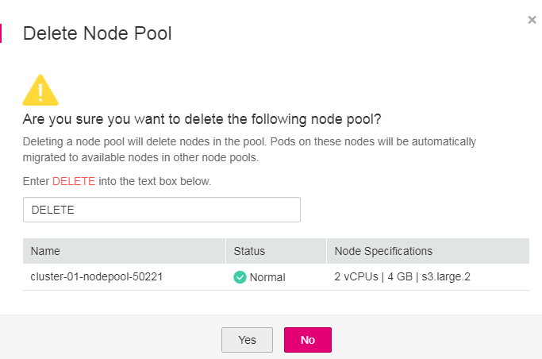

# Managing a Node Pool

## Configuration Management

To facilitate the management of Kubernetes parameters in a cluster, the cloud provides the configuration function. This function allows you to perform in-depth configuration on core components. For details, see  [kubelet](https://v1-15.docs.kubernetes.io/docs/reference/command-line-tools-reference/kubelet)  and  [docker](https://docs.docker.com/engine/reference/commandline/dockerd).

> **NOTE:**   
>-   This function is available only for clusters of v1.15 or later.  
>-   The default node pool DefaultPool does not support this type of configuration.  

1.  Log in to the CCE console. In the navigation pane, choose  **Resource Management**  \>  **Node Pools**.
2.  In the upper right corner of the displayed page, select a cluster to filter node pools by cluster.
3.  Click  **Configuration**  next to the node pool name.
4.  Change the values of the following Kubernetes parameters based on service requirements:

    **Table  1**  Kubernetes parameters

    
    <table><thead align="left"><tr id="row8546105514277"><th class="cellrowborder" valign="top" width="23.577642235776423%" id="mcps1.2.5.1.1">
Component

    </th>
    <th class="cellrowborder" valign="top" width="31.86681331866813%" id="mcps1.2.5.1.2">
Parameter

    </th>
    <th class="cellrowborder" valign="top" width="32.966703329667034%" id="mcps1.2.5.1.3">
Description

    </th>
    <th class="cellrowborder" valign="top" width="11.58884111588841%" id="mcps1.2.5.1.4">
Default Value

    </th>
    </tr>
    </thead>
    <tbody><tr id="row12546165518278"><td class="cellrowborder" rowspan="2" valign="top" width="23.577642235776423%" headers="mcps1.2.5.1.1 ">
docker

    </td>
    <td class="cellrowborder" valign="top" width="31.86681331866813%" headers="mcps1.2.5.1.2 ">
native-umask

    </td>
    <td class="cellrowborder" valign="top" width="32.966703329667034%" headers="mcps1.2.5.1.3 ">
`--exec-opt native.umask

    </td>
    <td class="cellrowborder" valign="top" width="11.58884111588841%" headers="mcps1.2.5.1.4 ">
normal

    </td>
    </tr>
    <tr id="row254765502711"><td class="cellrowborder" valign="top" headers="mcps1.2.5.1.1 ">
docker-base-size

    </td>
    <td class="cellrowborder" valign="top" headers="mcps1.2.5.1.2 ">
`--storage-opts dm.basesize

    </td>
    <td class="cellrowborder" valign="top" headers="mcps1.2.5.1.3 ">
10G

    </td>
    </tr>
    <tr id="row17272192410524"><td class="cellrowborder" rowspan="2" valign="top" width="23.577642235776423%" headers="mcps1.2.5.1.1 ">
kube-proxy

    </td>
    <td class="cellrowborder" valign="top" width="31.86681331866813%" headers="mcps1.2.5.1.2 ">
conntrack-min

    </td>
    <td class="cellrowborder" valign="top" width="32.966703329667034%" headers="mcps1.2.5.1.3 ">
sysctl -w net.nf_conntrack_max

    </td>
    <td class="cellrowborder" valign="top" width="11.58884111588841%" headers="mcps1.2.5.1.4 ">
131072

    </td>
    </tr>
    <tr id="row569134712527"><td class="cellrowborder" valign="top" headers="mcps1.2.5.1.1 ">
conntrack-tcp-timeout-close-wait

    </td>
    <td class="cellrowborder" valign="top" headers="mcps1.2.5.1.2 ">
sysctl -w net.netfilter.nf_conntrack_tcp_timeout_clouse_wait

    </td>
    <td class="cellrowborder" valign="top" headers="mcps1.2.5.1.3 ">
1h0m0s

    </td>
    </tr>
    <tr id="row175476554277"><td class="cellrowborder" rowspan="6" valign="top" width="23.577642235776423%" headers="mcps1.2.5.1.1 ">
kubelet

    </td>
    <td class="cellrowborder" valign="top" width="31.86681331866813%" headers="mcps1.2.5.1.2 ">
cpu-manager-policy

    </td>
    <td class="cellrowborder" valign="top" width="32.966703329667034%" headers="mcps1.2.5.1.3 ">
`--cpu-manager-policy

    </td>
    <td class="cellrowborder" valign="top" width="11.58884111588841%" headers="mcps1.2.5.1.4 ">
none

    </td>
    </tr>
    <tr id="row15547755132711"><td class="cellrowborder" valign="top" headers="mcps1.2.5.1.1 ">
kube-api-qps

    </td>
    <td class="cellrowborder" valign="top" headers="mcps1.2.5.1.2 ">
QPS communicating with kube-apiserver.

    </td>
    <td class="cellrowborder" valign="top" headers="mcps1.2.5.1.3 ">
100

    </td>
    </tr>
    <tr id="row9547135514272"><td class="cellrowborder" valign="top" headers="mcps1.2.5.1.1 ">
kube-api-burst

    </td>
    <td class="cellrowborder" valign="top" headers="mcps1.2.5.1.2 ">
Burst communicating with kube-apiserver.

    </td>
    <td class="cellrowborder" valign="top" headers="mcps1.2.5.1.3 ">
100

    </td>
    </tr>
    <tr id="row135471551272"><td class="cellrowborder" valign="top" headers="mcps1.2.5.1.1 ">
max-pods

    </td>
    <td class="cellrowborder" valign="top" headers="mcps1.2.5.1.2 ">
Maximum number of pods managed by kubelet.

    </td>
    <td class="cellrowborder" valign="top" headers="mcps1.2.5.1.3 ">
110

    </td>
    </tr>
    <tr id="row34291238195413"><td class="cellrowborder" valign="top" headers="mcps1.2.5.1.1 ">
with-local-dns

    </td>
    <td class="cellrowborder" valign="top" headers="mcps1.2.5.1.2 ">
Whether to use the local IP address as the ClusterDNS of the node.

    </td>
    <td class="cellrowborder" valign="top" headers="mcps1.2.5.1.3 ">
false

    </td>
    </tr>
    <tr id="row18828113575414"><td class="cellrowborder" valign="top" headers="mcps1.2.5.1.1 ">
allowed-unsafe-sysctls

    </td>
    <td class="cellrowborder" valign="top" headers="mcps1.2.5.1.2 ">
Insecure system configuration allowed.

    </td>
    <td class="cellrowborder" valign="top" headers="mcps1.2.5.1.3 ">
[]

    </td>
    </tr>
    </tbody>
    </table>

5.  Click  **OK**.

## Editing a Node Pool

1.  Log in to the CCE console. In the navigation pane, choose  **Resource Management**  \>  **Node Pools**.
2.  In the upper right corner of the displayed page, select a cluster to filter node pools by cluster.
3.  Click  **Edit**  next to the name of the node pool you will edit. In the  **Edit Node Pool**  dialog box, edit the following parameters:

    **Table  2**  Editing node pool parameters

    
    <table><thead align="left"><tr id="row173212251235"><th class="cellrowborder" valign="top" width="28.000000000000004%" id="mcps1.2.3.1.1">
Parameter

    </th>
    <th class="cellrowborder" valign="top" width="72%" id="mcps1.2.3.1.2">
Description

    </th>
    </tr>
    </thead>
    <tbody><tr id="row163229255313"><td class="cellrowborder" valign="top" width="28.000000000000004%" headers="mcps1.2.3.1.1 ">
Name

    </td>
    <td class="cellrowborder" valign="top" width="72%" headers="mcps1.2.3.1.2 ">
Name of the node pool.

    </td>
    </tr>
    <tr id="row6334727910"><td class="cellrowborder" valign="top" width="28.000000000000004%" headers="mcps1.2.3.1.1 ">
Nodes

    </td>
    <td class="cellrowborder" valign="top" width="72%" headers="mcps1.2.3.1.2 ">
Modify the number of nodes based on service requirements.

    </td>
    </tr>
    <tr id="row111551253912"><td class="cellrowborder" valign="top" width="28.000000000000004%" headers="mcps1.2.3.1.1 ">
Autoscaler

    </td>
    <td class="cellrowborder" valign="top" width="72%" headers="mcps1.2.3.1.2 ">
By default, autoscaler is disabled.

    
After you enable autoscaler by clicking After you enable autoscaler by clicking , nodes in the node pool are automatically created or deleted based on service requirements.

    <ul id="ul63223620274"><li><strong id="b98562832611">Maximum Nodes</strong> and <strong id="b4541113102617">Minimum Nodes</strong>: You can set the maximum and minimum number of nodes to ensure that the number of nodes to be scaled is within a proper range.</li></ul>
    <ul id="ul15733045165119"><li><strong id="b16822104144015">Priority</strong>: You can set the priority of auto scaling between node pools based on service requirements. If the value is set to <strong id="b48229418409">0</strong>, scaling is performed based on the minimum resource waste principle.</li><li><strong id="b13822114119406">Scale-In Cooling Interval</strong>: Set this parameter in the unit of minute. This field indicates the period during which the nodes added in the current node pool cannot be scaled in.</li></ul>
    
If the <strong id="b18191718101819">Autoscaler</strong> field is set to on, install the <a href="autoscaler.md">autoscaler add-on</a> to use the autoscaler feature.

    </td>
    </tr>
    <tr id="row1535723154615"><td class="cellrowborder" valign="top" width="28.000000000000004%" headers="mcps1.2.3.1.1 ">
Taints

    </td>
    <td class="cellrowborder" valign="top" width="72%" headers="mcps1.2.3.1.2 "><ul id="ul1414103745816"><li>This field is left blank by default. Taints allow nodes to repel a set of pods. You can add a maximum of 10 taints for each node pool. Each taint contains the following parameters:<ul id="ul17274222121015"><li><strong id="b138225358187">Key</strong>: A key must contain 1 to 63 characters starting with a letter or digit. Only letters, digits, hyphens (-), underscores (_), and periods (.) are allowed. A DNS subdomain name can be used as the prefix of a key.</li><li><strong id="b172009380180">Value</strong>: A value must start with a letter or digit and can contain a maximum of 63 characters, including letters, digits, hyphens (-), underscores (_), and periods (.).</li><li><strong id="b20244184015182">Effect</strong>: Available options are <strong id="b19246154041816">NoSchedule</strong>, <strong id="b824764019183">PreferNoSchedule</strong>, and <strong id="b624994001818">NoExecute</strong>.</li></ul>
    
 NOTICE: 
<ul id="ul104271158181515"><li>If taints are used, you must configure tolerations in the YAML files of pods. Otherwise, scale-up may fail or pods cannot be scheduled onto the added nodes.</li><li>Taints cannot be modified after configuration. Incorrect taints may cause a scale-up failure or prevent pods from being scheduled onto the added nodes.</li></ul>
    

    </li></ul>
    </td>
    </tr>
    <tr id="row133224252315"><td class="cellrowborder" valign="top" width="28.000000000000004%" headers="mcps1.2.3.1.1 ">
K8S Labels

    </td>
    <td class="cellrowborder" valign="top" width="72%" headers="mcps1.2.3.1.2 ">
K8S labels are key/value pairs that are attached to objects, such as pods. Labels are intended to be used to specify identifying attributes of objects that are meaningful and relevant to users, but do not directly imply semantics to the core system. For more information, see <a href="https://kubernetes.io/docs/concepts/overview/working-with-objects/labels/" target="_blank" rel="noopener noreferrer">Labels and Selectors</a>.

    </td>
    </tr>
    </tbody>
    </table>

4.  After the configuration is complete, click  **Save**.

    In the node pool list, the node pool status is  **Scaling**. After the status changes to  **Complete**, the node pool parameters are edited successfully.

## Copying a Node Pool

You can copy the configuration of an existing node pool to create a new node pool on the CCE console.

1.  Log in to the CCE console. In the navigation pane, choose  **Resource Management**  \>  **Node Pools**.
2.  In the upper right corner of the displayed page, select a cluster to filter node pools by cluster.
3.  Choose  **More \> Copy**  next to a node pool name to copy the node pool.
4.  The configuration of the selected node pool is replicated to the Create Node Pool page. You can edit the configuration as required and click  **Next: Confirm**.
5.  On the  **Confirm**  page, confirm the node pool configuration and click  **Create Now**. Then, a new node pool is created based on the edited configuration.

## Migrating a Node

You can migrate a node from a node pool to the default node pool in the same cluster. Currently, a node in the default node pool cannot be migrated to another node pool.

1.  Log in to the CCE console. In the navigation pane, choose  **Resource Management**  \>  **Node Pools**.
2.  In the upper right corner of the displayed page, select a cluster to filter node pools by cluster.
3.  Click  **More**\>  **Migrate**  next to the name of the node pool.
4.  In the dialog box displayed, select the destination node pool and the node to be migrated.

    > **NOTE:**   
    >-   Check whether the disk specifications of the node to be migrated are the same as those of the destination node pool.  
    >-   After node migration, original resources tags, Kubernetes tags, and taints will be retained, and new tags and taints from the destination node pool will be added.  

5.  Click  **OK**.

## Deleting a Node Pool

Deleting a node pool will delete nodes in the pool. Pods on these nodes will be automatically migrated to available nodes in other node pools. If pods in the node pool have a specific node selector and none of the other nodes in the cluster satisfies the node selector, the pods will become unschedulable.

1.  Log in to the CCE console. In the navigation pane, choose  **Resource Management**  \>  **Node Pools**.
2.  In the upper right corner of the displayed page, select a cluster to filter node pools by cluster.
3.  Choose  **More \> Delete**  next to a node pool name to delete the node pool.
4.  Read the precautions in the  **Delete Node Pool**  dialog box.
5.  Enter  **DELETE**  in the text box and click  **Yes**  to confirm that you want to continue the deletion.

    **Figure  1**  Deleting a Node Pool  
    

