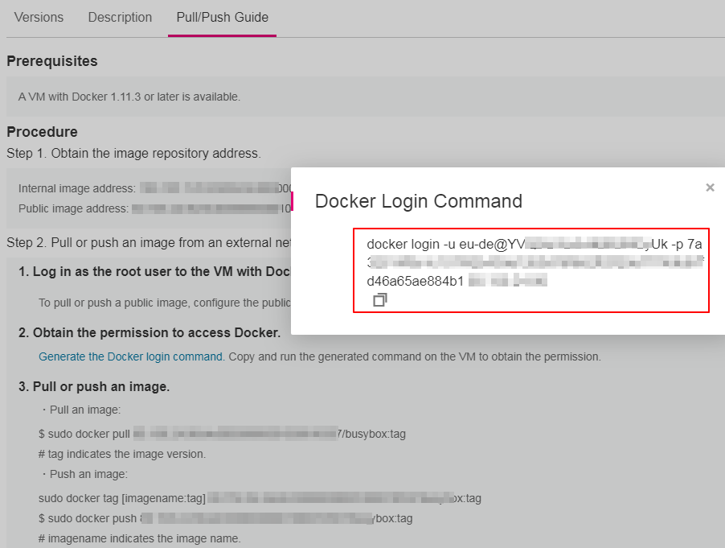

# Migrating Images<a name="cce_01_9997"></a>

Migrate the images stored in the image repository of CCE 1.0 to CCE 2.0.

## Prerequisites<a name="section84133634315"></a>

-   A VM is available. The VM is bound to a public IP address and can access the Internet. Docker \(earlier than 1706\) and jq have been installed on the VM.
-   Configure an access whitelist for Docker, and add the access addresses of the image repositories of CCE 1.0 and CCE 2.0 to the  **--insecure-registry**  parameter of Docker.

## Procedure<a name="section924789174410"></a>

1.  Obtain a docker login command from the image repository page of CCE 2.0.
    1.  Log in to the CCE 2.0 console. In the navigation pane, choose  **Image Repository**.
    2.  In the image repository list, click the name of the target image repository. On the  **Pull/Push Guide**  tab page, click  **Generate the Docker login command**.

        

2.  Log in to the CCE 1.0 console, and obtain the docker login configuration file  **dockercfg.json**.

    

3.  Log in to the Docker client as user  **root**, and copy the  **dockercfg.json**  file obtained in Step 2 and the image migration tool to the  **/root**  directory.
4.  In the  **/root**  directory, create a file named  **image\_list**. In the file, write the images to be migrated in the following format. Each image occupies a row.

    For example, write the BusyBox image into the  **image\_list**  file as follows:

    ```
    10.44.200.121:443/otc0***507/busybox:latest
    ```

5.  Run the following command to automatically migrate the images to the image repository of CCE 2.0:

    **bash  migrate.sh**  "_\{__The_ _login_ _command_ _obtained_ _in_ _Step 1_"

    After the preceding command is executed, go to the image repository of CCE 2.0. You can find that images have been successfully pushed.

    


