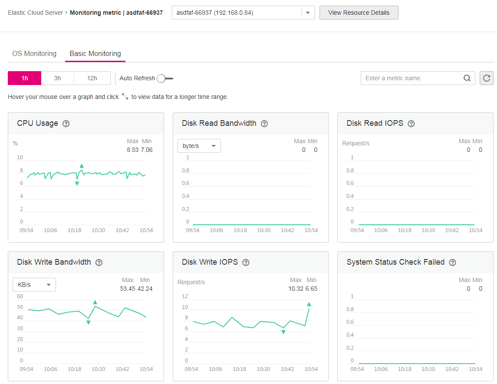

# Monitoring a Node

CCE is seamlessly integrated with the Cloud Eye service. You can learn the resource usage of the worker nodes in each cluster and monitoring metrics of ECSs in the cluster in real time and receive alarms in a timely manner to ensure smooth service running.

## Procedure

1.  Log in to the CCE console. In the navigation pane, choose  **Resource Management**  \>  **Nodes**.
2.  Select a cluster in the upper right corner of the  **Nodes**  page.
3.  In the same row of the node to be monitored, click  **Monitoring**.
4.  On the Cloud Eye console, view the basic monitoring information about the node, including the CPU usage, inbound bandwidth, outbound bandwidth, system disk BPS, and system disk IOPS.

    **Figure  1**  Metrics  
    

