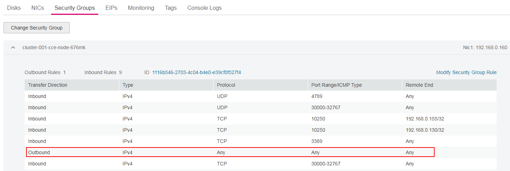

# NodePort<a name="cce_01_0142"></a>

A service is exposed on each node's IP address at a static port \(the NodePort\). A ClusterIP service, to which the NodePort service will route, is automatically created. By requesting the <NodeIP\>:<NodePort\>, you can access a NodePort service from the outside of the cluster.

NodePort access is further classified into intra-VPC access and EIP-based access.

-   **Intra-VPC Access**

    A workload can be accessed from other workloads in the same VPC through a  node IP address.

    Typical scenario: Workloads in a  Kubernetes cluster  need to be accessed by other workloads in the same VPC.

    **Figure  1**  Intra-VPC access by using a ClusterIP service address<a name="fig32443742164859"></a>  
    


-   **EIP-based Access**

    If the NodePort service needs to be exposed to public networks, the workload that the NodePort service targets can be accessed at an EIP from public networks.

    This can happen only after an EIP is bound to any node in the cluster and a service port is mapped to a node port in the 30000–32767 range. For example, the access address could be 10.117.117.117:30000.

    **Figure  2**  EIP-based access<a name="fig57690358164948"></a>  
    


## Setting the Access Type on the Console<a name="section8124108325"></a>

You can set the service access type when creating a  workload  on the CCE console. An Nginx workload is used as an example.

1.  In the  **Set Application Access**  step of  [Creating a Deployment](creating-a-deployment.md)  or  [Creating a StatefulSet](creating-a-statefulset.md), click  **Add Service**  and set the following parameters:
    -   **Access Type**: Select  **NodePort**.
    -   **Service Name**: can be the same as the workload name.
    -   **Service Affinity**
        -   **Cluster level**: External traffic is routed to all nodes in the cluster while masking clients' source IP addresses.
        -   **Node level**: External traffic is routed to the node where the workload targeted by the service is located, without masking clients' source IP addresses.

    -   **Port Settings**
        -   **Protocol**: protocol to be used by the service.
        -   **Container Port**: a port on which the workload in the container image listens. The value ranges from 1 to 65535.
        -   **Access Port**: Node port \(with a private IP address\) to which the container port will be mapped. You are advised to select  **Automatically generated**.
            -   **Automatically generated**: The system automatically assigns a port number.
            -   **Specified port**: You have to manually specify a fixed node port number in the range of 30000–32767. Ensure that the port is unique in a cluster.


2.  On the  **Add Service**  page, click  **OK**. On the workload creation page, click  **Next**. On the  **Configure Advanced Settings**  page, click  **Create**.
3.  <a name="li13702330143312"></a>Click  **View Deployment Details**  or  **View StatefulSet Details**. On the  **Services**  tab page, obtain the access address, for example, 192.168.0.160:30358.

## Setting the Intra-VPC Access Type Using kubectl<a name="section813715073217"></a>

You can run kubectl commands to set the service access type. This section uses an Nginx workload as an example to describe how to set intra-VPC access using kubectl.

**Prerequisites**

You have configured the kubectl and connected an ECS to the cluster. For details, see  [Connecting to a Kubernetes Cluster Using kubectl](connecting-to-a-kubernetes-cluster-using-kubectl.md).

**Procedure**

1.  Log in to the ECS on which the kubectl has been configured. For details, see  [Logging In to a Linux ECS](https://docs.otc.t-systems.com/en-us/usermanual/ecs/en-us_topic_0013771089.html).
2.  Create and edit the  **nginx-deployment.yaml**  and  **nginx-nodeport-svc.yaml**  files.

    The file names are user-defined.  **nginx-deployment.yaml**  and  **nginx-nodeport-svc.yaml**  are merely example file names.

    **vi nginx-deployment.yaml**

    ```
    apiVersion: extensions/v1beta1
    kind: Deployment
    metadata:
      name: nginx
    spec:
      replicas: 1
      selector:
        matchLabels:
          app: nginx
      strategy:
        type: RollingUpdate
      template:
        metadata:
          labels:
            app: nginx
        spec:
          containers:
          - image: nginx 
            imagePullPolicy: Always
            name: nginx
          imagePullSecrets:
          - name: default-secret
    ```

    **vi nginx-nodeport-svc.yaml**

    ```
    apiVersion: v1
    kind: Service
    metadata:
      labels:
        app: nginx
      name: nginx-nodeport
    spec:
      ports:
      - name: service
    #   nodePort: 30000
        port: 80
        protocol: TCP
        targetPort: 80
      selector:
        app: nginx
      type: NodePort
    ```

    **Table  1**  Key parameters

    <a name="table56443210447"></a>
    <table><thead align="left"><tr id="row157011325448"><th class="cellrowborder" valign="top" width="19.009999999999998%" id="mcps1.2.4.1.1"><p id="p127013213445"><a name="p127013213445"></a><a name="p127013213445"></a>Parameter</p>
    </th>
    <th class="cellrowborder" valign="top" width="18.43%" id="mcps1.2.4.1.2"><p id="p070113234410"><a name="p070113234410"></a><a name="p070113234410"></a>Type</p>
    </th>
    <th class="cellrowborder" valign="top" width="62.56%" id="mcps1.2.4.1.3"><p id="p870832124415"><a name="p870832124415"></a><a name="p870832124415"></a>Description</p>
    </th>
    </tr>
    </thead>
    <tbody><tr id="row19708321446"><td class="cellrowborder" valign="top" width="19.009999999999998%" headers="mcps1.2.4.1.1 "><p id="en-us_topic_0079615000_p41087597"><a name="en-us_topic_0079615000_p41087597"></a><a name="en-us_topic_0079615000_p41087597"></a>nodePort</p>
    </td>
    <td class="cellrowborder" valign="top" width="18.43%" headers="mcps1.2.4.1.2 "><p id="en-us_topic_0079615000_p66528668"><a name="en-us_topic_0079615000_p66528668"></a><a name="en-us_topic_0079615000_p66528668"></a>Integer</p>
    </td>
    <td class="cellrowborder" valign="top" width="62.56%" headers="mcps1.2.4.1.3 "><p id="p164654108492"><a name="p164654108492"></a><a name="p164654108492"></a>Access port set on the console. The value ranges from 30000 to 32767. If this parameter is left unspecified, the value is automatically generated.</p>
    </td>
    </tr>
    <tr id="row2787832142320"><td class="cellrowborder" valign="top" width="19.009999999999998%" headers="mcps1.2.4.1.1 "><p id="p5788113218236"><a name="p5788113218236"></a><a name="p5788113218236"></a>port</p>
    </td>
    <td class="cellrowborder" valign="top" width="18.43%" headers="mcps1.2.4.1.2 "><p id="en-us_topic_0079615000_p54093956"><a name="en-us_topic_0079615000_p54093956"></a><a name="en-us_topic_0079615000_p54093956"></a>Integer</p>
    </td>
    <td class="cellrowborder" valign="top" width="62.56%" headers="mcps1.2.4.1.3 "><p id="p167881320237"><a name="p167881320237"></a><a name="p167881320237"></a>Access port of the cluster-internal IP address. The value ranges from 1 to 65535.</p>
    </td>
    </tr>
    <tr id="row13718321449"><td class="cellrowborder" valign="top" width="19.009999999999998%" headers="mcps1.2.4.1.1 "><p id="en-us_topic_0079615000_p11039195"><a name="en-us_topic_0079615000_p11039195"></a><a name="en-us_topic_0079615000_p11039195"></a>protocol</p>
    </td>
    <td class="cellrowborder" valign="top" width="18.43%" headers="mcps1.2.4.1.2 "><p id="en-us_topic_0079615000_p17699892"><a name="en-us_topic_0079615000_p17699892"></a><a name="en-us_topic_0079615000_p17699892"></a>String</p>
    </td>
    <td class="cellrowborder" valign="top" width="62.56%" headers="mcps1.2.4.1.3 "><p id="p835181810259"><a name="p835181810259"></a><a name="p835181810259"></a>IP protocol used by the port. The value can be <strong id="b12448174110917"><a name="b12448174110917"></a><a name="b12448174110917"></a>TCP</strong> or <strong id="b453134311913"><a name="b453134311913"></a><a name="b453134311913"></a>UDP</strong>.</p>
    </td>
    </tr>
    <tr id="row1671532144412"><td class="cellrowborder" valign="top" width="19.009999999999998%" headers="mcps1.2.4.1.1 "><p id="en-us_topic_0079615000_p53639231"><a name="en-us_topic_0079615000_p53639231"></a><a name="en-us_topic_0079615000_p53639231"></a>targetPort</p>
    </td>
    <td class="cellrowborder" valign="top" width="18.43%" headers="mcps1.2.4.1.2 "><p id="en-us_topic_0079615000_p8117426"><a name="en-us_topic_0079615000_p8117426"></a><a name="en-us_topic_0079615000_p8117426"></a>String</p>
    </td>
    <td class="cellrowborder" valign="top" width="62.56%" headers="mcps1.2.4.1.3 "><p id="p1262218433513"><a name="p1262218433513"></a><a name="p1262218433513"></a>Container port set on the console. The value ranges from 1 to 65535.</p>
    </td>
    </tr>
    <tr id="row371674812911"><td class="cellrowborder" valign="top" width="19.009999999999998%" headers="mcps1.2.4.1.1 "><p id="p6716134816295"><a name="p6716134816295"></a><a name="p6716134816295"></a>type</p>
    </td>
    <td class="cellrowborder" valign="top" width="18.43%" headers="mcps1.2.4.1.2 "><p id="en-us_topic_0079615000_p18968549"><a name="en-us_topic_0079615000_p18968549"></a><a name="en-us_topic_0079615000_p18968549"></a>String</p>
    </td>
    <td class="cellrowborder" valign="top" width="62.56%" headers="mcps1.2.4.1.3 "><p id="p13717148202913"><a name="p13717148202913"></a><a name="p13717148202913"></a>Access type set on the console. NodePort indicates the private IP address of a node.</p>
    </td>
    </tr>
    </tbody>
    </table>

3.  Create a workload.

    **kubectl create -f nginx-deployment.yaml**

    If information similar to the following is displayed, the workload is being created.

    ```
    deployment "nginx" created
    ```

    **kubectl get po**

    If information similar to the following is displayed, the workload is running.

    ```
    NAME                     READY     STATUS             RESTARTS   AGE
    etcd-0                   0/1       ImagePullBackOff   0          48m
    icagent-m9dkt            0/0       Running            0          3d
    nginx-2601814895-qhxqv   1/1       Running            0          9s
    ```

4.  Create a service.

    **kubectl create -f nginx-nodeport-svc.yaml**

    If information similar to the following is displayed, the service is being created.

    ```
    service "nginx-nodeport" created
    ```

    **kubectl get svc**

    If information similar to the following is displayed, the service has been created.

    ```
    NAME             TYPE        CLUSTER-IP     EXTERNAL-IP   PORT(S)        AGE
    etcd-svc         ClusterIP   None           <none>        3120/TCP       49m
    kubernetes       ClusterIP   10.247.0.1     <none>        443/TCP        3d
    nginx-nodeport   NodePort    10.247.4.225   <none>        80:30000/TCP   7s
    ```

5.  Run the  **curl**  command to verify whether the workload is accessible.

    **curl **_192.168.2.240:30000_

    **192.168.2.240**  is the IP address of any node in the cluster, and  **30000**  is the port opened on all nodes in the cluster.

    If information similar to the following is displayed, the workload is accessible.

    ```
    <html>
    <head>
    <title>Welcome to nginx!</title>
    <style>
        body {
            width: 35em;
            margin: 0 auto;
            font-family: Tahoma, Verdana, Arial, sans-serif;
        }
    </style>
    </head>
    <body>
    <h1>Welcome to nginx!</h1>
    <p>If you see this page, the nginx web server is successfully installed and
    working. Further configuration is required.</p>
    
    <p>For online documentation and support please refer to
    <a href="http://nginx.org/">nginx.org</a>.<br/>
    Commercial support is available at
    <a href="http://nginx.com/">nginx.com</a>.</p>
    
    <p><em>Thank you for using nginx.</em></p>
    </body>
    </html>
    ```


## Setting the EIP-based Access Type Using kubectl<a name="section178584033417"></a>

This section uses an Nginx workload as an example to describe how to implement EIP-based access using kubectl.

**Prerequisites**

You have configured the kubectl and connected an ECS to the cluster. For details, see  [Connecting to a Kubernetes Cluster Using kubectl](connecting-to-a-kubernetes-cluster-using-kubectl.md).

**Procedure**

1.  Log in to the  ECS  on which the kubectl has been configured. For details, see  [Logging In to a Linux ECS](https://docs.otc.t-systems.com/en-us/usermanual/ecs/en-us_topic_0013771089.html).
2.  Create and edit the  **nginx-deployment.yaml**  and  **nginx-eip-svc.yaml**  files.

    The file names are user-defined.  **nginx-deployment.yaml**  and  **nginx-eip-svc.yaml**  are merely example file names.

    **vi nginx-deployment.yaml**

    ```
    apiVersion: extensions/v1beta1
    kind: Deployment
    metadata:
      name: nginx
    spec:
      replicas: 1
      selector:
        matchLabels:
          app: nginx
      strategy:
        type: RollingUpdate
      template:
        metadata:
          labels:
            app: nginx
        spec:
          containers:
          - image: nginx 
            imagePullPolicy: Always
            name: nginx
          imagePullSecrets:
          - name: default-secret
    ```

    **vi nginx-eip-svc.yaml**

    ```
    apiVersion: v1
    kind: Service
    metadata:
      labels:
        app: nginx
      name: nginx-eip
    spec:
      ports:
      - name: service0
        nodePort: 30000
        port: 80
        protocol: TCP
        targetPort: 80
      selector:
        app: nginx
      type: NodePort
    ```

    **Table  2**  Key parameters

    <a name="table1819001615355"></a>
    <table><thead align="left"><tr id="row1519121663519"><th class="cellrowborder" valign="top" width="33.2%" id="mcps1.2.4.1.1"><p id="p18191161619356"><a name="p18191161619356"></a><a name="p18191161619356"></a>Parameter</p>
    </th>
    <th class="cellrowborder" valign="top" width="15.110000000000001%" id="mcps1.2.4.1.2"><p id="p1191141613357"><a name="p1191141613357"></a><a name="p1191141613357"></a>Type</p>
    </th>
    <th class="cellrowborder" valign="top" width="51.690000000000005%" id="mcps1.2.4.1.3"><p id="p1919116161353"><a name="p1919116161353"></a><a name="p1919116161353"></a>Description</p>
    </th>
    </tr>
    </thead>
    <tbody><tr id="row7430236123515"><td class="cellrowborder" valign="top" width="33.2%" headers="mcps1.2.4.1.1 "><p id="p2430336153520"><a name="p2430336153520"></a><a name="p2430336153520"></a>service.portal.kubernetes.io/type</p>
    </td>
    <td class="cellrowborder" valign="top" width="15.110000000000001%" headers="mcps1.2.4.1.2 "><p id="p19430103693512"><a name="p19430103693512"></a><a name="p19430103693512"></a>String</p>
    </td>
    <td class="cellrowborder" valign="top" width="51.690000000000005%" headers="mcps1.2.4.1.3 "><p id="p643019366352"><a name="p643019366352"></a><a name="p643019366352"></a>The external access type is EIP-based.</p>
    </td>
    </tr>
    <tr id="row15191171618357"><td class="cellrowborder" valign="top" width="33.2%" headers="mcps1.2.4.1.1 "><p id="p20192181615358"><a name="p20192181615358"></a><a name="p20192181615358"></a>nodePort</p>
    </td>
    <td class="cellrowborder" valign="top" width="15.110000000000001%" headers="mcps1.2.4.1.2 "><p id="p14194181613351"><a name="p14194181613351"></a><a name="p14194181613351"></a>Integer</p>
    </td>
    <td class="cellrowborder" valign="top" width="51.690000000000005%" headers="mcps1.2.4.1.3 "><p id="p91941216193518"><a name="p91941216193518"></a><a name="p91941216193518"></a>Access port set on the console. The value ranges from 30000 to 32767. If this parameter is left unspecified, the value is automatically generated.</p>
    </td>
    </tr>
    <tr id="row81941516153513"><td class="cellrowborder" valign="top" width="33.2%" headers="mcps1.2.4.1.1 "><p id="p1619571643513"><a name="p1619571643513"></a><a name="p1619571643513"></a>port</p>
    </td>
    <td class="cellrowborder" valign="top" width="15.110000000000001%" headers="mcps1.2.4.1.2 "><p id="p1195181653518"><a name="p1195181653518"></a><a name="p1195181653518"></a>Integer</p>
    </td>
    <td class="cellrowborder" valign="top" width="51.690000000000005%" headers="mcps1.2.4.1.3 "><p id="p17195916113515"><a name="p17195916113515"></a><a name="p17195916113515"></a>Access port mapped to the cluster-internal IP address. The value ranges from 1 to 65535.</p>
    </td>
    </tr>
    <tr id="row201957167350"><td class="cellrowborder" valign="top" width="33.2%" headers="mcps1.2.4.1.1 "><p id="p17195131643517"><a name="p17195131643517"></a><a name="p17195131643517"></a>protocol</p>
    </td>
    <td class="cellrowborder" valign="top" width="15.110000000000001%" headers="mcps1.2.4.1.2 "><p id="p919551619351"><a name="p919551619351"></a><a name="p919551619351"></a>String</p>
    </td>
    <td class="cellrowborder" valign="top" width="51.690000000000005%" headers="mcps1.2.4.1.3 "><p id="p10195181611354"><a name="p10195181611354"></a><a name="p10195181611354"></a>IP protocol used by the port. The value can be <strong id="b2355121915358"><a name="b2355121915358"></a><a name="b2355121915358"></a>TCP</strong> or <strong id="b1837015193351"><a name="b1837015193351"></a><a name="b1837015193351"></a>UDP</strong>.</p>
    </td>
    </tr>
    <tr id="row1719518169356"><td class="cellrowborder" valign="top" width="33.2%" headers="mcps1.2.4.1.1 "><p id="p1419521610354"><a name="p1419521610354"></a><a name="p1419521610354"></a>targetPort</p>
    </td>
    <td class="cellrowborder" valign="top" width="15.110000000000001%" headers="mcps1.2.4.1.2 "><p id="p17195171613355"><a name="p17195171613355"></a><a name="p17195171613355"></a>String</p>
    </td>
    <td class="cellrowborder" valign="top" width="51.690000000000005%" headers="mcps1.2.4.1.3 "><p id="p819511683519"><a name="p819511683519"></a><a name="p819511683519"></a>Container port set on the console. The value ranges from 1 to 65535.</p>
    </td>
    </tr>
    <tr id="row619531693510"><td class="cellrowborder" valign="top" width="33.2%" headers="mcps1.2.4.1.1 "><p id="p1719615168353"><a name="p1719615168353"></a><a name="p1719615168353"></a>type</p>
    </td>
    <td class="cellrowborder" valign="top" width="15.110000000000001%" headers="mcps1.2.4.1.2 "><p id="p2196816113519"><a name="p2196816113519"></a><a name="p2196816113519"></a>String</p>
    </td>
    <td class="cellrowborder" valign="top" width="51.690000000000005%" headers="mcps1.2.4.1.3 "><p id="p16196121613518"><a name="p16196121613518"></a><a name="p16196121613518"></a>Access type set on the console. EIP-based access is based on a NodePort service.</p>
    </td>
    </tr>
    </tbody>
    </table>

3.  Create a workload.

    **kubectl create -f nginx-deployment.yaml**

    If information similar to the following is displayed, the workload is being created.

    ```
    deployment "nginx" created
    ```

    **kubectl get po**

    If information similar to the following is displayed, the workload is running.

    ```
    NAME                     READY     STATUS             RESTARTS   AGE
    etcd-0                   0/1       ImagePullBackOff   0          59m
    icagent-m9dkt            0/0       Running            0          3d
    nginx-2601814895-sf71t   1/1       Running            0          8s
    ```

4.  Create a service.

    **kubectl create -f nginx-eip-svc.yaml**

    If information similar to the following is displayed, the service has been created.

    ```
    service "nginx-eip" created
    ```

    **kubectl get svc**

    If information similar to the following is displayed, the service access type has been set successfully.

    ```
    NAME         TYPE        CLUSTER-IP       EXTERNAL-IP   PORT(S)        AGE
    etcd-svc     ClusterIP   None             <none>        3120/TCP       59m
    kubernetes   ClusterIP   10.247.0.1       <none>        443/TCP        3d
    nginx-eip    NodePort    10.247.120.135   <none>        80:30000/TCP   7s
    ```

5.  In the address bar of your browser, enter the access address \(for example, 10.78.44.60:30000\) and press  **Enter**.

    **10.78.44.60**  is the EIP, and  **30000**  is the node port number obtained in the previous step.

    **Figure  3**  Accessing Nginx through an EIP<a name="fig6924134814251"></a>  
    


## Methods of Verifying the Access Type<a name="section851316518140"></a>

-   **Verifying Intra-VPC Access**

1.  On the homepage of management console, choose  **Service List \> Computing**  \>  **Elastic Cloud Server**.
2.  Select any ECS in the same VPC as the workload that will be accessed, and confirm that the  security group  is open to the IP address and port to be connected.

    **Figure  4**  Confirming that the security group is open<a name="fig89539873216"></a>  
    

3.  Click  **Remote Login**. On the login page, enter the username and password.
4.  Run the  **curl**  command to check whether access to the workload is successful.

    > **NOTE:** 
    >Like other NodePort services, an intra-VPC access service will be assigned a cluster-internal IP address. You can use <service's cluster-internal IP address\>:<access port\> to verify whether the workload is reachable from inside the cluster. By default, <access port\> in <service's cluster-internal IP address\>:<access port\> is the same as the container port \(for example, 80\).

    **curl **_192.168.0.160:_30358

    **192.168.0.160:30358**  is the access address obtained in  [3](#li13702330143312).

    If information similar to the following is displayed, the workload is accessible.

    ```
    <html>
    <head>
    <title>Welcome to nginx!</title>
    <style>
        body {
            width: 35em;
            margin: 0 auto;
            font-family: Tahoma, Verdana, Arial, sans-serif;
        }
    </style>
    </head>
    <body>
    <h1>Welcome to nginx!</h1>
    <p>If you see this page, the nginx web server is successfully installed and
    working. Further configuration is required.</p>
    
    <p>For online documentation and support please refer to
    <a href="http://nginx.org/">nginx.org</a>.<br/>
    Commercial support is available at
    <a href="http://nginx.com/">nginx.com</a>.</p>
    
    <p><em>Thank you for using nginx.</em></p>
    </body>
    </html>
    ```


-   **Verifying EIP-based Access**

1.  After the workload is successfully created, choose  **Workloads**  \>  **Deployments**  or  **Workloads**  \>  **StatefulSets**  on the CCE console. Click the name of the workload you will verify to show more details of the workload. On the workload details page, click the  **Services**  tab and obtain the access address, for example, 10.78.27.59:30911.
2.  Click the access address.

    **Figure  5**  Accessing Nginx through an EIP<a name="fig1543716518012"></a>  
    


## Setting the Access Type After Creating a Workload on the Console<a name="section41290043210"></a>

You can set the access type after creating a workload. This has no impact on the workload status and takes effect immediately. The procedure is as follows:

1.  Log in to the CCE console. In the navigation pane, choose  **Workloads**  \>  **Deployments**. On the workload list, click the name of the workload for which you will create a service.

    > **NOTE:** 
    >If the service is associated with an ingress, the ingress is unavailable after the port information of the service is updated. In this case, you need to delete and recreate the service.

2.  On the  **Services**  tab page, click  **Create Service**.
3.  On the  **Create Service**  page, select  **NodePort**  from the  **Access Type**  drop-down list.
4.  Set node access parameters.
    -   **Service Name**: can be the same as the workload name.
    -   **Cluster Name**: name of the cluster where the workload runs. The value is inherited from the workload creation page and cannot be changed.
    -   **Namespace**: namespace where the workload is located. The value is inherited from the workload creation page and cannot be changed.
    -   **Workload**: a workload for which you want to add a service. The value is inherited from the workload creation page and cannot be changed.
    -   **Service Affinity**
        -   **Cluster level**: External traffic is routed to all nodes in the cluster while masking clients' source IP addresses.
        -   **Node level**: External traffic is routed to the node where the workload targeted by the service is located, without masking clients' source IP addresses.

    -   **Port Settings**
        -   **Protocol**: protocol to be used by the service.
        -   **Container Port**: a port on which the workload in the container image listens. The Nginx workload listens on port 80.
        -   **Access Port**: Node port \(with a private IP address\) to which the container port will be mapped. You are advised to select  **Automatically generated**.
            -   **Automatically generated**: The system automatically assigns a port number.
            -   **Specified port**: You have to manually specify a fixed node port number in the range of 30000–32767. Ensure that the port is unique in a cluster.


5.  Click  **Create**. A node access \(NodePort\) service will be added for the workload.

## Updating a Service<a name="section14145190183217"></a>

After adding a service, you can update the port configuration of the service. The procedure is as follows:

1.  Log in to the CCE console. In the navigation pane, choose  **Resource Management**  \>  **Network**. On the  **Services**  tab page, click  **Update**  for the service to be updated.
2.  On the  **Update Service**  page, select  **NodePort**  from the  **Access Type**  drop-down list.
3.  Update node access parameters.
    -   **Cluster Name**: name of the cluster where the workload runs. The value is inherited from the workload creation page and cannot be changed.
    -   **Namespace**: namespace where the workload is located. The value is inherited from the workload creation page and cannot be changed.
    -   **Workload**: a workload for which you want to update the service. The value is inherited from the workload creation page and cannot be changed.
    -   **Service Affinity**
        -   **Cluster level**: External traffic is routed to all nodes in the cluster while masking clients' source IP addresses.
        -   **Node level**: External traffic is routed to the node where the workload targeted by the service is located, without masking clients' source IP addresses.

    -   **Port Settings**
        -   **Protocol**: protocol to be used by the service.
        -   **Container Port**: a port on which the workload in the container image listens. The Nginx workload listens on port 80.
        -   **Access Port**: Node port \(with a private IP address\) to which the container port will be mapped. You are advised to select  **Automatically generated**.
            -   **Automatically generated**: The system automatically assigns a port number.
            -   **Specified port**: You have to manually specify a fixed node port number in the range of 30000–32767. Ensure that the port is unique in a cluster.


4.  Click  **Update**. The service will be updated for the workload.

