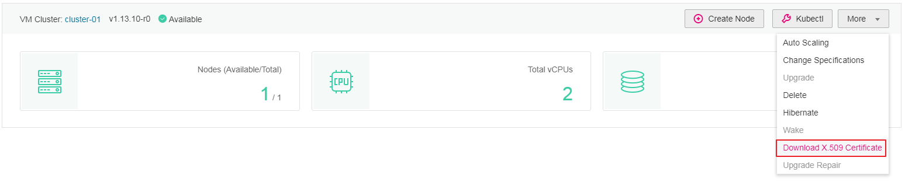

# Obtaining a Cluster Certificate

Before accessing cluster resources through open-source Kubernetes APIs, obtain the cluster's certificate.

## Constraints

-   This function works only for newly created clusters. For existing clusters, a CA certificate will not be able to update with the EIP of the master server.
-   When the EIP of the master server changes, the CA certificate still uses the old IP address \(unable to update\). In this case, the connection becomes unavailable.

## Procedure

1.  Log in to the CCE console. In the navigation pane, choose  **Resource Management**  \>  **Clusters**.
2.  In the card view of the target cluster, choose  **More \> Download X.509 Certificate**.

    **Figure  1**  Downloading a cluster certificate  
    

3.  In the displayed  **Download X.509 Certificate**  dialog box, download the X.509 certificate of the cluster as prompted.

    > **NOTICE:**   
    >The downloaded certificate contains three files:  **client.key**,  **client.crt**, and  **ca.crt**. Keep these files secure.  

