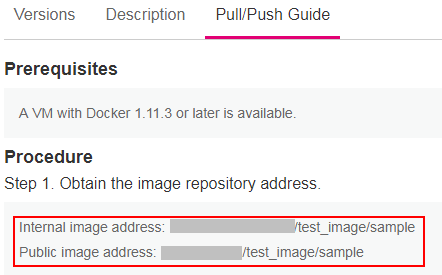
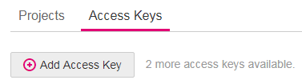
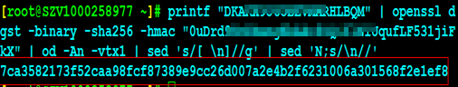

# Obtaining a Long-Term Valid Docker Login Command<a name="cce_01_0215"></a>

This chapter describes how to obtain a long-term valid  **docker login**  command.

## Procedure<a name="section12571630161312"></a>

1.  <a name="li5768123671815"></a>Obtain an image repository address and the name of a regional project.
    1.  Visit  [https://console.otc.t-systems.com/iam/\#/myCredential](https://console.otc.t-systems.com/iam/#/myCredential).
    2.  On the  **Projects**  tab page, view the project corresponding to the current region.

        The  **eu-de**  project corresponds to  **eu-de**, as shown in the following figure.

        **Figure  1**  Regions and projects<a name="fig108278021113"></a>  
        

    3.  Obtain the image repository address in CCE Console.

        **Figure  2**  Image repository address<a name="fig28617278018"></a>  
        

2.  <a name="li1863783911295"></a>Obtain the Access Key ID/Secret Access Key \(AK/SK\).

    > **NOTE:**   
    >If the AK/SK is available, you can directly use it.  

    1.  Visit  [https://console.otc.t-systems.com/iam/\#/myCredential](https://console.otc.t-systems.com/iam/#/myCredential).
    2.  On the  **Access Keys**  tab page, click  **Create Access Key**  to create an access key.

        **Figure  3**  Adding an access key<a name="fig1750516234350"></a>  
        

    3.  Enter the login password of the current user and verify the password by email or mobile phone.

        > **NOTE:**   
        >For the accounts created in Identity and Access Management \(IAM\), if no email address or mobile phone is filled during account creation, you only need to verify the login password.  

    4.  Click  **OK**  to download an access key.

        Properly keep the downloaded key. You need to upload the key when creating a cluster. Otherwise, the cluster cannot be created.

        > **NOTE:**   
        >Keep the access key confidential to prevent information leakage.  


3.  <a name="li132430753010"></a>Log in to a Linux PC and run the following command to obtain the login key:

    **printf "_$AK_" | openssl dgst -binary -sha256 -hmac "_$SK_" | od -An -vtx1 | sed 's/\[ \\n\]//g' | sed 'N;s/\\n//'**

    In the preceding information,  **$AK**  and  **$SK**  respectively indicate the AK and SK obtained in  [2](#li1863783911295).

    Example:

    

4.  Splice the  **docker login**  command in the following format:

    **docker** **login** **-u**  \[_Name of the regional project_\]**@**\[AK\]  **-p**  \[_Login key_\] \[_Image repository address_\]

    In the preceding information, the name of the regional project and the image repository address are obtained in  [1](#li5768123671815), the AK is obtained in  [2](#li1863783911295), and the login key is the execution result in  [3](#li132430753010).

    Example:

    ```
    docker login -u eu-de@kwb1******5IdAD -p 7ca3582173f52caa98fcf87389e9cc26d007a2e4b2f6231006a301568f2e1ef8 10.158.24.86
    ```


