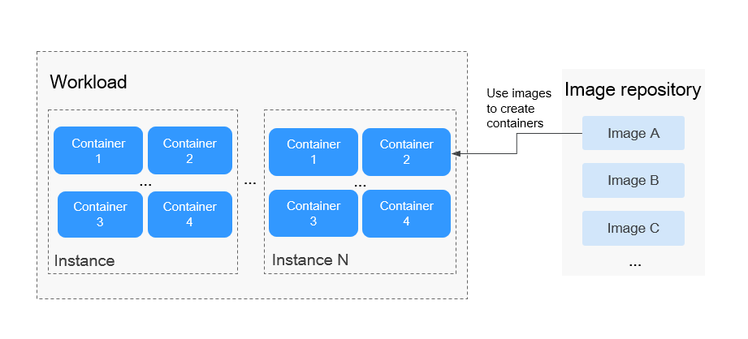

# Overview

A  workload  is an abstract model of a group of pods in Kubernetes. Kubernetes classify workloads into  Deployments,  StatefulSets,  DaemonSets,  jobs, and  cron jobs.

CCE provides Kubernetes-native container deployment and management and supports lifecycle management of container workloads, including creation, configuration, monitoring, capacity expansion, upgrade, uninstallation, service discovery, and load balancing.

## Basic Concepts

-   **Deployment**: Pods are completely independent of each other and functionally identical. They feature auto scaling and rolling upgrade. Typical examples include Nginx and WordPress. For details on how to create a deployment, see  [Creating a Deployment](creating-a-deployment.md).
-   **StatefulSet**: Pods are not completely independent of each other. They have stable persistent storage, and feature orderly deployment and deletion. Typical examples include MySQL-HA and etcd. For details on how to create a StatefulSet, see  [Creating a StatefulSet](creating-a-statefulset.md).
-   **DaemonSet**:  A DaemonSet ensures that all or some nodes run a pod. It is applicable to pods running on every node. Typical examples include Ceph, Fluentd, and Prometheus Node Exporter. For details about how to create a DaemonSet, see  [Creating a DaemonSet](creating-a-daemonset.md).
-   **Job**: A job is a resource object that Kubernetes uses to control tasks in batches.

    A job is different from a long-term servo workload \(such as Deployment and StatefulSet\). The former is started and terminated at specific times, while the latter runs unceasingly unless being terminated. The pods managed by a job automatically exit after successfully completing the job based on user configurations. The success flag varies according to the spec.completions policy.

    -   One-off jobs: A single pod runs once until successful termination.
    -   Jobs with a fixed success count: N pods run until successful termination.
    -   Queue jobs: Queue jobs are considered successful based on the global success confirmed by the application.

    For details about how to create a job, see  [Creating a Job](creating-a-job.md).

-   **Cron job**: A cron job runs periodically at the specified time. It is similar to Linux crontab. A cron job has the following characteristics:

    -   Runs only once at the specified time.
    -   Runs periodically at the specified time.

    The typical usage of a cron job is as follows:

    -   Schedules jobs at the specified time.
    -   Creates jobs to run periodically, for example, database backup and email sending.

    For details about how to create a cron job, see  [Creating a Cron Job](creating-a-cron-job.md).

## Relationship Between Workloads and Containers

As shown in  [Figure 1](#fig1801862479), a workload controls one or more instances \(pods\). A pod consists of one or more containers. Each container is created from a container image. Pods of Deployments are exactly the same.

**Figure  1**  Relationship between workloads and containers  

## Workload Lifecycle

**Table  1**  Status description

<table><thead align="left"><tr id="row13888105212343"><th class="cellrowborder" valign="top" width="25%" id="mcps1.2.3.1.1">
Status

</th>
<th class="cellrowborder" valign="top" width="75%" id="mcps1.2.3.1.2">
Description

</th>
</tr>
</thead>
<tbody><tr id="row14889152173415"><td class="cellrowborder" valign="top" width="25%" headers="mcps1.2.3.1.1 ">
Running

</td>
<td class="cellrowborder" valign="top" width="75%" headers="mcps1.2.3.1.2 ">
All pods are running.

</td>
</tr>
<tr id="row12889195263417"><td class="cellrowborder" valign="top" width="25%" headers="mcps1.2.3.1.1 ">
Unready

</td>
<td class="cellrowborder" valign="top" width="75%" headers="mcps1.2.3.1.2 ">
All containers are in the pending state.

</td>
</tr>
<tr id="row12889195213419"><td class="cellrowborder" valign="top" width="25%" headers="mcps1.2.3.1.1 ">
Updating

</td>
<td class="cellrowborder" valign="top" width="75%" headers="mcps1.2.3.1.2 ">
After the upgrade operation is triggered, the workload is being upgraded.

</td>
</tr>
<tr id="row2088975211346"><td class="cellrowborder" valign="top" width="25%" headers="mcps1.2.3.1.1 ">
Stopped

</td>
<td class="cellrowborder" valign="top" width="75%" headers="mcps1.2.3.1.2 ">
After the stop operation is triggered, the workload is stopped and the number of pods changes to 0.

</td>
</tr>
<tr id="row172011222121114"><td class="cellrowborder" valign="top" width="25%" headers="mcps1.2.3.1.1 ">
Available

</td>
<td class="cellrowborder" valign="top" width="75%" headers="mcps1.2.3.1.2 ">
For a multi-pod Deployment, some pods are abnormal but at least one pod is available.

</td>
</tr>
<tr id="row1280465420481"><td class="cellrowborder" valign="top" width="25%" headers="mcps1.2.3.1.1 ">
Deleting

</td>
<td class="cellrowborder" valign="top" width="75%" headers="mcps1.2.3.1.2 ">
After the delete operation is triggered, the workload is being deleted.

</td>
</tr>
</tbody>
</table>

